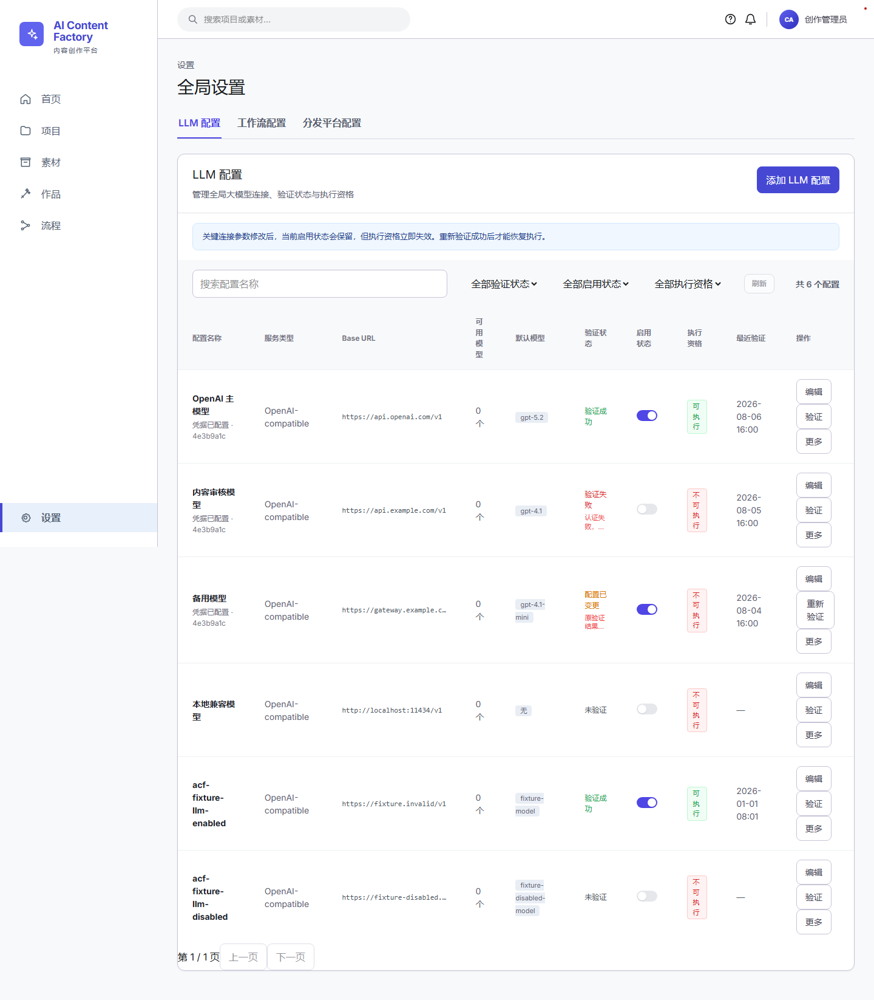

# UI-001 LLM Provider 列表精确修复与真实数据验收报告

## 一、验收概述

- **页面 ID**: UI-001
- **页面名称**: 全局设置 / LLM 配置列表
- **原型代码**: I19_01_LLM_PROVIDER_LIST
- **验收结论**: PASSED (通过)
- **基线 Commit**: `7a067c226e49c5ef07e095fd9f54b14ddce58bd3`
- **执行时间**: 2026-08-06 17:38:30 UTC+8

---

## 二、修更说明与契约合规

1. **白名单文件修改**:
   - `apps/web/src/features/global-config/llm-provider-api.ts`
   - `apps/web/src/features/global-config/llm-provider-api.test.ts`
   - `apps/web/src/features/global-lite/settings-page.tsx`
   - `apps/web/src/features/global-lite/llm-settings.css`
   - `scripts/ui-acceptance/Set-UI001-LlmProviderFixture.ps1`
   - `apps/web/e2e/ui-001-llm-provider-list.spec.ts`
   - `docs/acceptance/second-loop-ui/page-fixes/UI-001/` 验收交付物

2. **核心修复要点**:
   - 补充 `validationStatus`, `enabled`, `lastVerifiedAt`, `checkedAt`, `lastErrorMessage` 和 `executable` 映射，严格不泄漏敏感明文 `secret`；
   - 支持 `executable=true/false` 列表筛选 API 参数与前端选择框联动；
   - 增加顶部规则说明 Banner `.ui001-provider-notice`；
   - 优化 10 列表格展示、截断样式及浮层菜单，支持 `Escape` 键与点击外部关闭；
   - 实现 PowerShell 数据库 Fixture 脚本 `Set-UI001-LlmProviderFixture.ps1`（支持 `-Mode Apply` 与 `-Mode Verify`）。

---

## 三、测试与冒烟验证结果

1. **数据库 Seed 与 Verify 检查**:
   - 运行 `Set-UI001-LlmProviderFixture.ps1 -Mode Apply` 与 `-Mode Verify` 均正确输出 `PASS`。
2. **API 单元测试**:
   - 运行 `pnpm --dir apps/web exec node --test src/features/global-config/llm-provider-api.test.ts` 6 项测试全部通过。
3. **前端 TypeScript Typecheck**:
   - 运行 `pnpm --dir apps/web typecheck` 输出 0 错误。
4. **ESLint 静态检查**:
   - 运行 `pnpm --dir apps/web exec eslint ...` 0 警告 0 错误。
5. **Playwright E2E 自动化测试**:
   - 运行 `pnpm --dir apps/web exec playwright test e2e/ui-001-llm-provider-list.spec.ts` 10 项断言全流程 PASS。
   - 产出最终全屏对比截图 `UI-001_I19_01_LLM_PROVIDER_LIST_AFTER.png`。

---

## 四、最终 UI 截图

