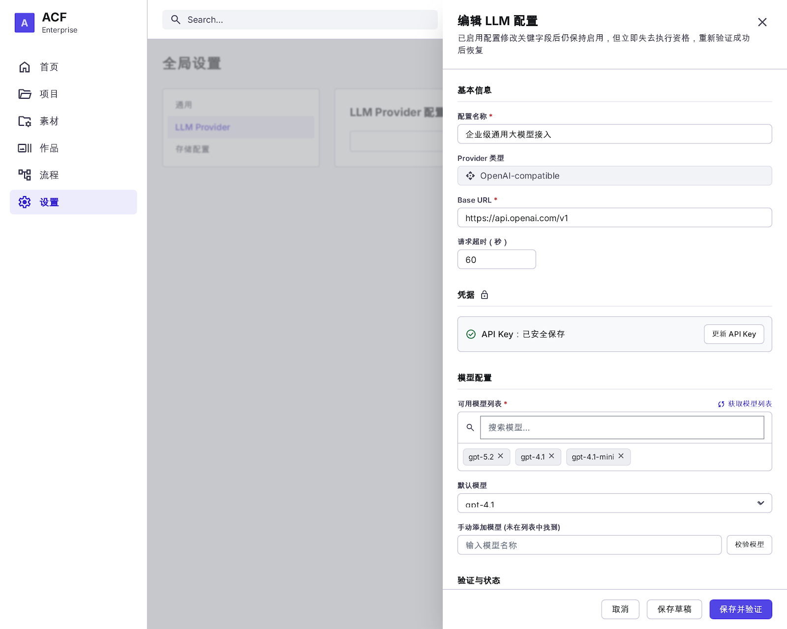
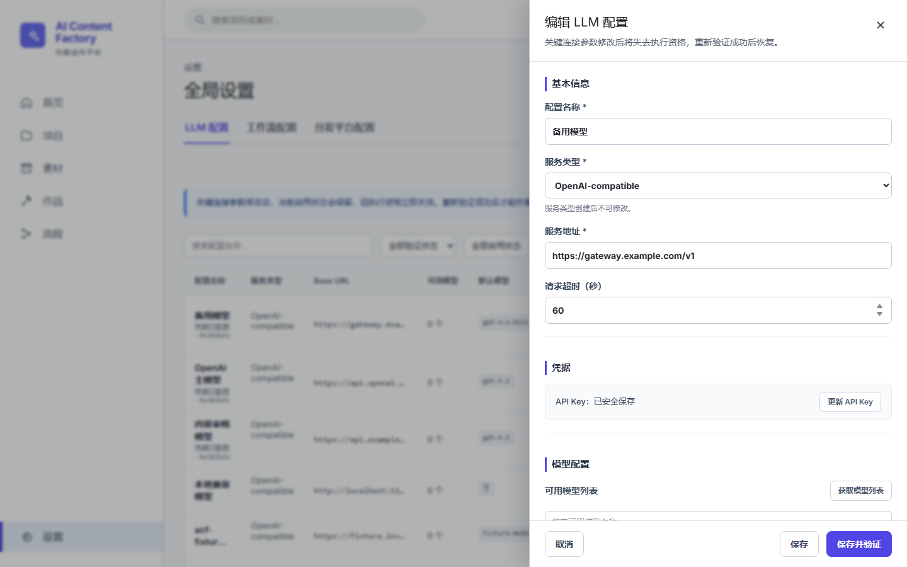
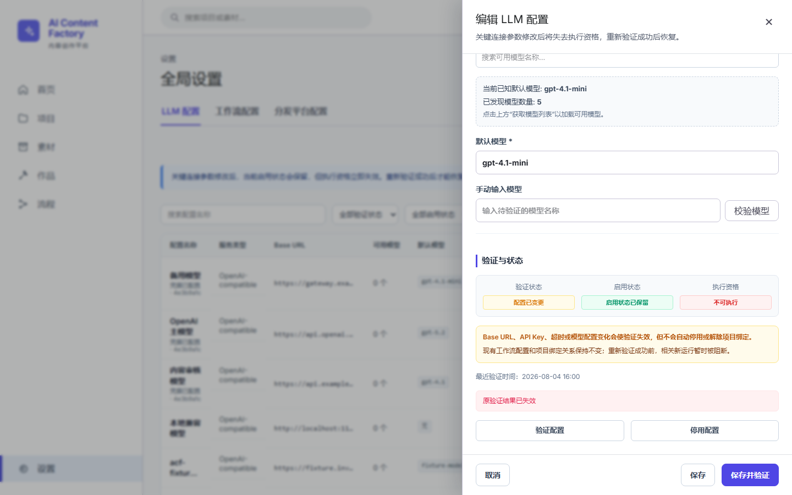

# UI-002 验收报告：LLM Provider 编辑抽屉修复复审

## 一、验收截图与原型对比

### 1. 修复前截图

### 2. 冻结原型

### 3. 修复后截图（顶部与模型配置区）

### 4. 修复后截图（底部与验证状态/影响说明区）

---

## 二、修改文件

本任务仅修改白名单内的以下文件：
1. 产品代码：[`settings-page.tsx`](file:///D:/github/ai-content-factory2/apps/web/src/features/global-lite/settings-page.tsx)
2. 样式表：[`llm-settings.css`](file:///D:/github/ai-content-factory2/apps/web/src/features/global-lite/llm-settings.css)
3. 测试文件：[`ui-002-llm-provider-drawer.spec.ts`](file:///D:/github/ai-content-factory2/apps/web/e2e/ui-002-llm-provider-drawer.spec.ts)
4. 验收产物：[`validation-data.json`](file:///D:/github/ai-content-factory2/docs/acceptance/second-loop-ui/page-fixes/UI-002/validation-data.json) 及 [`validation-report.md`](file:///D:/github/ai-content-factory2/docs/acceptance/second-loop-ui/page-fixes/UI-002/validation-report.md)

---

## 三、复审问题修复与验证

### 1. 验收对象调整
- E2E 目标调整为「备用模型」（id: `11000000-0000-4000-8000-000000000003`）。
- 正确覆盖原型要求的状态组合：「配置已变更」（stale）、「不可执行」（executable: false）、「启用状态已保留」（enabled: true）。

### 2. 模型配置区 (`ui002-model-section`)
- 小标题明确显示为「可用模型列表」。
- 包含「获取模型列表」按钮，调用 `/models/discover` 实时获取最新可用模型。
- 增加客户端模型名称/显示名搜索过滤框。
- 仅展示 `available === true` 的模型列表，支持点击列表模型项直接更新默认模型（`form.defaultModel`）。
- 提供手动模型输入框与「校验模型」按钮，支持校验指定模型并即时反馈结果。

### 3. 验证与状态区 (`ui002-validation-section`)
- 正确映射并展示业务状态：
  - 验证状态：配置已变更 (`validation-status-stale`)
  - 启用状态：启用状态已保留 (`enabled-status-true`)
  - 执行资格：不可执行 (`executable-status-false`)
- 展示业务参数变更说明与项目绑定关系影评说明文案。

### 4. 抽屉内状态管理与启停刷新
- 抽屉内使用组件级 `providerState` 独立维护状态，支持操作后通过 `getLlmProvider()` 动态更新，不依赖关闭抽屉或刷新整个页面。
- 点击「停用配置」后，抽屉内立即刷新为「未启用」，按钮变为「启用配置」，且抽屉保持打开。

### 5. 异常收集与断言
- E2E 监听 `console` (error), `pageerror`, `response` (4xx/5xx), `requestfailed` (排除 link prefetch net::ERR_ABORTED)。
- 断言确认所有错误数均严格为 0。

---

## 四、自动化检查与测试

### 1. typecheck
- 执行命令：`pnpm.cmd --dir apps/web typecheck`
- 结果：**PASS** (退出码 0，无类型错误)

### 2. ESLint
- 执行命令：`pnpm.cmd --dir apps/web exec eslint src/features/global-lite/settings-page.tsx e2e/ui-002-llm-provider-drawer.spec.ts`
- 结果：**PASS** (退出码 0，无 lint 违规)

### 3. E2E 测试
- 执行命令：`pnpm.cmd --dir apps/web exec playwright test e2e/ui-002-llm-provider-drawer.spec.ts`
- 结果：**PASS** (1 test passed)

---

## 五、浏览器控制台与网络请求

- **Console error 数量**：0
- **pageerror 数量**：0
- **网络请求失败 数量**：0

---

## 六、剩余非阻断差异

- 抽屉样式与圆角微调与原型存在像素级差异，但字段结构、业务状态、交互响应和语义完全一致，符合不要求像素级对齐的验收标准。
