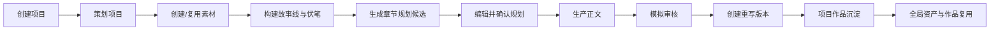
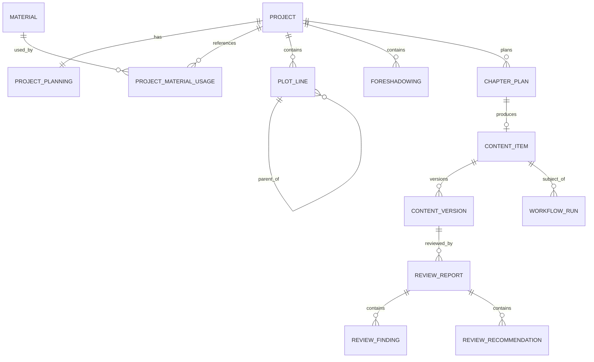

# AI Content Factory 2.0｜业务架构

## 1. 业务定位

AI Content Factory 2.0 是面向内容创作者的“资产 + 能力 + 工作流”生产平台。

P0 先以小说生产为落地场景，验证以下核心价值：

1. 项目化管理内容生产过程。
2. 将人物、世界观、地点、组织、道具和参考资料沉淀为可复用资产。
3. 将故事线、章节规划、正文、审核和重写串成可追踪链路。
4. 通过统一 Provider 抽象，为后续真实 AI 和外部工作流保留扩展能力。
5. 保留内容版本、审核结果和生产记录，避免生成结果不可追溯。

## 2. 业务目标

### P0 目标

- 完成小说项目从创建到正文重写的完整闭环。
- 验证素材资产可跨项目复用。
- 验证故事线、章节规划、正文、审核和版本之间的可追踪关系。
- 验证内置 Mock Provider 能替代真实 AI 完成产品和工程闭环。
- 建立 2.0 可继续扩展其他内容类型和工作流平台的架构基础。

### P0 不承担

- 真实模型效果验证。
- 商业化订阅和计费。
- 团队多人协作。
- 发布平台连接。
- 外部工作流执行。
- 多内容类型同时上线。

## 3. 核心价值链



## 4. 业务角色

### 创作者

P0 的主要角色，负责：

- 创建项目。
- 维护项目策划。
- 创建或复用素材。
- 设计故事线和伏笔。
- 确认章节规划。
- 编辑正文。
- 查看审核结果。
- 决定是否创建重写版本。

### 系统

负责：

- 保证数据一致性和状态规则。
- 记录版本和审计信息。
- 调用内置 Mock Provider。
- 聚合项目作品、全局素材和全局作品。
- 明确展示不可用能力，不伪造真实连接。

### 外部能力提供方

P0 仅保留抽象，不执行：

- LLM Provider。
- n8n / Coze / ComfyUI。
- 微信公众号 / 抖音 / YouTube / Webhook。

## 5. 业务能力地图

```text
内容项目管理
├── 项目创建
├── 项目概览
├── 项目策划
└── 项目状态

内容资产管理
├── 全局素材本体
├── 项目素材用途
├── 素材绑定
├── 素材解绑
└── 跨项目引用查询

叙事结构管理
├── 主故事线
├── 子故事线
├── 故事线树
├── 伏笔种下
└── 伏笔回收计划

章节规划
├── 模拟生成候选
├── 编辑候选
├── 删除候选
├── 选择候选
└── 确认规划

内容生产
├── 创建正文
├── 模拟生成正文
├── 人工编辑
├── 保存草稿
└── 内容版本

审核与重写
├── 模拟审核
├── 问题与建议
├── 创建重写任务
├── 生成新版本
└── 保留旧版本

全局管理
├── 全局素材
├── 全局作品
├── 流程中心
└── 能力与集成状态
```

## 6. 领域边界

### Project Context

负责项目身份、类型、状态、策划和工作区聚合。

拥有：

- Project
- ProjectPlanning

不拥有：

- Material 本体
- ContentVersion
- WorkflowRun

### Material Context

负责全局素材本体及项目用途。

拥有：

- Material
- ProjectMaterialUsage

关键规则：

- Material 是全局唯一资产。
- ProjectMaterialUsage 是项目关系。
- 项目内新建素材时，一次事务创建 Material 和 Usage。
- 解绑只删除 Usage，不删除 Material。

### Narrative Context

负责故事结构。

拥有：

- PlotLine
- Foreshadowing

关键规则：

- 主线和子线统一为 PlotLine。
- 父子关系通过 parent_id 表达。
- 伏笔是一级业务对象，不作为 PlotLine 的附属文本。

### Planning Context

负责章节候选和确认。

拥有：

- ChapterPlan
- MockGenerationRun

关键规则：

- 生成只产生候选。
- 候选确认前可编辑和删除。
- 确认不自动创建正文。
- 只有 confirmed 规划可进入生产。

### Content Context

负责正文、版本和当前版本选择。

拥有：

- ContentItem
- ContentVersion

关键规则：

- ContentItem 表示作品单元。
- ContentVersion 表示不可覆盖的内容快照。
- 保存草稿可以更新当前草稿版本；生成重写必须新增版本。
- P0 重写版本不自动成为 current version。

### Review Context

负责审核报告。

拥有：

- ReviewReport
- ReviewFinding
- ReviewRecommendation

关键规则：

- 审核只读取指定 ContentVersion。
- 审核不得修改正文。
- 审核结果必须关联被审核版本。

### Workflow Context

负责能力执行与追踪。

拥有：

- WorkflowRun
- WorkflowDefinition
- ProviderDescriptor

关键规则：

- P0 只允许 provider_key=`mock`。
- 生成、审核和重写都必须记录 WorkflowRun。
- 真实 AI 和外部平台只展示能力状态。

## 7. 核心业务对象关系



## 8. 核心业务规则

### 项目

- P0 只允许创建 `novel` 项目。
- 项目创建成功后进入项目概览。
- 项目列表和首页最近项目必须使用同一 Project 数据源。

### 素材

- 同一项目与同一素材最多存在一条有效 Usage。
- 素材本体字段和项目用途字段必须分离。
- 项目内创建的素材必须可在全局素材页查询。
- 解除项目绑定不得删除全局素材。

### 故事线

- 子故事线必须与父故事线属于同一项目。
- 故事线树不能出现循环引用。
- 伏笔可以关联不同的种下和回收故事线。

### 章节规划

- Mock 生成结果状态为 `pending_confirmation`。
- 未确认规划不得创建正文。
- 已确认规划不得被普通编辑接口修改关键身份字段。
- 确认操作必须幂等。

### 正文与审核

- 正文必须关联已确认 ChapterPlan。
- ReviewReport 必须关联明确的 ContentVersion。
- 审核前后正文哈希必须保持一致。

### 重写

- 重写输入至少包含源版本和审核结果。
- 重写成功创建新的 ContentVersion。
- v1 必须保留。
- v2 不自动成为 current version。
- v2 不自动提交审核、不自动发布。

## 9. 业务指标建议

P0 不做商业化指标，但应保留以下埋点结构：

- 项目创建成功率。
- 素材复用率。
- 章节候选确认率。
- 从确认章节到创建正文的转化率。
- 审核完成率。
- 审核后创建重写版本的比例。
- 每个作品平均版本数。
- Mock Workflow 成功率和平均耗时。

## 10. 后续扩展方向

```text
内容包扩展
├── 短剧
├── 图文
├── 视频脚本
└── 社交媒体内容

能力扩展
├── 真实 LLM
├── 图像生成
├── 视频生成
├── 外部审核
└── 发布适配器

协作扩展
├── 团队
├── 权限
├── 评论
├── 审批
└── 版本对比
```
