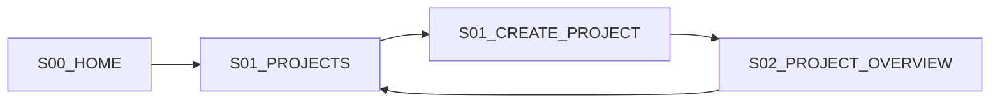
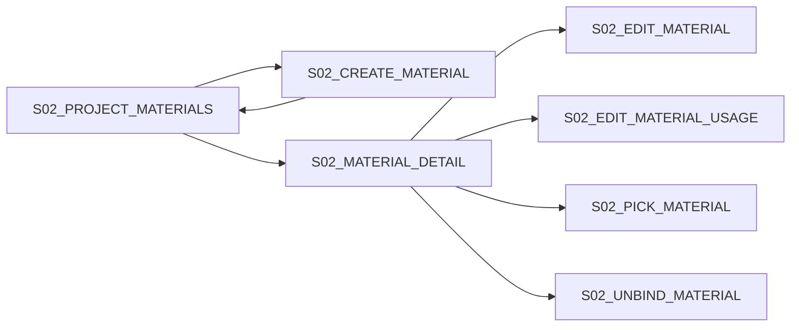
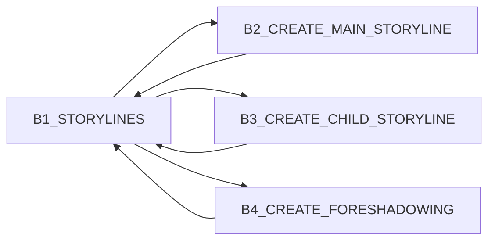
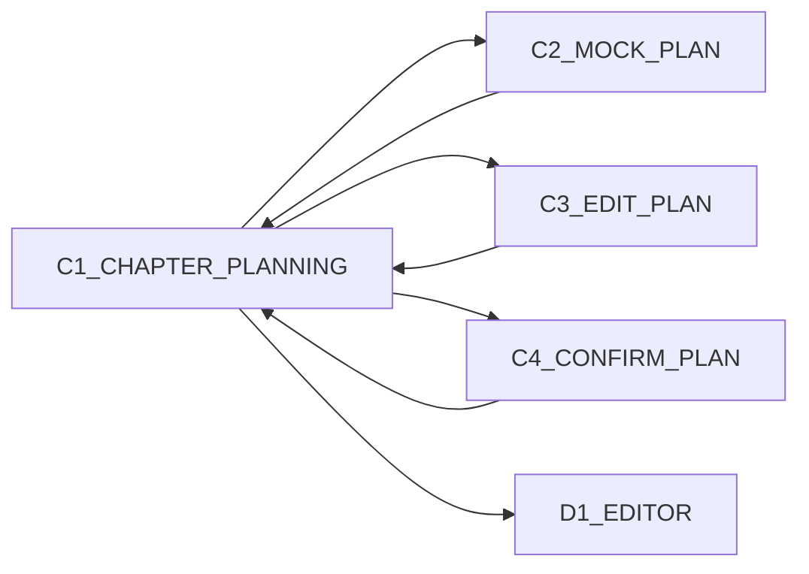
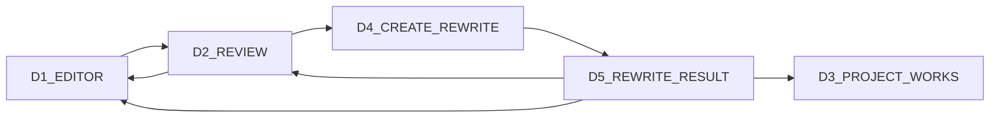

# AI Content Factory 2.0｜产品架构

## 1. 产品定位

AI Content Factory 2.0 不是单一“AI 写作工具”，而是内容生产操作系统：

```text
项目
+ 可复用资产
+ 内容类型能力包
+ 生产流程
+ 审核与版本
+ 外部能力适配
```

P0 用小说项目验证最小但完整的生产闭环。

## 2. 产品原则

1. 项目是用户工作的主要上下文。
2. 素材本体全局唯一，项目只配置用途。
3. 生成结果不是最终结果，必须经过选择、编辑和确认。
4. 内容版本不可被重写流程覆盖。
5. AI 是可替换能力，不应侵入业务领域模型。
6. 不可用能力明确禁用，不展示伪连接和伪成功。
7. 全局页面负责聚合，项目页面负责生产。
8. P0 页面必须可形成真实业务闭环，而不是静态展示。

## 3. 产品信息架构

```text
AI Content Factory
├── 首页
│   ├── 业务概览
│   └── 最近项目
├── 项目
│   ├── 项目列表
│   ├── 创建项目
│   └── 项目工作区
│       ├── 项目概览
│       ├── 策划
│       ├── 素材
│       ├── 故事线
│       ├── 章节
│       ├── 审核
│       └── 作品
├── 素材
│   └── 全局素材
├── 作品
│   └── 全局作品
├── 流程
│   └── 内置模拟流程
└── 设置
    └── 能力与外部集成状态
```

## 4. 功能架构

### 项目域

| 功能 | P0 |
|---|---|
| 项目列表 | 实现 |
| 创建小说项目 | 实现 |
| 项目概览 | 实现 |
| 项目策划 | 实现 |
| 项目设置 | 不实现 |
| 删除/复制项目 | 不实现 |
| 团队成员 | 不实现 |

### 素材域

| 功能 | P0 |
|---|---|
| 创建人物/世界观/地点/组织/道具/参考资料 | 实现 |
| 项目内创建并同步全局 | 实现 |
| 绑定已有素材 | 实现 |
| 编辑素材本体 | 实现 |
| 编辑项目用途 | 实现 |
| 解除绑定 | 实现 |
| 删除全局素材 | 不实现 |
| 批量导入 | 不实现 |

### 叙事域

| 功能 | P0 |
|---|---|
| 主线 | 实现 |
| 子故事线 | 实现 |
| 故事线树 | 实现 |
| 伏笔 | 实现 |
| 复杂关系图 | 不实现 |
| AI 自动生成 | 不实现 |

### 章节域

| 功能 | P0 |
|---|---|
| Mock 生成候选 | 实现 |
| 编辑/删除候选 | 实现 |
| 选择候选 | 实现 |
| 确认规划 | 实现 |
| 自动生成正文 | 不实现 |

### 内容生产域

| 功能 | P0 |
|---|---|
| 正文编辑 | 实现 |
| 保存草稿 | 实现 |
| Mock 正文生成 | 实现 |
| Mock 审核 | 实现 |
| 审核问题和建议 | 实现 |
| 创建重写版本 | 实现 |
| 版本保留 | 实现 |
| 版本差异专页 | 不实现 |
| 发布 | 不实现 |

## 5. 核心用户旅程

### Journey A：创建项目



成功标准：

- 创建后立即进入正确项目。
- 返回列表可看到新项目。
- 刷新后数据仍存在。

### Journey B：创建和复用素材



成功标准：

- 项目内创建自动同步到全局。
- 素材本体和用途分离。
- 解绑不删除全局素材。

### Journey C：叙事结构



### Journey D：章节规划



产品规则：

- 确认规划和进入正文生产是两个动作。
- 确认后返回章节列表。
- 用户手动选择“进入正文生产”。

### Journey E：正文、审核和重写



## 6. 页面注册表

| Frame ID | 页面 | 产品上下文 |
|---|---|---|
| S00_HOME | 首页 | 全局 |
| S01_PROJECTS | 项目列表 | 全局 |
| S01_CREATE_PROJECT | 创建项目 | 全局 |
| S02_PROJECT_OVERVIEW | 项目概览 | 项目 |
| S02_PROJECT_PLANNING | 项目策划 | 项目 |
| S02_PROJECT_MATERIALS | 项目素材 | 项目 |
| S02_CREATE_MATERIAL | 创建素材 | 项目 |
| S02_MATERIAL_DETAIL | 素材详情 | 项目 |
| S02_PICK_MATERIAL | 选择素材 | 项目 |
| S02_EDIT_MATERIAL | 编辑素材 | 项目 |
| S02_EDIT_MATERIAL_USAGE | 编辑项目用途 | 项目 |
| S02_UNBIND_MATERIAL | 解除绑定 | 项目 |
| B1_STORYLINES | 故事线工作区 | 项目 |
| B2_CREATE_MAIN_STORYLINE | 新建主线 | 项目 |
| B3_CREATE_CHILD_STORYLINE | 新建子线 | 项目 |
| B4_CREATE_FORESHADOWING | 新增伏笔 | 项目 |
| C1_CHAPTER_PLANNING | 章节规划 | 项目 |
| C2_MOCK_PLAN | Mock 生成规划 | 项目 |
| C3_EDIT_PLAN | 编辑规划 | 项目 |
| C4_CONFIRM_PLAN | 确认规划 | 项目 |
| D1_EDITOR | 正文编辑器 | 项目 |
| D2_REVIEW | 审核结果 | 项目 |
| D3_PROJECT_WORKS | 项目作品 | 项目 |
| D4_CREATE_REWRITE | 创建重写版本 | 项目 |
| D5_REWRITE_RESULT | 重写结果 | 项目 |
| E1_GLOBAL_MATERIALS | 全局素材 | 全局 |
| E2_GLOBAL_WORKS | 全局作品 | 全局 |
| E3_WORKFLOWS | 流程中心 | 全局 |
| E4_SETTINGS | 设置 | 全局 |

## 7. 产品状态模型

### 页面通用状态

每个数据页面至少覆盖：

```text
loading
empty
success
error
permission_denied（P0 可保留占位）
```

每个提交页面至少覆盖：

```text
idle
validating
submitting
success
failure
```

### 章节规划状态

```text
pending_confirmation
confirmed
```

UI 表现：

- pending_confirmation：允许编辑、删除、选择、确认。
- confirmed：只读核心规划，显示进入正文入口。

### 内容状态

```text
draft
in_review
reviewed
```

### 版本状态

P0 不将版本建模为审批状态，重点展示：

- version_no
- source
- is_current
- review_status
- publish_status

## 8. 全局与项目页面职责

| 能力 | 全局页面 | 项目页面 |
|---|---|---|
| 素材 | 跨项目查看和引用统计 | 创建、绑定、用途配置 |
| 作品 | 跨项目聚合 | 具体生产和版本管理 |
| 流程 | 能力和运行记录聚合 | 业务动作触发 |
| 设置 | Provider 与集成状态 | P0 不提供项目设置 |

## 9. P0 文案与状态基线

### 能力

- 模拟能力：已启用。
- 真实 AI：暂未配置。
- 发布平台：暂未开放。
- n8n / Coze / ComfyUI：暂未开放。

### 禁止出现

- 虚假的连接成功。
- API Key 输入框。
- OAuth 授权入口。
- 真实模型选择。
- 真实发布记录。
- 自动将 v2 标记为当前版本。

## 10. 产品验收原则

- 页面必须由真实 API 数据驱动。
- UI 冻结稿是视觉和信息架构基线。
- 核心验收必须验证创建、读取、更新、状态变化和持久化。
- 不接受仅“页面打开成功”。
- 不接受通过前端本地变量伪造状态闭环。
