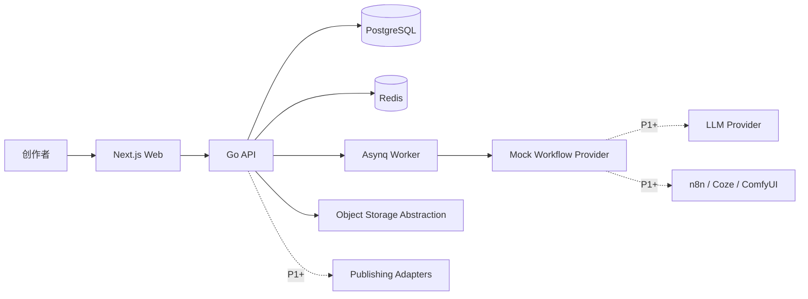
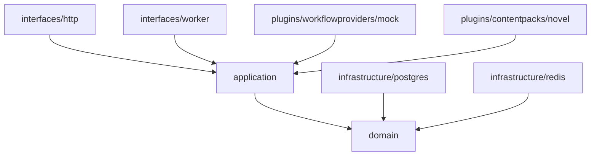

# AI Content Factory 2.0｜技术架构

## 1. 架构目标

1. 复用 1.0 已验证的工程技术栈和部署方式。
2. 使用模块化单体完成 P0，避免过早微服务化。
3. 将内容类型差异收敛到 Content Pack。
4. 将生成、审核和重写能力收敛到 Workflow Provider。
5. 通过 OpenAPI、数据库约束和自动化测试控制需求漂移。
6. 支持后续拆分异步任务、真实 AI、外部工作流和发布适配器。

## 2. 技术栈

| 层 | 技术 |
|---|---|
| Web | TypeScript、React、Next.js |
| API | Go |
| 数据库 | PostgreSQL |
| 缓存与任务 | Redis、Asynq |
| 契约 | OpenAPI、JSON Schema |
| 测试 | Go test、Testcontainers、Web 单测、Playwright |
| 部署 | Docker Compose 起步 |
| 可观测性 | Structured Log、request_id、AuditLog、基础指标 |

## 3. 系统上下文



P0 真实执行路径：

```text
Web → Go API → Application Use Case
→ Domain Rule
→ PostgreSQL / Redis
→ Mock Provider
→ WorkflowRun
→ API Result
```

## 4. 部署单元

P0 使用模块化单体：

```text
web
api
worker
postgres
redis
```

推荐 Docker Compose 服务：

```yaml
services:
  web:
    ports: ["3000:3000"]
  api:
    ports: ["8080:8080"]
  worker:
    depends_on: [redis, postgres]
  postgres:
    ports: ["5432:5432"]
  redis:
    ports: ["6379:6379"]
```

API 与 worker 可以共享 Go module，但必须是不同进程入口。

## 5. 后端分层



依赖规则：

```text
interfaces → application → domain
infrastructure → domain interfaces
plugins → extension contracts
domain 不依赖 infrastructure/interfaces/plugins
```

## 6. 后端模块边界

```text
project
material
narrative
chapterplan
content
review
workflow
works
capability
audit
```

每个模块推荐结构：

```text
internal/<module>/
├── domain/
│   ├── entity.go
│   ├── value_object.go
│   ├── repository.go
│   ├── service.go
│   ├── events.go
│   └── errors.go
├── application/
│   ├── commands/
│   ├── queries/
│   ├── dto/
│   └── ports/
├── interfaces/
│   ├── http/
│   └── worker/
└── infrastructure/
    └── postgres/
```

## 7. Content Pack 架构

Content Pack 负责内容类型差异，不负责通用项目、素材、版本和审核逻辑。

```go
type ContentPack interface {
    Key() string
    ProjectSchema() json.RawMessage
    PlanningSchema() json.RawMessage
    MaterialUsageTypes() []string
    ProductionUnitType() string
    ValidateProjectPayload(ctx context.Context, payload json.RawMessage) error
    ValidatePlanPayload(ctx context.Context, payload json.RawMessage) error
}
```

P0：

```text
pack_key = novel
production_unit = chapter
```

Novel Pack 可定义：

- 小说项目策划字段。
- 人物角色类型。
- 章节规划扩展字段。
- 小说正文和审核维度。

禁止：

- 在通用模块中散落 `if project.Type == "novel"`。
- 为小说复制一套 Project、Material、Content 表。

## 8. Workflow Provider 架构

生成、审核、重写统一通过 Provider：

```go
type WorkflowProvider interface {
    Key() string
    Execute(ctx context.Context, req ExecuteRequest) (ExecuteResult, error)
    Capabilities(ctx context.Context) []Capability
}
```

P0 Provider：

```text
provider_key = mock
```

工作流定义：

```text
novel.chapter_plan.mock_generate
novel.content.mock_generate
novel.review.mock_review
novel.rewrite.mock_rewrite
```

每次执行必须：

1. 创建 WorkflowRun。
2. 保存输入快照。
3. 执行 Provider。
4. 保存输出摘要或错误。
5. 更新状态和结束时间。
6. 在同一业务事务或可靠补偿流程中创建领域结果。

## 9. API 架构

### 前缀

```text
/api/v1
```

### 成功响应

```json
{
  "data": {},
  "request_id": "req_01..."
}
```

### 错误响应

```json
{
  "code": "CHAPTER_PLAN_NOT_CONFIRMED",
  "message": "Chapter plan must be confirmed before production.",
  "details": {},
  "request_id": "req_01..."
}
```

### HTTP 语义

| 状态 | 用途 |
|---|---|
| 200 | 查询或更新成功 |
| 201 | 创建成功 |
| 204 | 删除/解绑成功 |
| 400 | 参数或领域校验失败 |
| 404 | 资源不存在 |
| 409 | 状态冲突、重复绑定、幂等冲突 |
| 422 | 可选：结构合法但业务内容无法处理 |
| 500 | 未处理错误 |

### 幂等

重点接口：

- 创建项目：前端生成 idempotency key。
- 确认章节规划：必须幂等。
- 创建正文：同一 chapter_plan 只能有一个 ContentItem。
- 创建重写：同一 idempotency key 只能创建一个 WorkflowRun。

## 10. 数据架构

### 数据库原则

- PostgreSQL 是业务真值源。
- Redis 只用于缓存、分布式互斥和任务队列。
- JSONB 用于 Pack 扩展字段，不用于替代核心关系。
- 外键、唯一索引和状态约束必须在数据库层兜底。
- 所有表统一使用 UTC 时间，展示层转换时区。

### 关键约束

```sql
UNIQUE(project_id, material_id)
UNIQUE(chapter_plan_id) -- content_items
UNIQUE(content_item_id, version_no)
CHECK(version_no > 0)
```

### 事务边界

| 用例 | 事务内容 |
|---|---|
| 项目内创建素材 | Material + ProjectMaterialUsage + AuditLog |
| 绑定已有素材 | Usage + AuditLog |
| 确认章节规划 | 状态更新 + confirmed_at + AuditLog |
| 创建正文 | ContentItem + v1（按场景）+ AuditLog |
| 创建重写结果 | WorkflowRun 更新 + v2 + AuditLog |

## 11. 前端架构

```text
Next.js App Router
├── app/                 路由和页面组合
├── features/            业务功能
├── entities/            领域展示模型
├── shared/              通用组件、API、工具
└── widgets/             跨功能页面模块
```

推荐依赖方向：

```text
app → widgets/features/entities/shared
widgets → features/entities/shared
features → entities/shared
entities → shared
shared 不依赖上层
```

### 数据访问

- OpenAPI 生成或手写薄 API Client。
- Query Key 必须集中管理。
- 服务端数据不得复制到全局客户端状态作为真值。
- 表单临时状态与服务端状态分离。
- 写操作成功后精确 invalidate 或更新缓存。

### UI 实现

- Stitch HTML 仅作为视觉基线，不直接作为生产代码结构。
- 组件需要按 Design Token、Layout、Feature 重新实现。
- Frame ID 作为路由和测试标识。
- 关键元素添加稳定 `data-testid`。

## 12. 异步任务

P0 以下动作允许走 Asynq：

- Mock 正文生成。
- Mock 审核。
- Mock 重写。

章节规划 Mock 生成可同步，也可统一异步；同一类工作流保持一致。

任务负载只传 ID：

```json
{
  "workflow_run_id": "run_xxx"
}
```

Worker 自行从数据库读取输入，避免消息体保存大段正文。

## 13. 安全与权限

P0 无完整多租户，但仍必须：

- 参数化 SQL。
- 输入长度限制。
- JSON Schema 校验。
- 日志不得打印正文全文、密钥或敏感配置。
- 错误响应不暴露堆栈。
- 所有 ID 查询校验项目归属。
- 对后续 tenant_id / organization_id 预留迁移策略，但 P0 不伪造复杂权限。

## 14. 可观测性

每个请求：

```text
request_id
method
path
status
latency_ms
actor_id
project_id（如有）
error_code（如有）
```

每个 WorkflowRun：

```text
run_id
provider_key
workflow_key
subject_id
status
duration_ms
error_code
```

业务审计：

- 项目创建。
- 素材创建、绑定、解绑。
- 章节确认。
- 正文创建。
- 审核创建。
- 重写版本创建。
- 当前版本切换（P1 如实现）。

## 15. 测试架构

```text
Domain Unit
Application Use Case
Repository Integration
HTTP Contract
Web Component
Playwright E2E
Full P0 Regression
```

关键禁止项：

- 用前端 Mock 替代 Iteration 验收。
- 用内存 Repository 作为唯一 Repository 测试。
- 只验证 HTTP 200。
- 忽略重启后的持久化。
- 在 E2E 中跳过真实 API。

## 16. 架构决策

| 决策 | 选择 |
|---|---|
| 服务形态 | 模块化单体 |
| 内容类型扩展 | Content Pack |
| 能力扩展 | Workflow Provider |
| 业务真值 | PostgreSQL |
| 异步 | Redis + Asynq |
| API | REST + OpenAPI |
| P0 AI | Mock Provider |
| UI 技术 | Next.js + React |
| 版本策略 | 新版本追加，不覆盖 |
