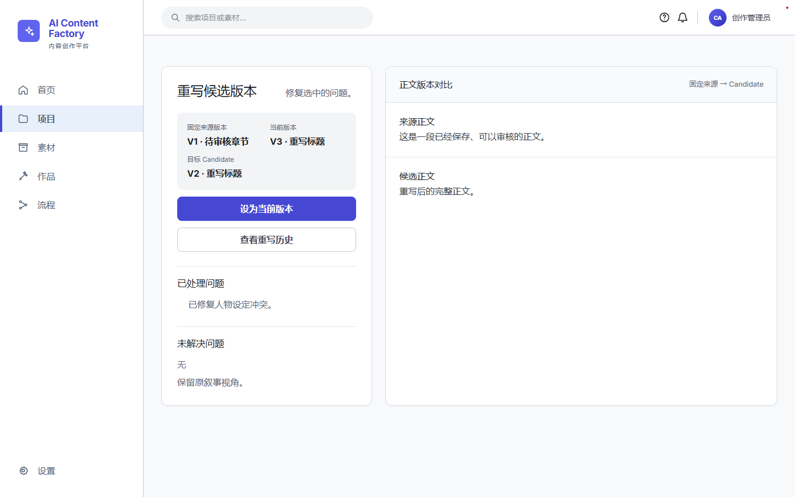
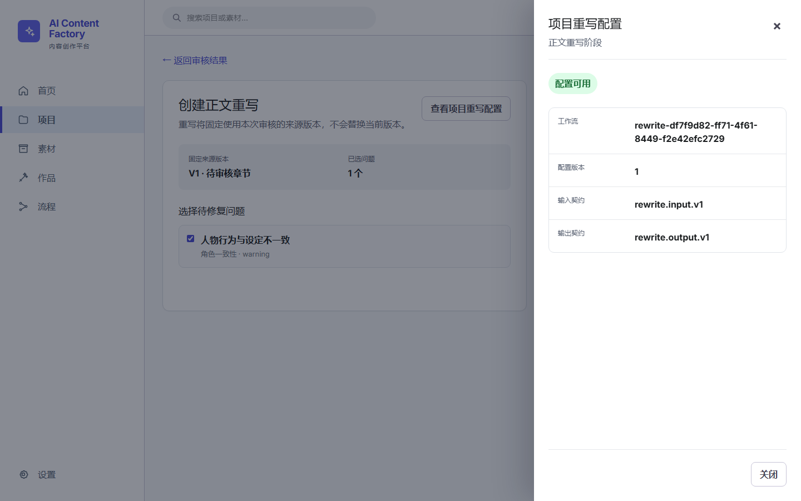

# Iteration 15～18 浏览器 UI 对比验收总报告

- BASELINE_COMMIT：`f05a31e64a437ea07f8f917eaf9e3f6dae3aed8a`
- 总 Frame：49
- Iteration 15：21
- Iteration 16：11
- Iteration 17：8
- Iteration 18：9
- 初次 PASS：41
- 初次 FAIL：8
- 已修复：8
- 未修复：0
- Console error：0
- Iteration 15 最终状态：修复成功
- Iteration 16 最终状态：修复成功
- Iteration 17 最终状态：修复成功
- Iteration 18 最终状态：修复成功
- 总体最终状态：修复成功

## 修改文件

- `apps/web/e2e/iteration17/review-ui.spec.ts`
- `apps/web/src/app/globals.css`
- `apps/web/src/features/project-works/rewrite-history.tsx`
- `apps/web/src/features/project-works/rewrite-result-panel.tsx`
- `apps/web/src/features/project-works/rewrite-workspace.tsx`
- `scripts/agent/browser-smoke.mjs`
- `scripts/browser-acceptance/build-report.py`
- `scripts/browser-acceptance/capture-iteration18.mjs`
- `scripts/browser-acceptance/iteration16-config.json`

## 工程门禁

- Chapter Planning 定向测试：PASS
- Content Generation 定向测试：PASS
- Review 定向测试与 12 条 Playwright E2E：PASS
- Rewrite 定向测试：PASS
- 前端完整单元测试：PASS
- Typecheck：PASS
- Lint：PASS
- Production Build：PASS
- validate-openapi.ps1：PASS
- validate-iteration17-contract.ps1：PASS
- validate-iteration18-contract.ps1：PASS
- git diff --check：PASS
- Production Docker：PASS

## 逐迭代报告

- [Iteration 15](iteration-15/iteration-15-report.md)
- [Iteration 16](iteration-16/iteration-16-report.md)
- [Iteration 17](iteration-17/iteration-17-report.md)
- [Iteration 18](iteration-18/iteration-18-report.md)

## 关键修复后截图

未修改数据库业务数据、Migration、OpenAPI、后端、冻结原型、n8n 或 AppShell；未执行真实 n8n 联调或 Migration Down。
