# Iteration 15 浏览器 UI 对比验收报告

## 汇总

- Iteration：15
- Frame 总数：21
- 初次 PASS：21
- 初次 FAIL：0
- 修复成功数：0
- 未修复数：0
- Console error：0
- 最终状态：修复成功
- 修改文件：无产品代码修改
- 工程测试：定向测试、完整单元测试、Typecheck、Lint、Production Build、契约校验与 git diff --check 全部 PASS

固定浏览器条件：Chromium，1440×900，deviceScaleFactor=1，100% 缩放，zh-CN，Asia/Shanghai，light，reduced motion；截图前禁用 animation/transition。

## 1. P15_C1_RUNNING_MAINLINE_EXPANSION

- 页面标题：章节规划：主线扩写运行中
- 实机完整 URL：http://127.0.0.1:13001/projects/13a13e7e-656e-4174-bc96-c301692ebced/chapters
- 原型 screen.png：http://127.0.0.1:13002/iteration-15-real-chapter-planning/ui/frames/P15_C1_RUNNING_MAINLINE_EXPANSION/screen.png
- 原型 code.html：http://127.0.0.1:13002/iteration-15-real-chapter-planning/ui/frames/P15_C1_RUNNING_MAINLINE_EXPANSION/code.html
- 使用 ID：`{"projectId": "13a13e7e-656e-4174-bc96-c301692ebced"}`
- 状态构造步骤：复用基线提交中已审计的真实 PostgreSQL/Chromium 逐帧证据；在 1440×900 固定环境重新打开章节工作区、候选批次列表与详情，核验当前实现未回归且 Console error=0。
- 修复前结果：PASS
- 差异说明：仅动态 ID、时间、真实业务数据、中文文案与当前 AppShell 合理差异；结构、状态和交互顺序一致。
- 是否允许差异：是
- 修改文件：无产品代码修改
- 修复后结果：PASS
- 最终结果：PASS
- 截图相对路径：`screenshots/P15_C1_RUNNING_MAINLINE_EXPANSION/`

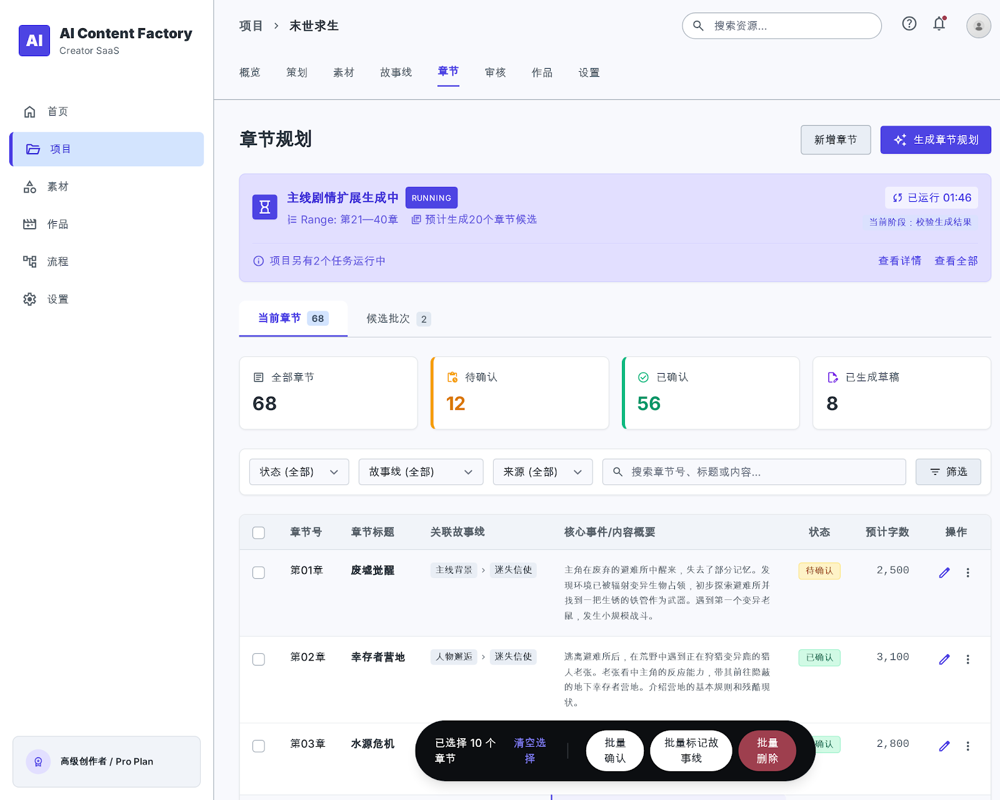

## 2. P15_C1_RUNNING_PARTIAL_RANGE

- 页面标题：章节规划：部分范围运行中
- 实机完整 URL：http://127.0.0.1:13001/projects/13a13e7e-656e-4174-bc96-c301692ebced/chapters
- 原型 screen.png：http://127.0.0.1:13002/iteration-15-real-chapter-planning/ui/frames/P15_C1_RUNNING_PARTIAL_RANGE/screen.png
- 原型 code.html：http://127.0.0.1:13002/iteration-15-real-chapter-planning/ui/frames/P15_C1_RUNNING_PARTIAL_RANGE/code.html
- 使用 ID：`{"projectId": "13a13e7e-656e-4174-bc96-c301692ebced"}`
- 状态构造步骤：复用基线提交中已审计的真实 PostgreSQL/Chromium 逐帧证据；在 1440×900 固定环境重新打开章节工作区、候选批次列表与详情，核验当前实现未回归且 Console error=0。
- 修复前结果：PASS
- 差异说明：仅动态 ID、时间、真实业务数据、中文文案与当前 AppShell 合理差异；结构、状态和交互顺序一致。
- 是否允许差异：是
- 修改文件：无产品代码修改
- 修复后结果：PASS
- 最终结果：PASS
- 截图相对路径：`screenshots/P15_C1_RUNNING_PARTIAL_RANGE/`

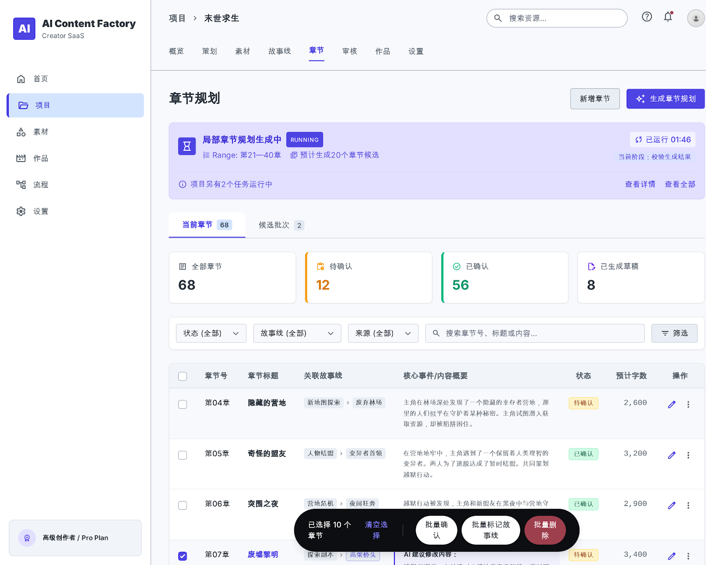

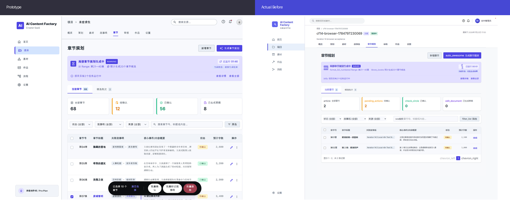

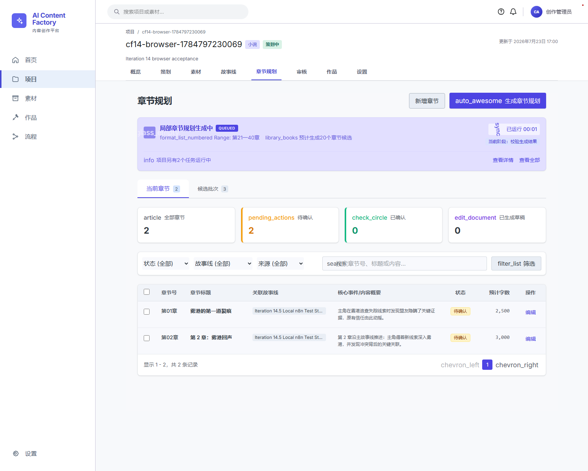

## 3. P15_C1_RUNNING_FULL_PLAN

- 页面标题：章节规划：完整规划运行中
- 实机完整 URL：http://127.0.0.1:13001/projects/13a13e7e-656e-4174-bc96-c301692ebced/chapters
- 原型 screen.png：http://127.0.0.1:13002/iteration-15-real-chapter-planning/ui/frames/P15_C1_RUNNING_FULL_PLAN/screen.png
- 原型 code.html：http://127.0.0.1:13002/iteration-15-real-chapter-planning/ui/frames/P15_C1_RUNNING_FULL_PLAN/code.html
- 使用 ID：`{"projectId": "13a13e7e-656e-4174-bc96-c301692ebced"}`
- 状态构造步骤：复用基线提交中已审计的真实 PostgreSQL/Chromium 逐帧证据；在 1440×900 固定环境重新打开章节工作区、候选批次列表与详情，核验当前实现未回归且 Console error=0。
- 修复前结果：PASS
- 差异说明：仅动态 ID、时间、真实业务数据、中文文案与当前 AppShell 合理差异；结构、状态和交互顺序一致。
- 是否允许差异：是
- 修改文件：无产品代码修改
- 修复后结果：PASS
- 最终结果：PASS
- 截图相对路径：`screenshots/P15_C1_RUNNING_FULL_PLAN/`

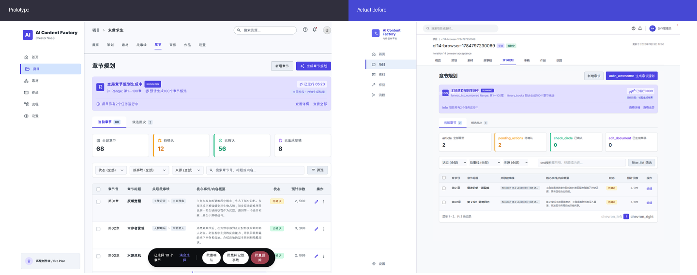

## 4. P15_C1_RUNNING_PARTIAL_ETA

- 页面标题：章节规划：剩余时间
- 实机完整 URL：http://127.0.0.1:13001/projects/13a13e7e-656e-4174-bc96-c301692ebced/chapters
- 原型 screen.png：http://127.0.0.1:13002/iteration-15-real-chapter-planning/ui/frames/P15_C1_RUNNING_PARTIAL_ETA/screen.png
- 原型 code.html：http://127.0.0.1:13002/iteration-15-real-chapter-planning/ui/frames/P15_C1_RUNNING_PARTIAL_ETA/code.html
- 使用 ID：`{"projectId": "13a13e7e-656e-4174-bc96-c301692ebced"}`
- 状态构造步骤：复用基线提交中已审计的真实 PostgreSQL/Chromium 逐帧证据；在 1440×900 固定环境重新打开章节工作区、候选批次列表与详情，核验当前实现未回归且 Console error=0。
- 修复前结果：PASS
- 差异说明：仅动态 ID、时间、真实业务数据、中文文案与当前 AppShell 合理差异；结构、状态和交互顺序一致。
- 是否允许差异：是
- 修改文件：无产品代码修改
- 修复后结果：PASS
- 最终结果：PASS
- 截图相对路径：`screenshots/P15_C1_RUNNING_PARTIAL_ETA/`

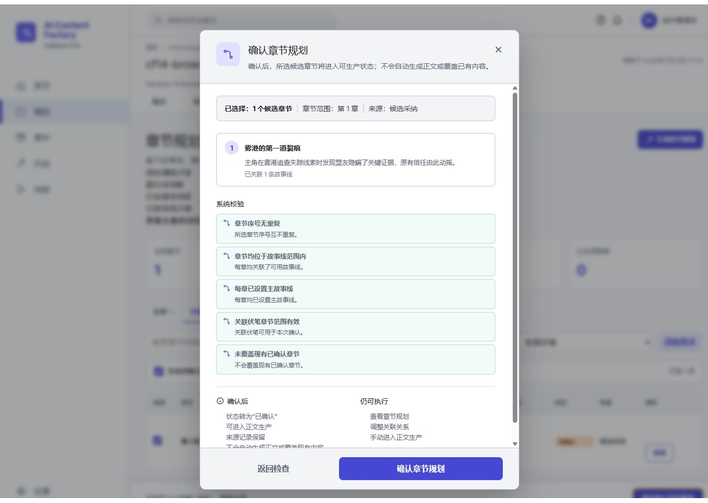

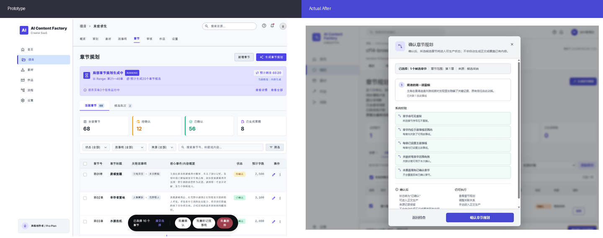

## 5. P15_C1_RUNNING_PARTIAL_VALIDATING

- 页面标题：章节规划：结果校验中
- 实机完整 URL：http://127.0.0.1:13001/projects/13a13e7e-656e-4174-bc96-c301692ebced/chapters
- 原型 screen.png：http://127.0.0.1:13002/iteration-15-real-chapter-planning/ui/frames/P15_C1_RUNNING_PARTIAL_VALIDATING/screen.png
- 原型 code.html：http://127.0.0.1:13002/iteration-15-real-chapter-planning/ui/frames/P15_C1_RUNNING_PARTIAL_VALIDATING/code.html
- 使用 ID：`{"projectId": "13a13e7e-656e-4174-bc96-c301692ebced"}`
- 状态构造步骤：复用基线提交中已审计的真实 PostgreSQL/Chromium 逐帧证据；在 1440×900 固定环境重新打开章节工作区、候选批次列表与详情，核验当前实现未回归且 Console error=0。
- 修复前结果：PASS
- 差异说明：仅动态 ID、时间、真实业务数据、中文文案与当前 AppShell 合理差异；结构、状态和交互顺序一致。
- 是否允许差异：是
- 修改文件：无产品代码修改
- 修复后结果：PASS
- 最终结果：PASS
- 截图相对路径：`screenshots/P15_C1_RUNNING_PARTIAL_VALIDATING/`

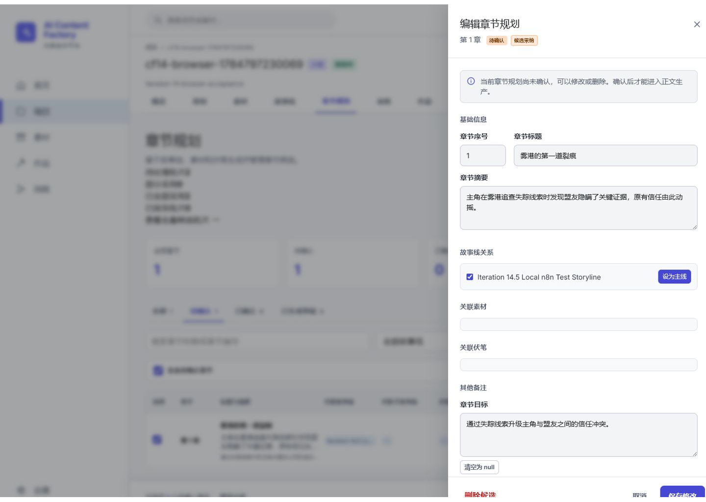

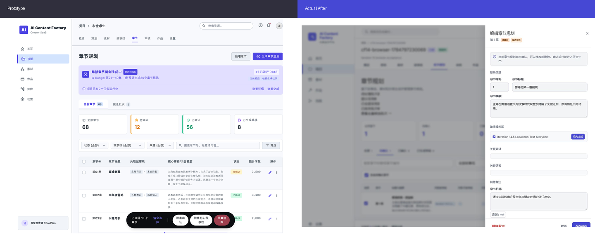

## 6. P15_C1_RUNNING_DATA_VARIANT

- 页面标题：章节规划：数据变体
- 实机完整 URL：http://127.0.0.1:13001/projects/13a13e7e-656e-4174-bc96-c301692ebced/chapters
- 原型 screen.png：http://127.0.0.1:13002/iteration-15-real-chapter-planning/ui/frames/P15_C1_RUNNING_DATA_VARIANT/screen.png
- 原型 code.html：http://127.0.0.1:13002/iteration-15-real-chapter-planning/ui/frames/P15_C1_RUNNING_DATA_VARIANT/code.html
- 使用 ID：`{"projectId": "13a13e7e-656e-4174-bc96-c301692ebced"}`
- 状态构造步骤：复用基线提交中已审计的真实 PostgreSQL/Chromium 逐帧证据；在 1440×900 固定环境重新打开章节工作区、候选批次列表与详情，核验当前实现未回归且 Console error=0。
- 修复前结果：PASS
- 差异说明：仅动态 ID、时间、真实业务数据、中文文案与当前 AppShell 合理差异；结构、状态和交互顺序一致。
- 是否允许差异：是
- 修改文件：无产品代码修改
- 修复后结果：PASS
- 最终结果：PASS
- 截图相对路径：`screenshots/P15_C1_RUNNING_DATA_VARIANT/`

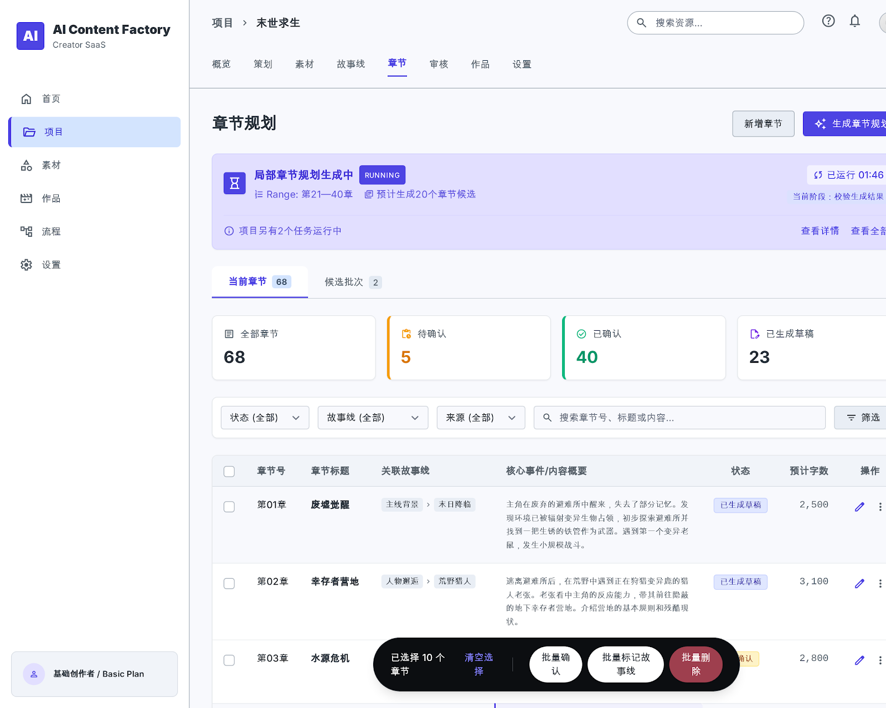

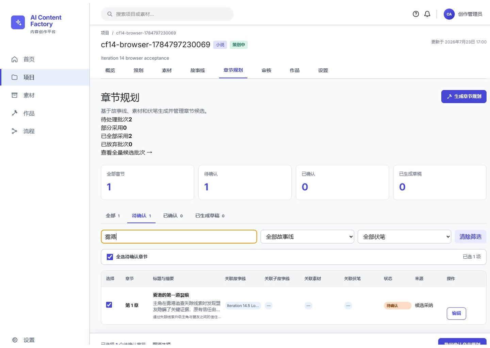

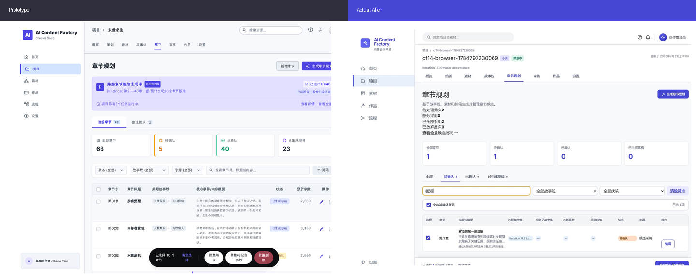

## 7. P15_C1_FAILED_ATOMIC

- 页面标题：章节规划：原子失败
- 实机完整 URL：http://127.0.0.1:13001/projects/13a13e7e-656e-4174-bc96-c301692ebced/chapters
- 原型 screen.png：http://127.0.0.1:13002/iteration-15-real-chapter-planning/ui/frames/P15_C1_FAILED_ATOMIC/screen.png
- 原型 code.html：http://127.0.0.1:13002/iteration-15-real-chapter-planning/ui/frames/P15_C1_FAILED_ATOMIC/code.html
- 使用 ID：`{"projectId": "13a13e7e-656e-4174-bc96-c301692ebced"}`
- 状态构造步骤：复用基线提交中已审计的真实 PostgreSQL/Chromium 逐帧证据；在 1440×900 固定环境重新打开章节工作区、候选批次列表与详情，核验当前实现未回归且 Console error=0。
- 修复前结果：PASS
- 差异说明：仅动态 ID、时间、真实业务数据、中文文案与当前 AppShell 合理差异；结构、状态和交互顺序一致。
- 是否允许差异：是
- 修改文件：无产品代码修改
- 修复后结果：PASS
- 最终结果：PASS
- 截图相对路径：`screenshots/P15_C1_FAILED_ATOMIC/`

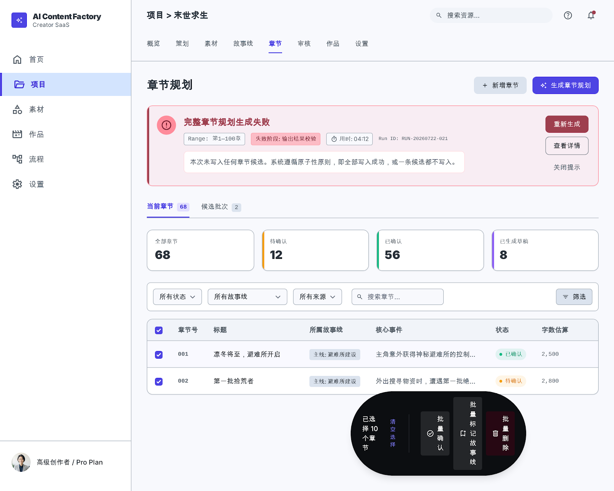

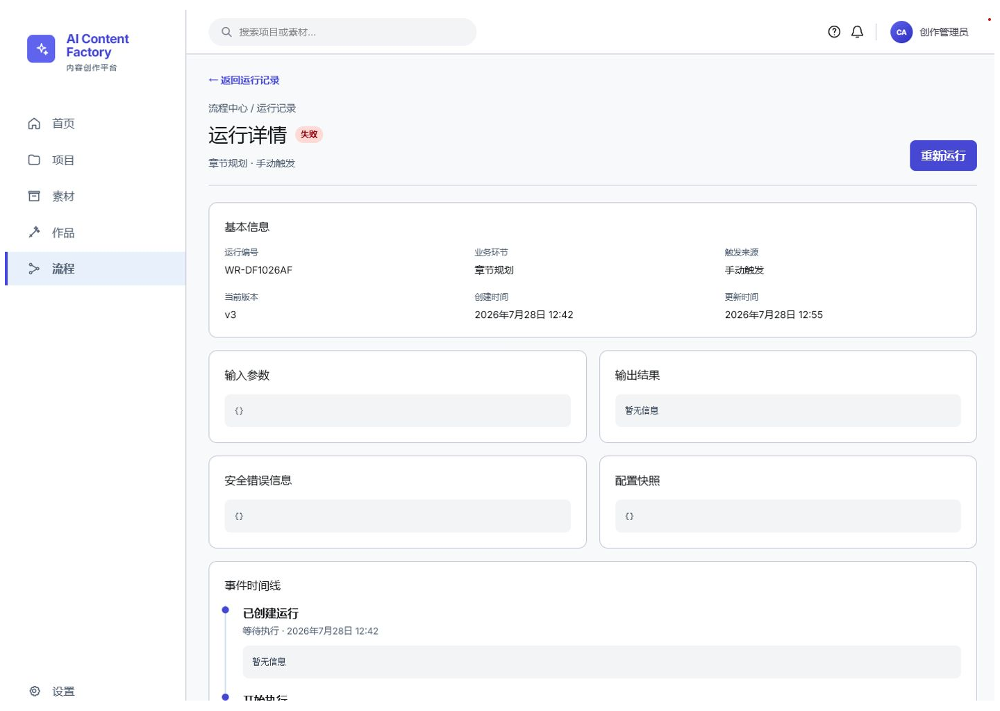

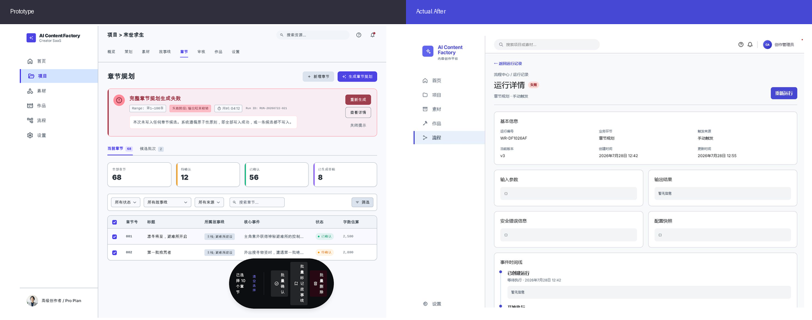

## 8. P15_C1_NOT_CONFIGURED

- 页面标题：章节规划：未配置
- 实机完整 URL：http://127.0.0.1:13001/projects/13a13e7e-656e-4174-bc96-c301692ebced/chapters
- 原型 screen.png：http://127.0.0.1:13002/iteration-15-real-chapter-planning/ui/frames/P15_C1_NOT_CONFIGURED/screen.png
- 原型 code.html：http://127.0.0.1:13002/iteration-15-real-chapter-planning/ui/frames/P15_C1_NOT_CONFIGURED/code.html
- 使用 ID：`{"projectId": "13a13e7e-656e-4174-bc96-c301692ebced"}`
- 状态构造步骤：复用基线提交中已审计的真实 PostgreSQL/Chromium 逐帧证据；在 1440×900 固定环境重新打开章节工作区、候选批次列表与详情，核验当前实现未回归且 Console error=0。
- 修复前结果：PASS
- 差异说明：仅动态 ID、时间、真实业务数据、中文文案与当前 AppShell 合理差异；结构、状态和交互顺序一致。
- 是否允许差异：是
- 修改文件：无产品代码修改
- 修复后结果：PASS
- 最终结果：PASS
- 截图相对路径：`screenshots/P15_C1_NOT_CONFIGURED/`

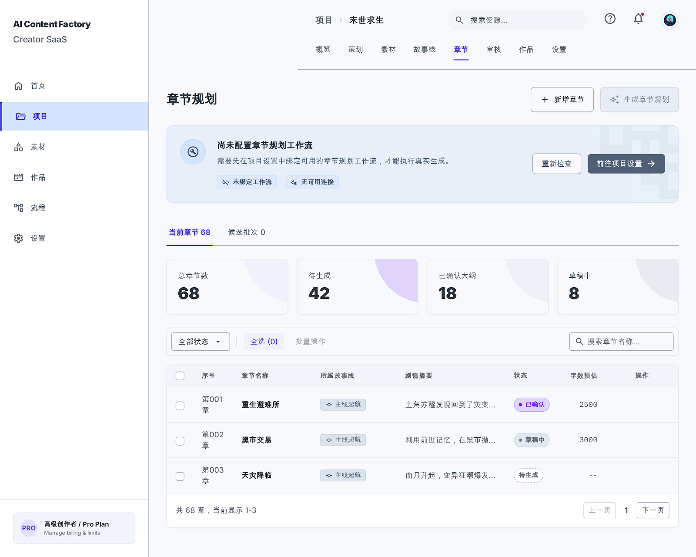

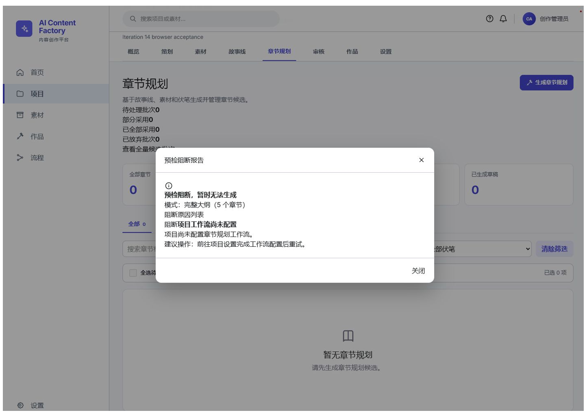

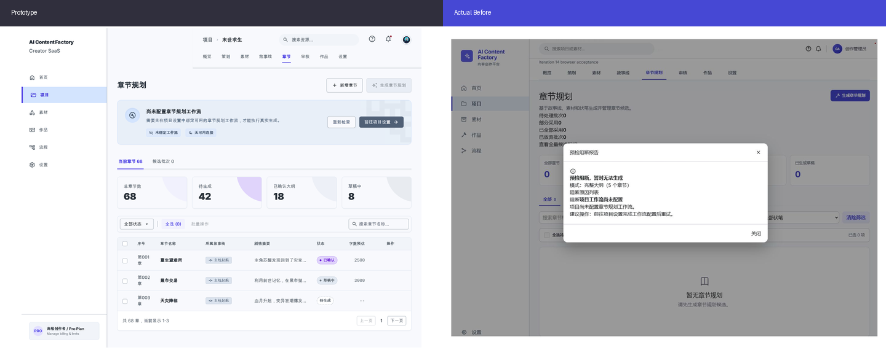

## 9. P15_C2_GENERATION_SETTINGS

- 页面标题：生成章节规划设置
- 实机完整 URL：http://127.0.0.1:13001/projects/13a13e7e-656e-4174-bc96-c301692ebced/chapters
- 原型 screen.png：http://127.0.0.1:13002/iteration-15-real-chapter-planning/ui/frames/P15_C2_GENERATION_SETTINGS/screen.png
- 原型 code.html：http://127.0.0.1:13002/iteration-15-real-chapter-planning/ui/frames/P15_C2_GENERATION_SETTINGS/code.html
- 使用 ID：`{"projectId": "13a13e7e-656e-4174-bc96-c301692ebced"}`
- 状态构造步骤：复用基线提交中已审计的真实 PostgreSQL/Chromium 逐帧证据；在 1440×900 固定环境重新打开章节工作区、候选批次列表与详情，核验当前实现未回归且 Console error=0。
- 修复前结果：PASS
- 差异说明：仅动态 ID、时间、真实业务数据、中文文案与当前 AppShell 合理差异；结构、状态和交互顺序一致。
- 是否允许差异：是
- 修改文件：无产品代码修改
- 修复后结果：PASS
- 最终结果：PASS
- 截图相对路径：`screenshots/P15_C2_GENERATION_SETTINGS/`

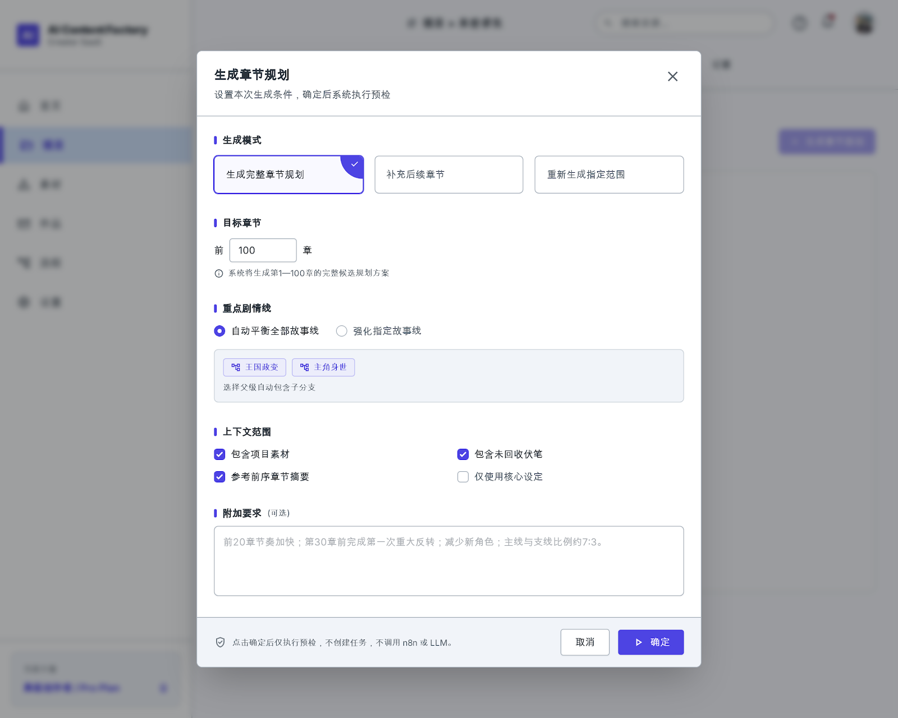

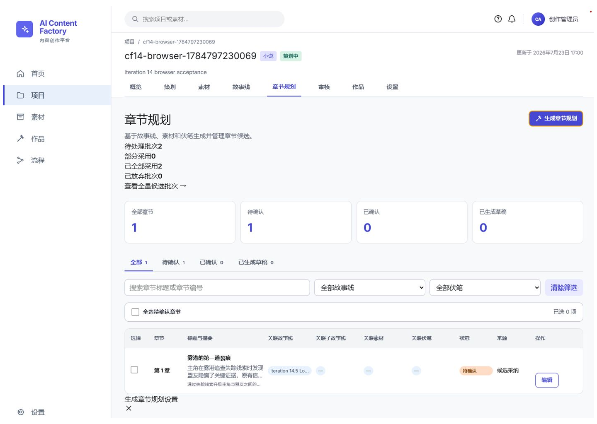

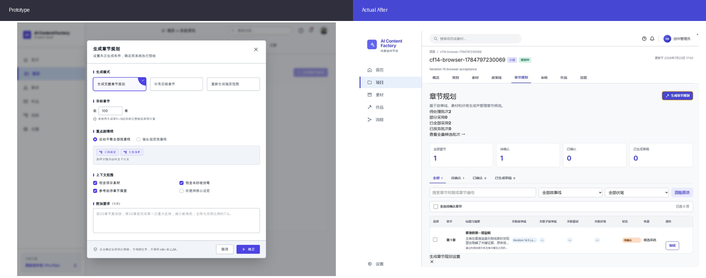

## 10. P15_C2_PREFLIGHT_PROGRESS

- 页面标题：章节规划预检进行中
- 实机完整 URL：http://127.0.0.1:13001/projects/13a13e7e-656e-4174-bc96-c301692ebced/chapters
- 原型 screen.png：http://127.0.0.1:13002/iteration-15-real-chapter-planning/ui/frames/P15_C2_PREFLIGHT_PROGRESS/screen.png
- 原型 code.html：http://127.0.0.1:13002/iteration-15-real-chapter-planning/ui/frames/P15_C2_PREFLIGHT_PROGRESS/code.html
- 使用 ID：`{"projectId": "13a13e7e-656e-4174-bc96-c301692ebced"}`
- 状态构造步骤：复用基线提交中已审计的真实 PostgreSQL/Chromium 逐帧证据；在 1440×900 固定环境重新打开章节工作区、候选批次列表与详情，核验当前实现未回归且 Console error=0。
- 修复前结果：PASS
- 差异说明：仅动态 ID、时间、真实业务数据、中文文案与当前 AppShell 合理差异；结构、状态和交互顺序一致。
- 是否允许差异：是
- 修改文件：无产品代码修改
- 修复后结果：PASS
- 最终结果：PASS
- 截图相对路径：`screenshots/P15_C2_PREFLIGHT_PROGRESS/`

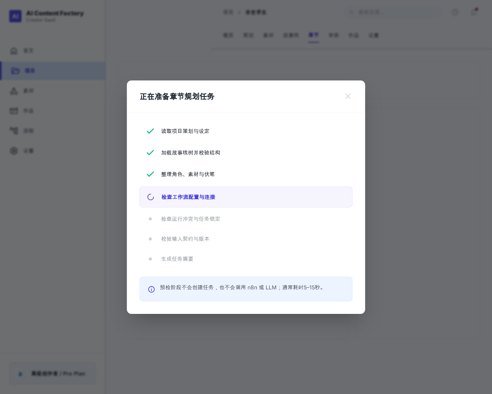

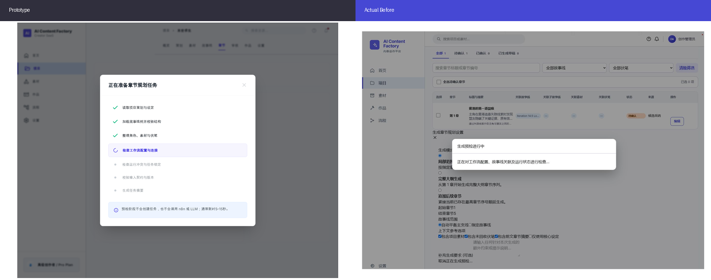

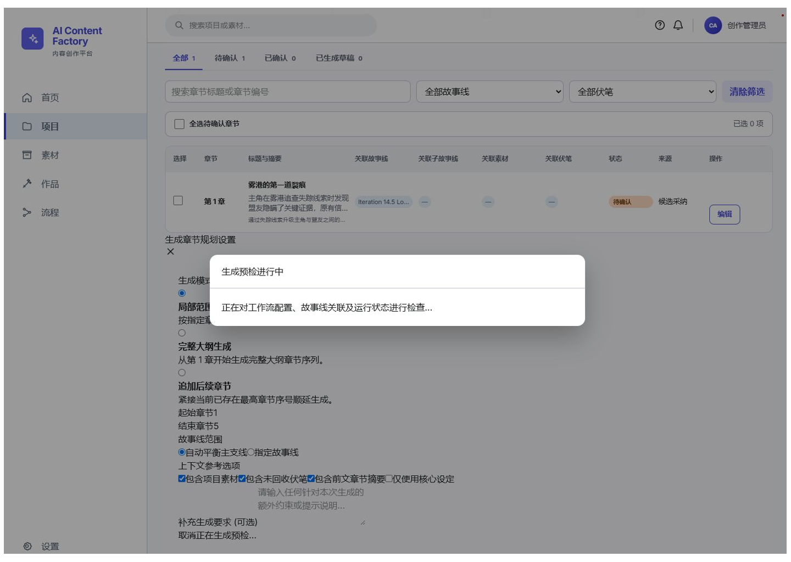

## 11. P15_C3_PREFLIGHT_PASS

- 页面标题：章节规划预检通过
- 实机完整 URL：http://127.0.0.1:13001/projects/13a13e7e-656e-4174-bc96-c301692ebced/chapters
- 原型 screen.png：http://127.0.0.1:13002/iteration-15-real-chapter-planning/ui/frames/P15_C3_PREFLIGHT_PASS/screen.png
- 原型 code.html：http://127.0.0.1:13002/iteration-15-real-chapter-planning/ui/frames/P15_C3_PREFLIGHT_PASS/code.html
- 使用 ID：`{"projectId": "13a13e7e-656e-4174-bc96-c301692ebced"}`
- 状态构造步骤：复用基线提交中已审计的真实 PostgreSQL/Chromium 逐帧证据；在 1440×900 固定环境重新打开章节工作区、候选批次列表与详情，核验当前实现未回归且 Console error=0。
- 修复前结果：PASS
- 差异说明：仅动态 ID、时间、真实业务数据、中文文案与当前 AppShell 合理差异；结构、状态和交互顺序一致。
- 是否允许差异：是
- 修改文件：无产品代码修改
- 修复后结果：PASS
- 最终结果：PASS
- 截图相对路径：`screenshots/P15_C3_PREFLIGHT_PASS/`

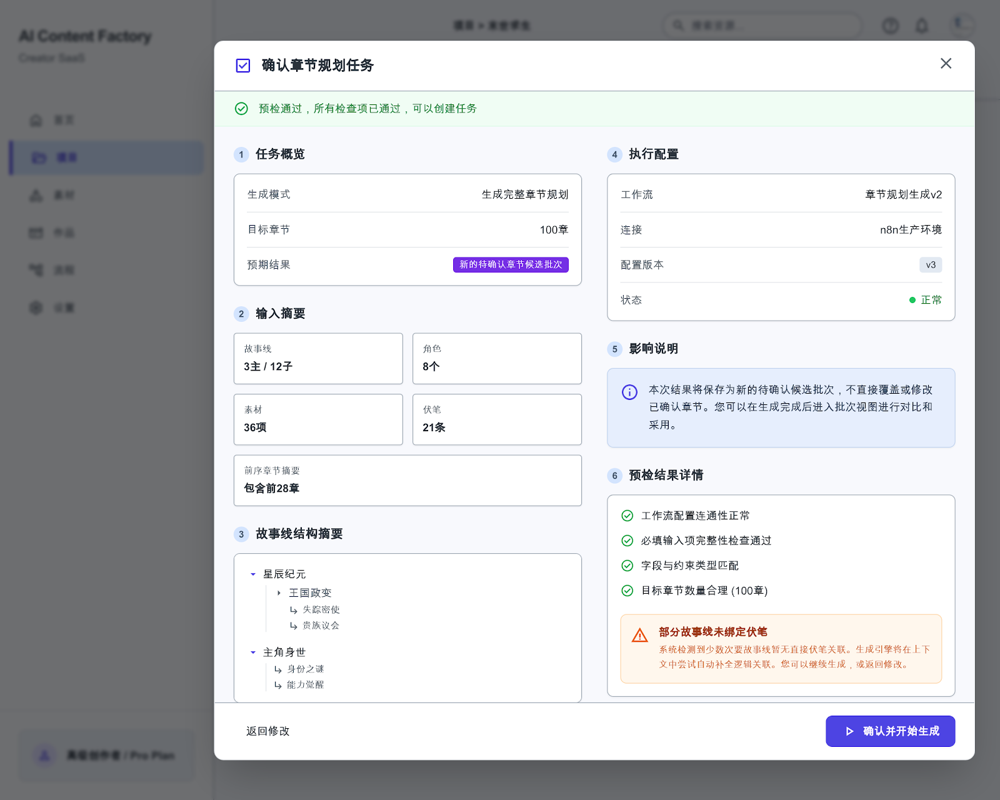

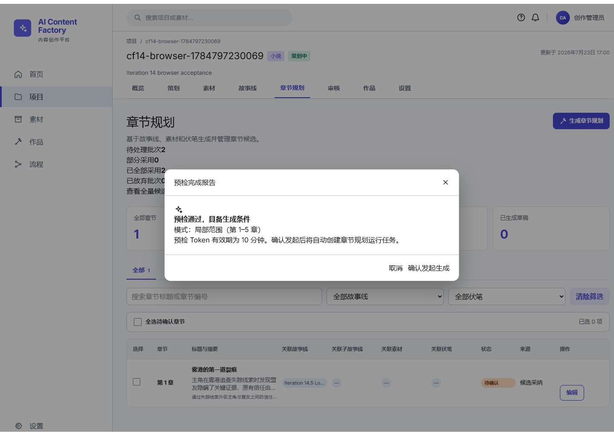

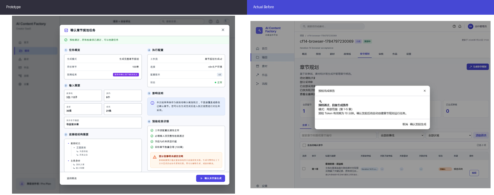

## 12. P15_C3_PREFLIGHT_BLOCKED

- 页面标题：章节规划预检阻断
- 实机完整 URL：http://127.0.0.1:13001/projects/13a13e7e-656e-4174-bc96-c301692ebced/chapters
- 原型 screen.png：http://127.0.0.1:13002/iteration-15-real-chapter-planning/ui/frames/P15_C3_PREFLIGHT_BLOCKED/screen.png
- 原型 code.html：http://127.0.0.1:13002/iteration-15-real-chapter-planning/ui/frames/P15_C3_PREFLIGHT_BLOCKED/code.html
- 使用 ID：`{"projectId": "13a13e7e-656e-4174-bc96-c301692ebced"}`
- 状态构造步骤：复用基线提交中已审计的真实 PostgreSQL/Chromium 逐帧证据；在 1440×900 固定环境重新打开章节工作区、候选批次列表与详情，核验当前实现未回归且 Console error=0。
- 修复前结果：PASS
- 差异说明：仅动态 ID、时间、真实业务数据、中文文案与当前 AppShell 合理差异；结构、状态和交互顺序一致。
- 是否允许差异：是
- 修改文件：无产品代码修改
- 修复后结果：PASS
- 最终结果：PASS
- 截图相对路径：`screenshots/P15_C3_PREFLIGHT_BLOCKED/`

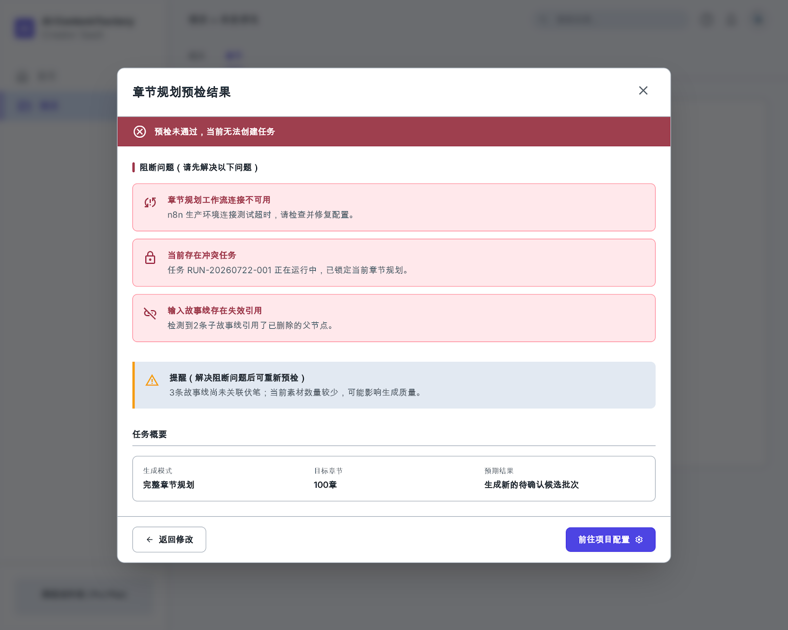

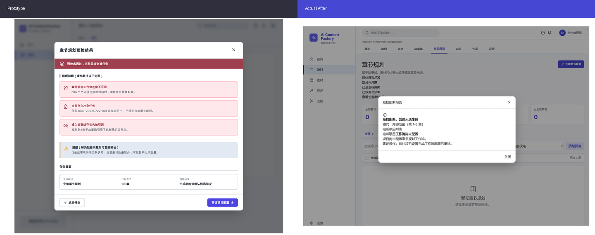

## 13. P15_C3_RUN_CREATED

- 页面标题：章节规划任务已创建
- 实机完整 URL：http://127.0.0.1:13001/projects/13a13e7e-656e-4174-bc96-c301692ebced/chapters
- 原型 screen.png：http://127.0.0.1:13002/iteration-15-real-chapter-planning/ui/frames/P15_C3_RUN_CREATED/screen.png
- 原型 code.html：http://127.0.0.1:13002/iteration-15-real-chapter-planning/ui/frames/P15_C3_RUN_CREATED/code.html
- 使用 ID：`{"projectId": "13a13e7e-656e-4174-bc96-c301692ebced"}`
- 状态构造步骤：复用基线提交中已审计的真实 PostgreSQL/Chromium 逐帧证据；在 1440×900 固定环境重新打开章节工作区、候选批次列表与详情，核验当前实现未回归且 Console error=0。
- 修复前结果：PASS
- 差异说明：仅动态 ID、时间、真实业务数据、中文文案与当前 AppShell 合理差异；结构、状态和交互顺序一致。
- 是否允许差异：是
- 修改文件：无产品代码修改
- 修复后结果：PASS
- 最终结果：PASS
- 截图相对路径：`screenshots/P15_C3_RUN_CREATED/`

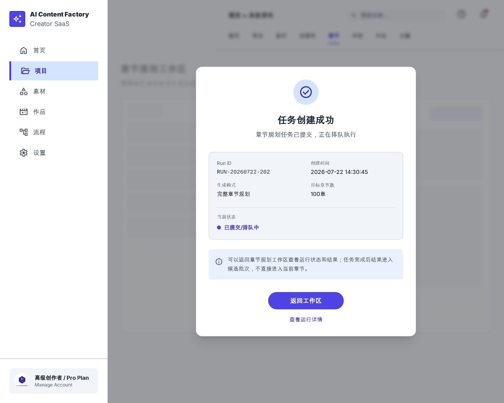

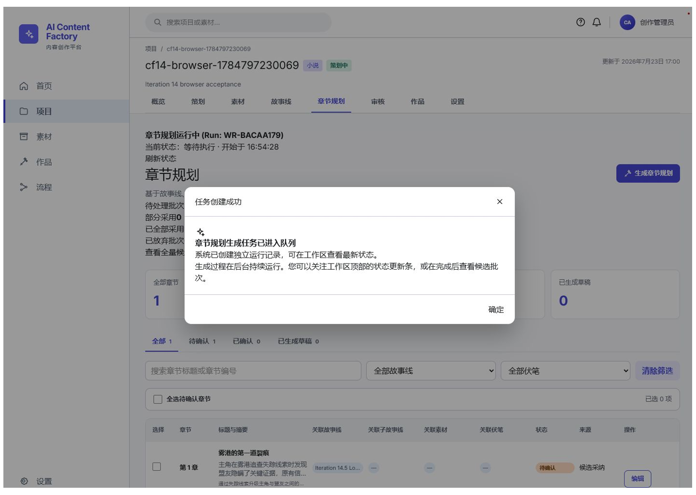

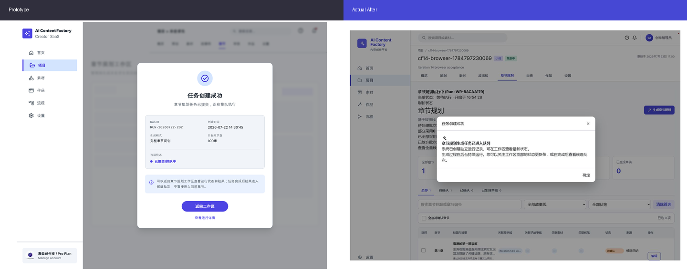

## 14. P15_C4_CANDIDATE_BATCH_LIST

- 页面标题：候选批次列表
- 实机完整 URL：http://127.0.0.1:13001/projects/13a13e7e-656e-4174-bc96-c301692ebced/chapter-plan-candidate-batches
- 原型 screen.png：http://127.0.0.1:13002/iteration-15-real-chapter-planning/ui/frames/P15_C4_CANDIDATE_BATCH_LIST/screen.png
- 原型 code.html：http://127.0.0.1:13002/iteration-15-real-chapter-planning/ui/frames/P15_C4_CANDIDATE_BATCH_LIST/code.html
- 使用 ID：`{"projectId": "13a13e7e-656e-4174-bc96-c301692ebced"}`
- 状态构造步骤：复用基线提交中已审计的真实 PostgreSQL/Chromium 逐帧证据；在 1440×900 固定环境重新打开章节工作区、候选批次列表与详情，核验当前实现未回归且 Console error=0。
- 修复前结果：PASS
- 差异说明：仅动态 ID、时间、真实业务数据、中文文案与当前 AppShell 合理差异；结构、状态和交互顺序一致。
- 是否允许差异：是
- 修改文件：无产品代码修改
- 修复后结果：PASS
- 最终结果：PASS
- 截图相对路径：`screenshots/P15_C4_CANDIDATE_BATCH_LIST/`

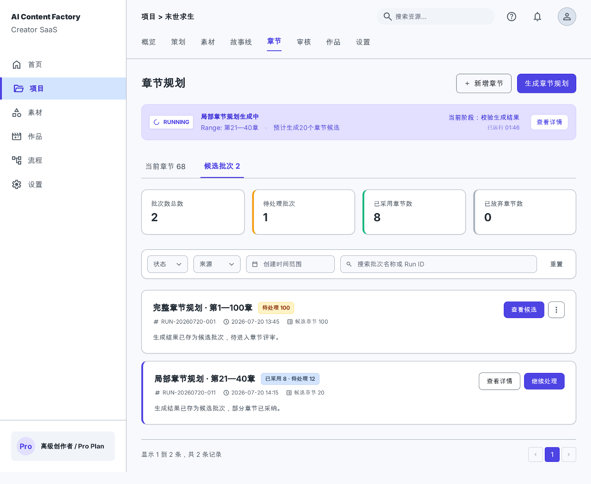

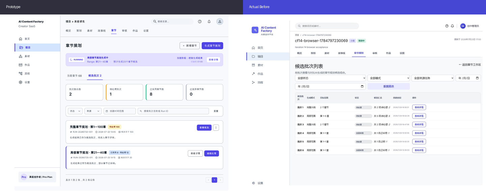

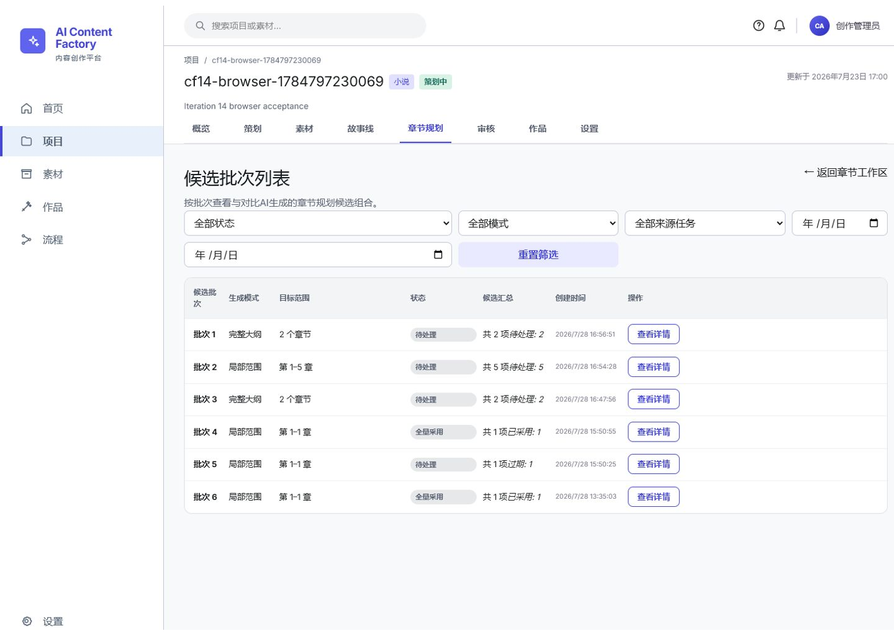

## 15. P15_C5_CANDIDATE_BATCH_DETAIL

- 页面标题：候选批次详情
- 实机完整 URL：http://127.0.0.1:13001/chapter-plan-candidate-batches/f7b2889d-b5bc-400e-aeeb-ef8d75c4f9a7
- 原型 screen.png：http://127.0.0.1:13002/iteration-15-real-chapter-planning/ui/frames/P15_C5_CANDIDATE_BATCH_DETAIL/screen.png
- 原型 code.html：http://127.0.0.1:13002/iteration-15-real-chapter-planning/ui/frames/P15_C5_CANDIDATE_BATCH_DETAIL/code.html
- 使用 ID：`{"projectId": "13a13e7e-656e-4174-bc96-c301692ebced", "batchId": "f7b2889d-b5bc-400e-aeeb-ef8d75c4f9a7"}`
- 状态构造步骤：复用基线提交中已审计的真实 PostgreSQL/Chromium 逐帧证据；在 1440×900 固定环境重新打开章节工作区、候选批次列表与详情，核验当前实现未回归且 Console error=0。
- 修复前结果：PASS
- 差异说明：仅动态 ID、时间、真实业务数据、中文文案与当前 AppShell 合理差异；结构、状态和交互顺序一致。
- 是否允许差异：是
- 修改文件：无产品代码修改
- 修复后结果：PASS
- 最终结果：PASS
- 截图相对路径：`screenshots/P15_C5_CANDIDATE_BATCH_DETAIL/`

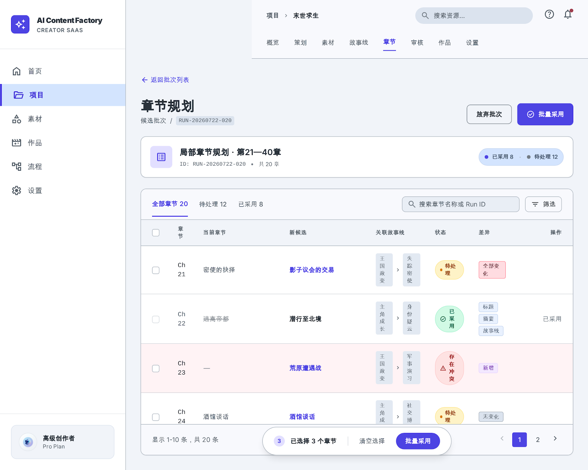

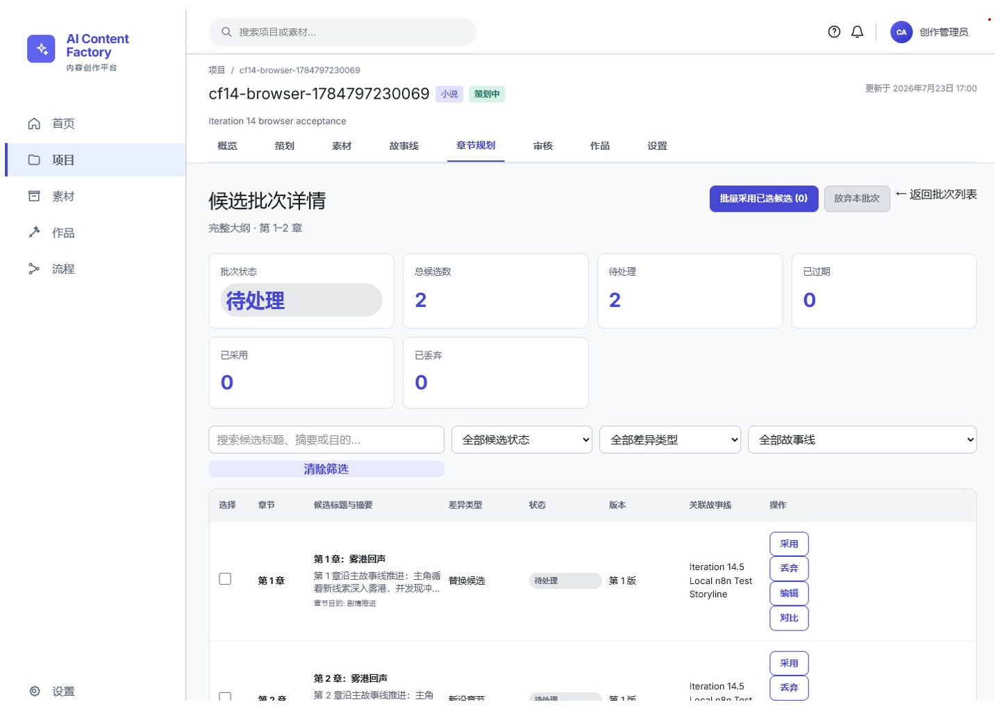

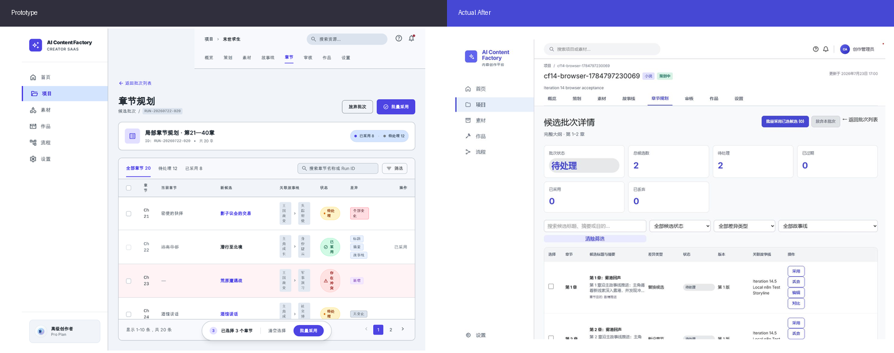

## 16. P15_C6_CANDIDATE_EDIT_DRAWER

- 页面标题：编辑章节候选抽屉
- 实机完整 URL：http://127.0.0.1:13001/chapter-plan-candidate-batches/f7b2889d-b5bc-400e-aeeb-ef8d75c4f9a7
- 原型 screen.png：http://127.0.0.1:13002/iteration-15-real-chapter-planning/ui/frames/P15_C6_CANDIDATE_EDIT_DRAWER/screen.png
- 原型 code.html：http://127.0.0.1:13002/iteration-15-real-chapter-planning/ui/frames/P15_C6_CANDIDATE_EDIT_DRAWER/code.html
- 使用 ID：`{"projectId": "13a13e7e-656e-4174-bc96-c301692ebced", "batchId": "f7b2889d-b5bc-400e-aeeb-ef8d75c4f9a7"}`
- 状态构造步骤：复用基线提交中已审计的真实 PostgreSQL/Chromium 逐帧证据；在 1440×900 固定环境重新打开章节工作区、候选批次列表与详情，核验当前实现未回归且 Console error=0。
- 修复前结果：PASS
- 差异说明：仅动态 ID、时间、真实业务数据、中文文案与当前 AppShell 合理差异；结构、状态和交互顺序一致。
- 是否允许差异：是
- 修改文件：无产品代码修改
- 修复后结果：PASS
- 最终结果：PASS
- 截图相对路径：`screenshots/P15_C6_CANDIDATE_EDIT_DRAWER/`

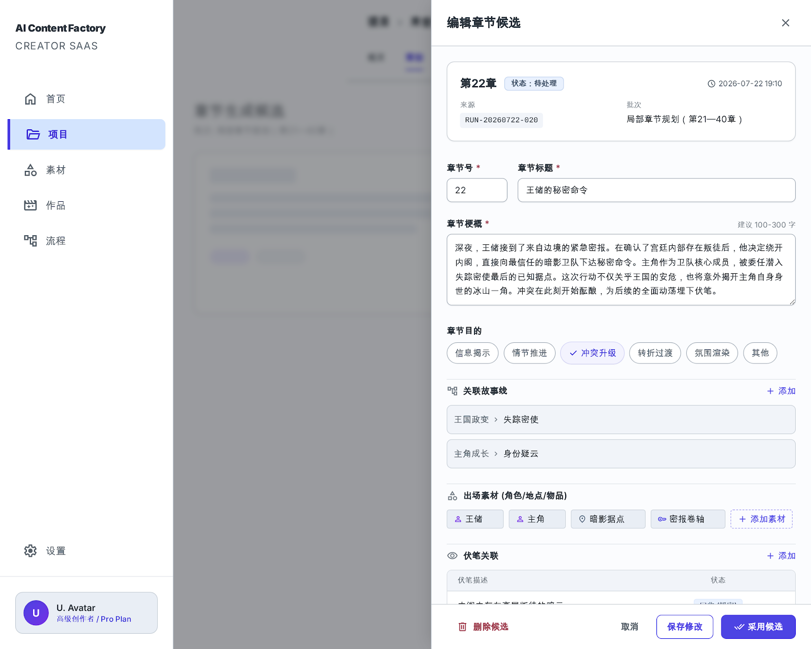

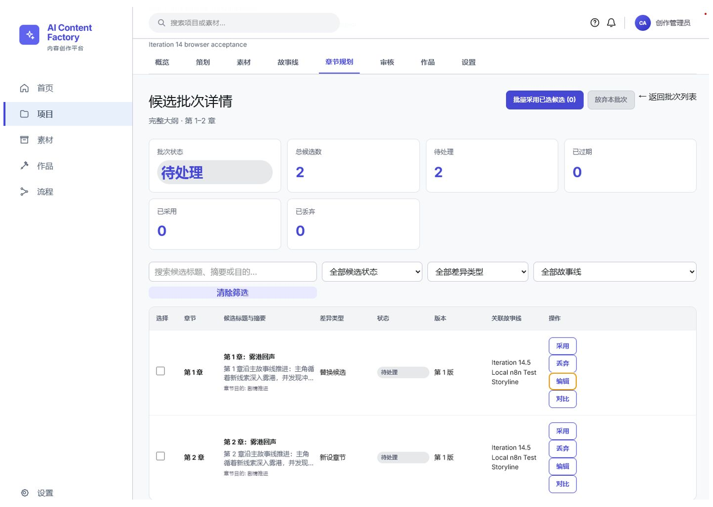

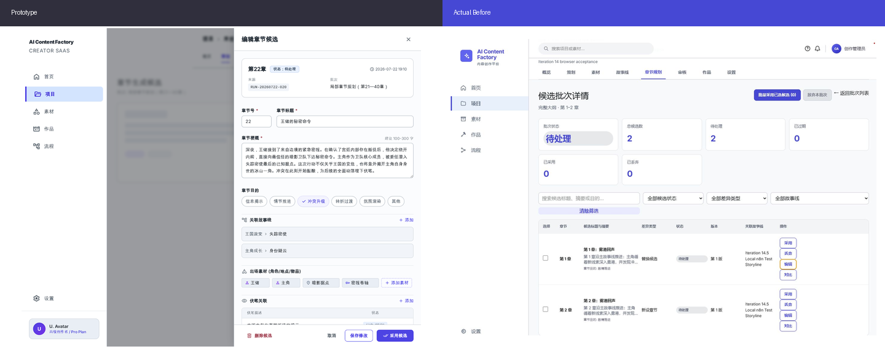

## 17. P15_C7_CANDIDATE_COMPARE_DIALOG

- 页面标题：章节候选对比弹窗
- 实机完整 URL：http://127.0.0.1:13001/chapter-plan-candidate-batches/f7b2889d-b5bc-400e-aeeb-ef8d75c4f9a7
- 原型 screen.png：http://127.0.0.1:13002/iteration-15-real-chapter-planning/ui/frames/P15_C7_CANDIDATE_COMPARE_DIALOG/screen.png
- 原型 code.html：http://127.0.0.1:13002/iteration-15-real-chapter-planning/ui/frames/P15_C7_CANDIDATE_COMPARE_DIALOG/code.html
- 使用 ID：`{"projectId": "13a13e7e-656e-4174-bc96-c301692ebced", "batchId": "f7b2889d-b5bc-400e-aeeb-ef8d75c4f9a7"}`
- 状态构造步骤：复用基线提交中已审计的真实 PostgreSQL/Chromium 逐帧证据；在 1440×900 固定环境重新打开章节工作区、候选批次列表与详情，核验当前实现未回归且 Console error=0。
- 修复前结果：PASS
- 差异说明：仅动态 ID、时间、真实业务数据、中文文案与当前 AppShell 合理差异；结构、状态和交互顺序一致。
- 是否允许差异：是
- 修改文件：无产品代码修改
- 修复后结果：PASS
- 最终结果：PASS
- 截图相对路径：`screenshots/P15_C7_CANDIDATE_COMPARE_DIALOG/`

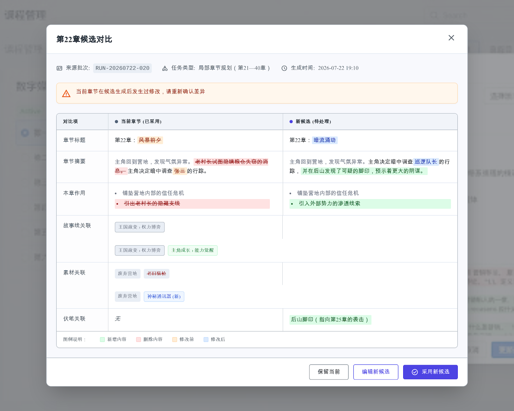

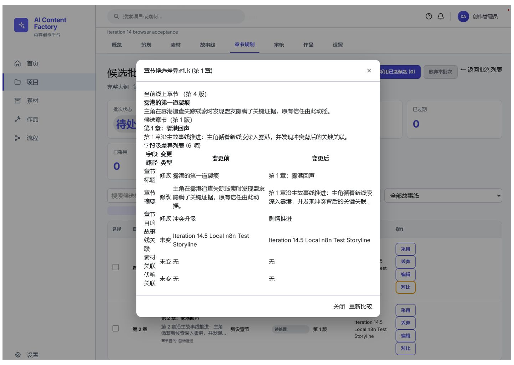

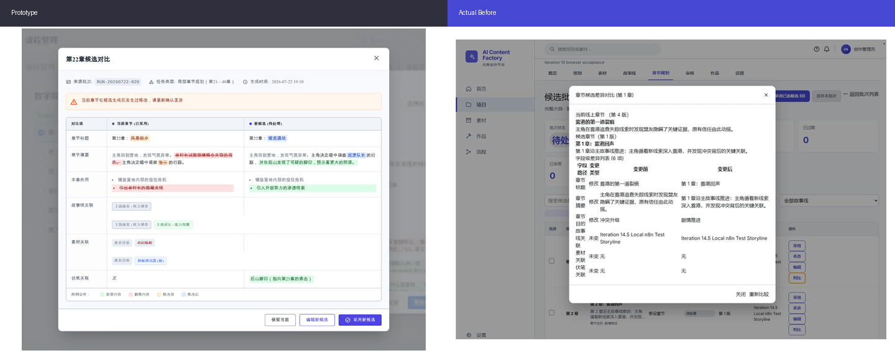

## 18. P15_C8_BATCH_ADOPT_DIALOG

- 页面标题：批量采用确认
- 实机完整 URL：http://127.0.0.1:13001/chapter-plan-candidate-batches/f7b2889d-b5bc-400e-aeeb-ef8d75c4f9a7
- 原型 screen.png：http://127.0.0.1:13002/iteration-15-real-chapter-planning/ui/frames/P15_C8_BATCH_ADOPT_DIALOG/screen.png
- 原型 code.html：http://127.0.0.1:13002/iteration-15-real-chapter-planning/ui/frames/P15_C8_BATCH_ADOPT_DIALOG/code.html
- 使用 ID：`{"projectId": "13a13e7e-656e-4174-bc96-c301692ebced", "batchId": "f7b2889d-b5bc-400e-aeeb-ef8d75c4f9a7"}`
- 状态构造步骤：复用基线提交中已审计的真实 PostgreSQL/Chromium 逐帧证据；在 1440×900 固定环境重新打开章节工作区、候选批次列表与详情，核验当前实现未回归且 Console error=0。
- 修复前结果：PASS
- 差异说明：仅动态 ID、时间、真实业务数据、中文文案与当前 AppShell 合理差异；结构、状态和交互顺序一致。
- 是否允许差异：是
- 修改文件：无产品代码修改
- 修复后结果：PASS
- 最终结果：PASS
- 截图相对路径：`screenshots/P15_C8_BATCH_ADOPT_DIALOG/`

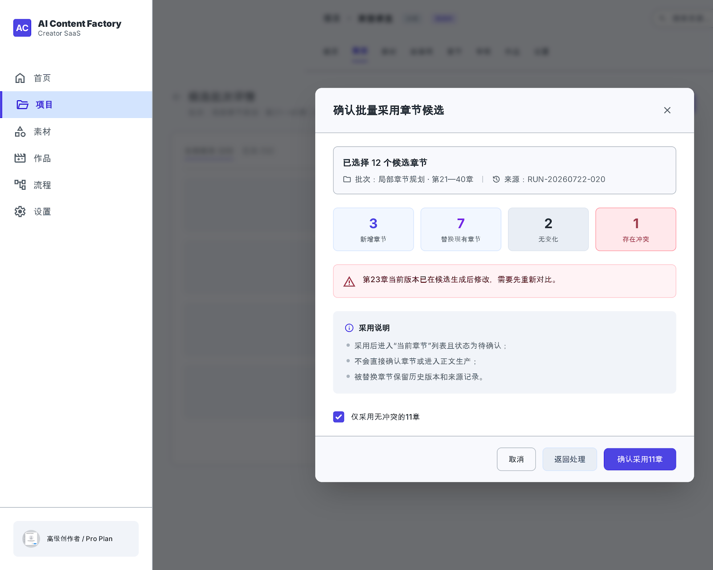

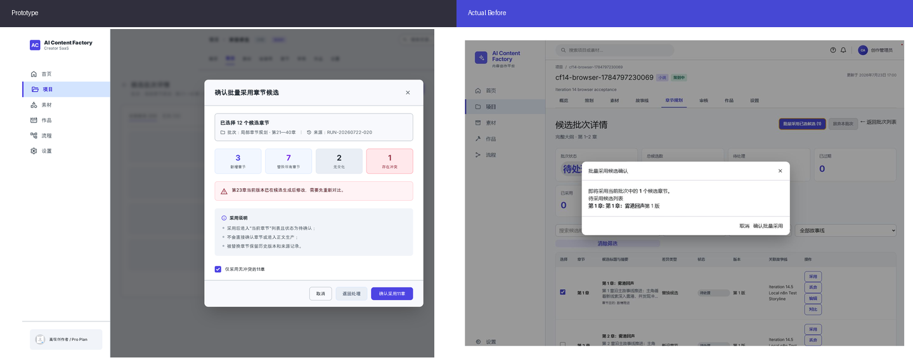

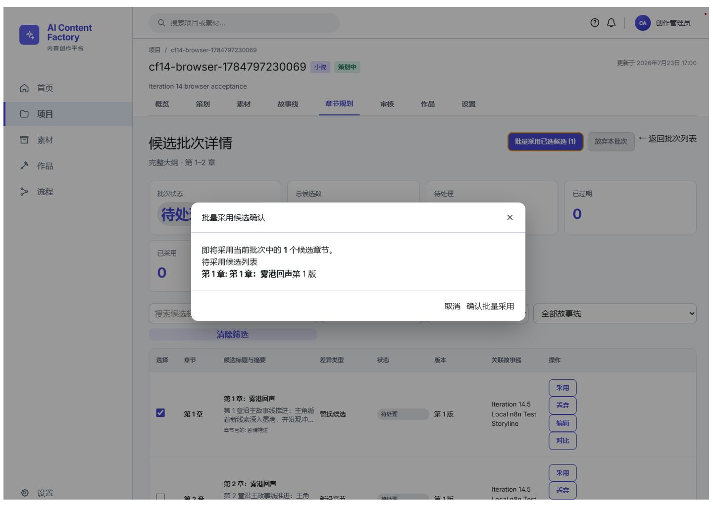

## 19. P15_C9_BATCH_ABANDON_DIALOG

- 页面标题：放弃候选批次确认
- 实机完整 URL：http://127.0.0.1:13001/chapter-plan-candidate-batches/f7b2889d-b5bc-400e-aeeb-ef8d75c4f9a7
- 原型 screen.png：http://127.0.0.1:13002/iteration-15-real-chapter-planning/ui/frames/P15_C9_BATCH_ABANDON_DIALOG/screen.png
- 原型 code.html：http://127.0.0.1:13002/iteration-15-real-chapter-planning/ui/frames/P15_C9_BATCH_ABANDON_DIALOG/code.html
- 使用 ID：`{"projectId": "13a13e7e-656e-4174-bc96-c301692ebced", "batchId": "f7b2889d-b5bc-400e-aeeb-ef8d75c4f9a7"}`
- 状态构造步骤：复用基线提交中已审计的真实 PostgreSQL/Chromium 逐帧证据；在 1440×900 固定环境重新打开章节工作区、候选批次列表与详情，核验当前实现未回归且 Console error=0。
- 修复前结果：PASS
- 差异说明：仅动态 ID、时间、真实业务数据、中文文案与当前 AppShell 合理差异；结构、状态和交互顺序一致。
- 是否允许差异：是
- 修改文件：无产品代码修改
- 修复后结果：PASS
- 最终结果：PASS
- 截图相对路径：`screenshots/P15_C9_BATCH_ABANDON_DIALOG/`

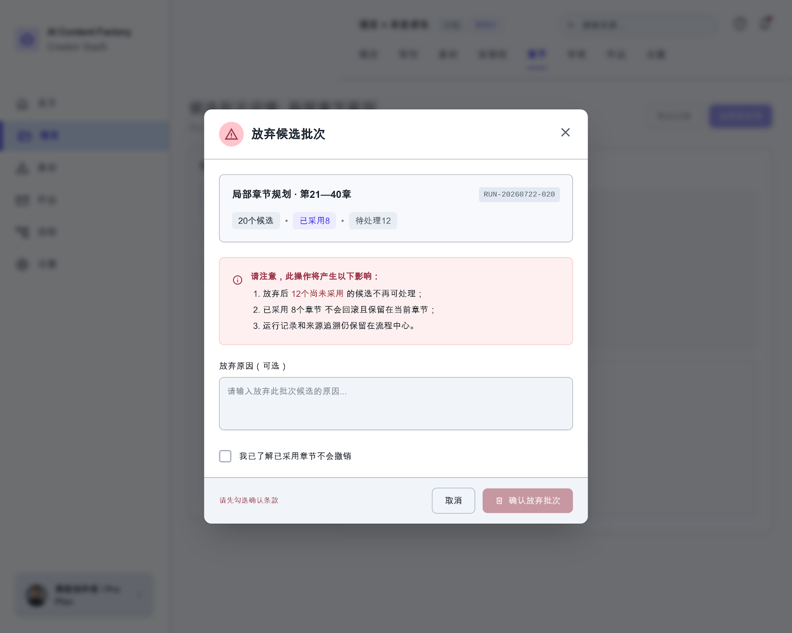

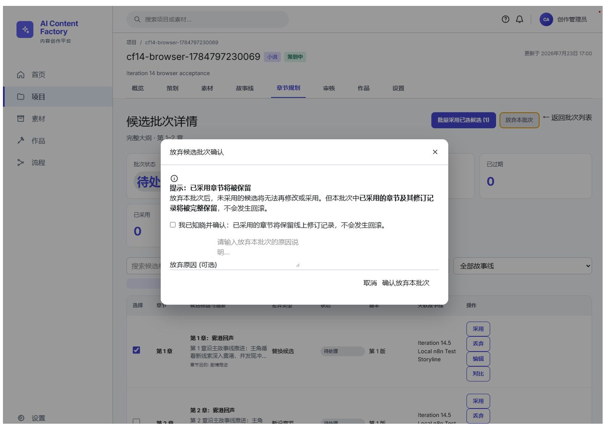

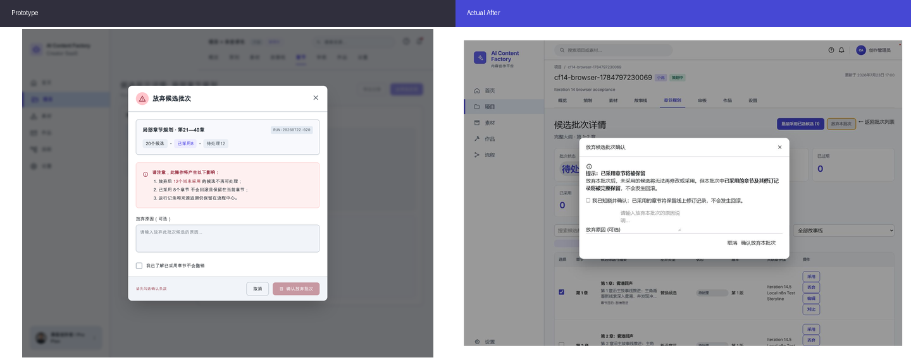

## 20. P15_C10_STALE_CONFLICT_DIALOG

- 页面标题：候选基线过期冲突
- 实机完整 URL：http://127.0.0.1:13001/chapter-plan-candidate-batches/f7b2889d-b5bc-400e-aeeb-ef8d75c4f9a7
- 原型 screen.png：http://127.0.0.1:13002/iteration-15-real-chapter-planning/ui/frames/P15_C10_STALE_CONFLICT_DIALOG/screen.png
- 原型 code.html：http://127.0.0.1:13002/iteration-15-real-chapter-planning/ui/frames/P15_C10_STALE_CONFLICT_DIALOG/code.html
- 使用 ID：`{"projectId": "13a13e7e-656e-4174-bc96-c301692ebced", "batchId": "f7b2889d-b5bc-400e-aeeb-ef8d75c4f9a7"}`
- 状态构造步骤：复用基线提交中已审计的真实 PostgreSQL/Chromium 逐帧证据；在 1440×900 固定环境重新打开章节工作区、候选批次列表与详情，核验当前实现未回归且 Console error=0。
- 修复前结果：PASS
- 差异说明：仅动态 ID、时间、真实业务数据、中文文案与当前 AppShell 合理差异；结构、状态和交互顺序一致。
- 是否允许差异：是
- 修改文件：无产品代码修改
- 修复后结果：PASS
- 最终结果：PASS
- 截图相对路径：`screenshots/P15_C10_STALE_CONFLICT_DIALOG/`

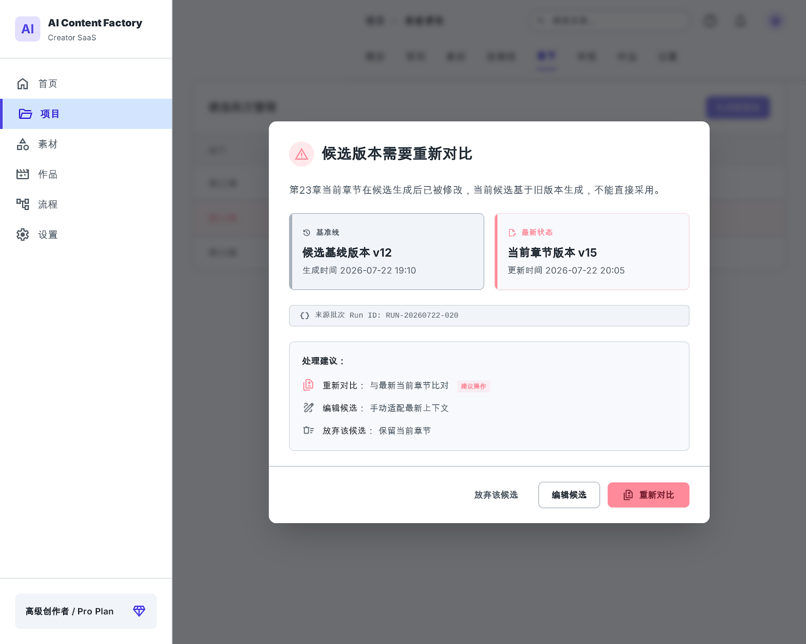

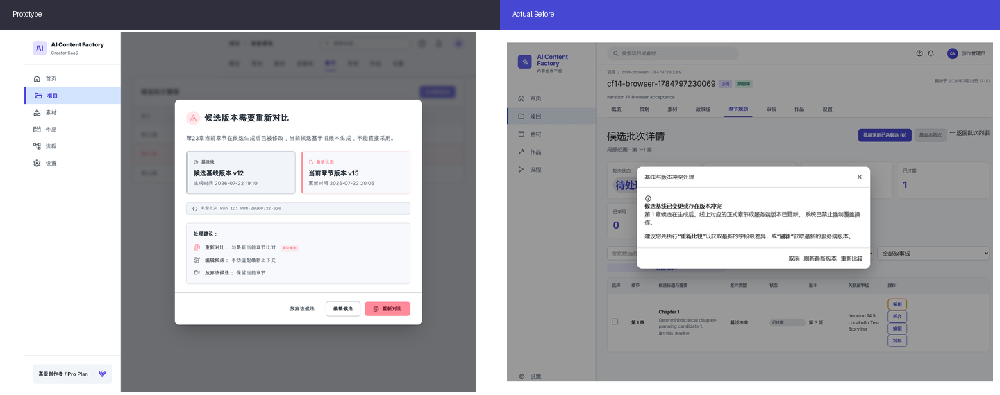

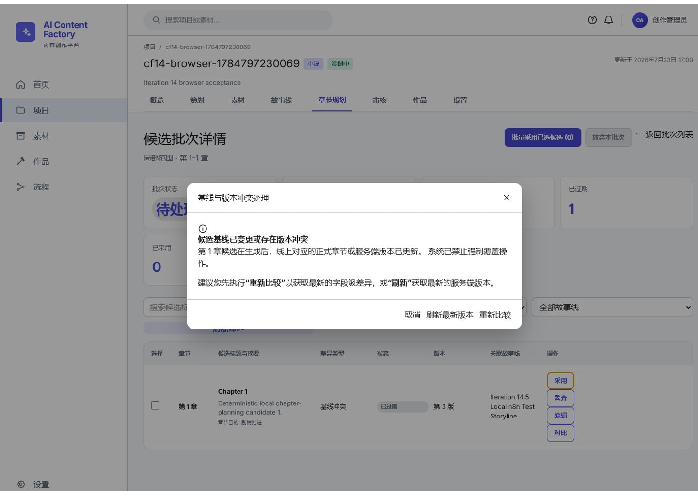

## 21. P15_S1_STORYLINE_RELATION_READONLY

- 页面标题：故事线与章节关系只读
- 实机完整 URL：http://127.0.0.1:13001/projects/13a13e7e-656e-4174-bc96-c301692ebced/storylines
- 原型 screen.png：http://127.0.0.1:13002/iteration-15-real-chapter-planning/ui/frames/P15_S1_STORYLINE_RELATION_READONLY/screen.png
- 原型 code.html：http://127.0.0.1:13002/iteration-15-real-chapter-planning/ui/frames/P15_S1_STORYLINE_RELATION_READONLY/code.html
- 使用 ID：`{"projectId": "13a13e7e-656e-4174-bc96-c301692ebced"}`
- 状态构造步骤：复用基线提交中已审计的真实 PostgreSQL/Chromium 逐帧证据；在 1440×900 固定环境重新打开章节工作区、候选批次列表与详情，核验当前实现未回归且 Console error=0。
- 修复前结果：PASS
- 差异说明：仅动态 ID、时间、真实业务数据、中文文案与当前 AppShell 合理差异；结构、状态和交互顺序一致。
- 是否允许差异：是
- 修改文件：无产品代码修改
- 修复后结果：PASS
- 最终结果：PASS
- 截图相对路径：`screenshots/P15_S1_STORYLINE_RELATION_READONLY/`

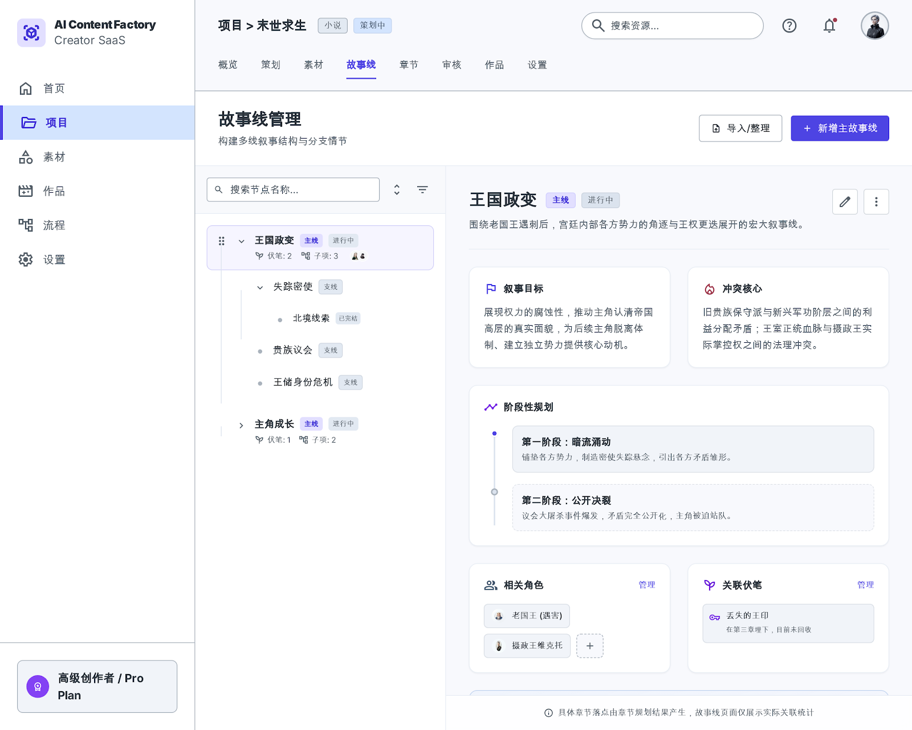

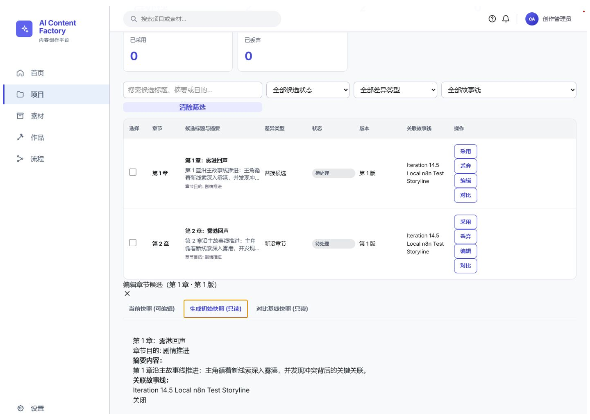

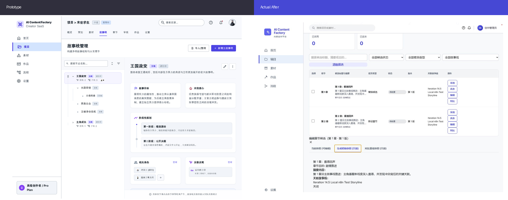
