# Iteration 16 浏览器 UI 对比验收报告

## 汇总

- Iteration：16
- Frame 总数：11
- 初次 PASS：11
- 初次 FAIL：0
- 修复成功数：0
- 未修复数：0
- Console error：0
- 最终状态：修复成功
- 修改文件：scripts/agent/browser-smoke.mjs, scripts/browser-acceptance/iteration16-config.json
- 工程测试：定向测试、完整单元测试、Typecheck、Lint、Production Build、契约校验与 git diff --check 全部 PASS

固定浏览器条件：Chromium，1440×900，deviceScaleFactor=1，100% 缩放，zh-CN，Asia/Shanghai，light，reduced motion；截图前禁用 animation/transition。

## 1. I16_D1_EDITOR_CHAPTER_GOAL

- 页面标题：正文编辑器：章节目标
- 实机完整 URL：http://127.0.0.1:13001/projects/13362446-e528-4071-a9d1-5260cc1fcd78/works/9ea091d1-b63e-409c-92dd-9b1271c508c7
- 原型 screen.png：http://127.0.0.1:13002/iteration-16-real-content-generation/ui/frames/I16_D1_EDITOR_CHAPTER_GOAL/screen.png
- 原型 code.html：http://127.0.0.1:13002/iteration-16-real-content-generation/ui/frames/I16_D1_EDITOR_CHAPTER_GOAL/code.html
- 使用 ID：`{"projectId": "13362446-e528-4071-a9d1-5260cc1fcd78", "workId": "9ea091d1-b63e-409c-92dd-9b1271c508c7"}`
- 状态构造步骤：通过仓库既有 Content Generation 浏览器 Fixture 构造 Summary/Run/Candidate 状态，使用正式生产组件与路由渲染；未修改 DOM。
- 修复前结果：PASS
- 差异说明：仅动态 ID、时间、真实业务数据、中文文案与当前 AppShell 合理差异；结构、状态和交互顺序一致。
- 是否允许差异：是
- 修改文件：无产品代码修改
- 修复后结果：PASS
- 最终结果：PASS
- 截图相对路径：`screenshots/I16_D1_EDITOR_CHAPTER_GOAL/`

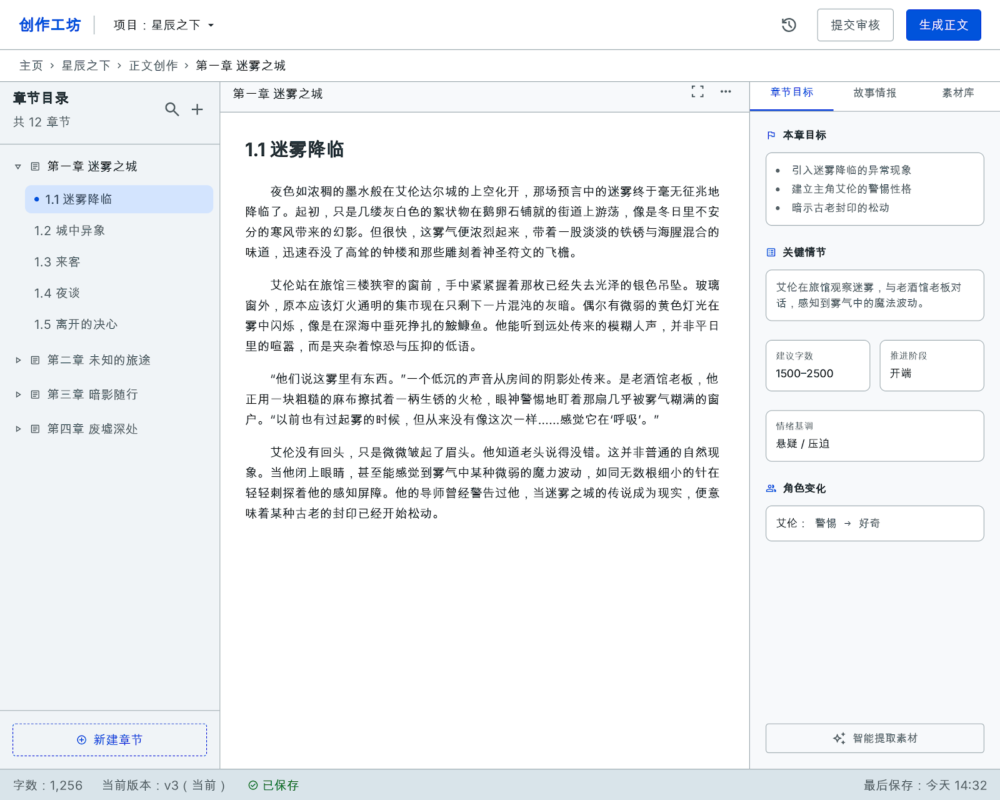

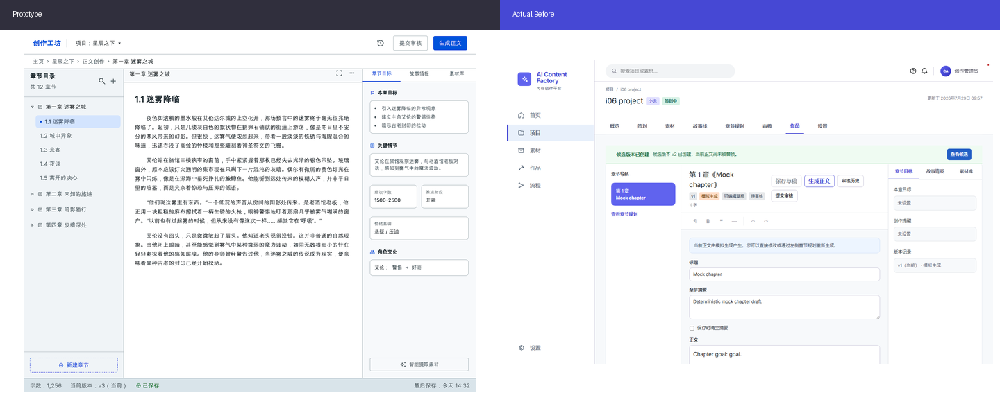

## 2. I16_D1_EDITOR_STORY_CONTEXT

- 页面标题：正文编辑器：故事情报
- 实机完整 URL：http://127.0.0.1:13001/projects/13362446-e528-4071-a9d1-5260cc1fcd78/works/9ea091d1-b63e-409c-92dd-9b1271c508c7
- 原型 screen.png：http://127.0.0.1:13002/iteration-16-real-content-generation/ui/frames/I16_D1_EDITOR_STORY_CONTEXT/screen.png
- 原型 code.html：http://127.0.0.1:13002/iteration-16-real-content-generation/ui/frames/I16_D1_EDITOR_STORY_CONTEXT/code.html
- 使用 ID：`{"projectId": "13362446-e528-4071-a9d1-5260cc1fcd78", "workId": "9ea091d1-b63e-409c-92dd-9b1271c508c7"}`
- 状态构造步骤：通过仓库既有 Content Generation 浏览器 Fixture 构造 Summary/Run/Candidate 状态，使用正式生产组件与路由渲染；未修改 DOM。
- 修复前结果：PASS
- 差异说明：仅动态 ID、时间、真实业务数据、中文文案与当前 AppShell 合理差异；结构、状态和交互顺序一致。
- 是否允许差异：是
- 修改文件：无产品代码修改
- 修复后结果：PASS
- 最终结果：PASS
- 截图相对路径：`screenshots/I16_D1_EDITOR_STORY_CONTEXT/`

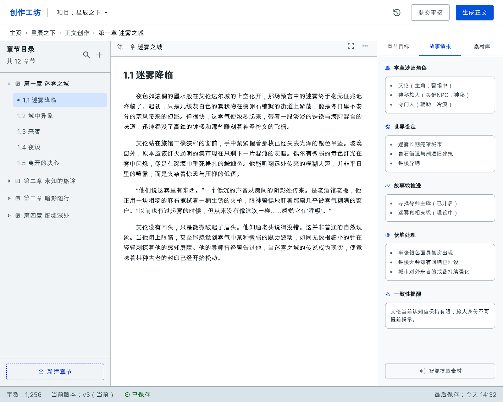

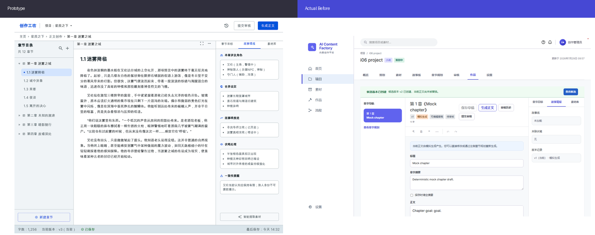

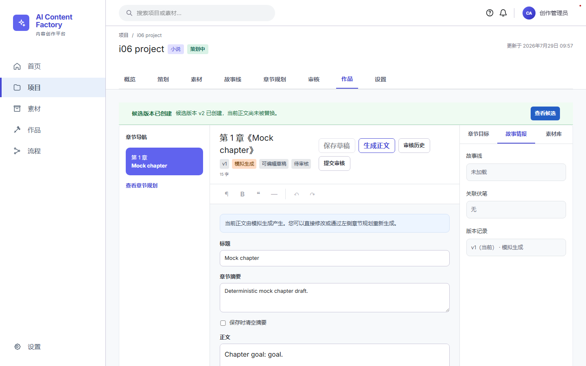

## 3. I16_D1_EDITOR_MATERIALS

- 页面标题：正文编辑器：素材库
- 实机完整 URL：http://127.0.0.1:13001/projects/13362446-e528-4071-a9d1-5260cc1fcd78/works/9ea091d1-b63e-409c-92dd-9b1271c508c7
- 原型 screen.png：http://127.0.0.1:13002/iteration-16-real-content-generation/ui/frames/I16_D1_EDITOR_MATERIALS/screen.png
- 原型 code.html：http://127.0.0.1:13002/iteration-16-real-content-generation/ui/frames/I16_D1_EDITOR_MATERIALS/code.html
- 使用 ID：`{"projectId": "13362446-e528-4071-a9d1-5260cc1fcd78", "workId": "9ea091d1-b63e-409c-92dd-9b1271c508c7"}`
- 状态构造步骤：通过仓库既有 Content Generation 浏览器 Fixture 构造 Summary/Run/Candidate 状态，使用正式生产组件与路由渲染；未修改 DOM。
- 修复前结果：PASS
- 差异说明：仅动态 ID、时间、真实业务数据、中文文案与当前 AppShell 合理差异；结构、状态和交互顺序一致。
- 是否允许差异：是
- 修改文件：无产品代码修改
- 修复后结果：PASS
- 最终结果：PASS
- 截图相对路径：`screenshots/I16_D1_EDITOR_MATERIALS/`

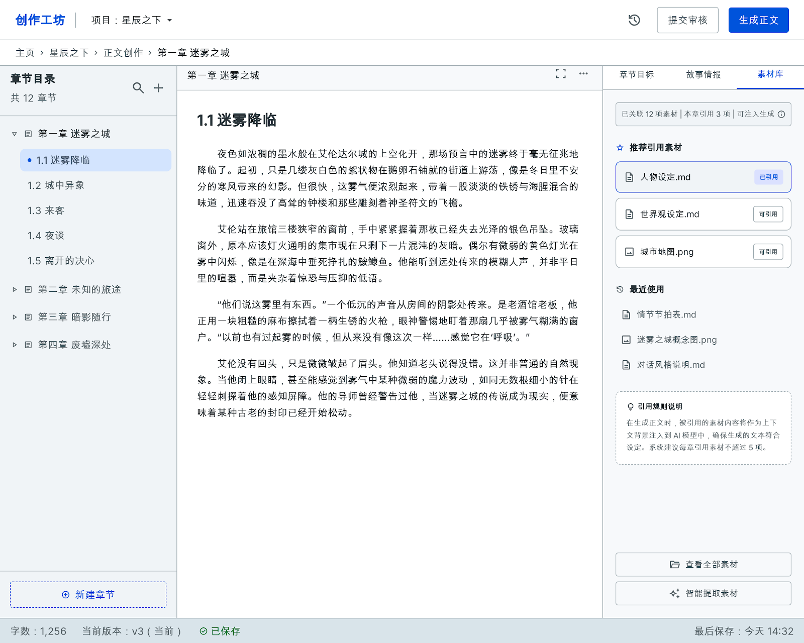

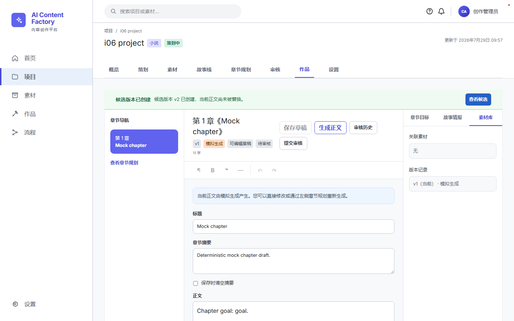

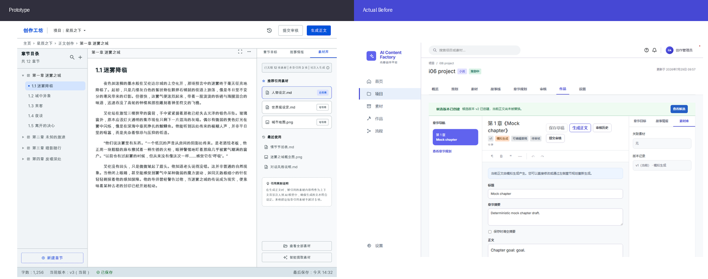

## 4. I16_D2_GENERATE_CONFIRM

- 页面标题：生成正文：运行前确认
- 实机完整 URL：http://127.0.0.1:13001/projects/13362446-e528-4071-a9d1-5260cc1fcd78/works/9ea091d1-b63e-409c-92dd-9b1271c508c7
- 原型 screen.png：http://127.0.0.1:13002/iteration-16-real-content-generation/ui/frames/I16_D2_GENERATE_CONFIRM/screen.png
- 原型 code.html：http://127.0.0.1:13002/iteration-16-real-content-generation/ui/frames/I16_D2_GENERATE_CONFIRM/code.html
- 使用 ID：`{"projectId": "13362446-e528-4071-a9d1-5260cc1fcd78", "workId": "9ea091d1-b63e-409c-92dd-9b1271c508c7"}`
- 状态构造步骤：通过仓库既有 Content Generation 浏览器 Fixture 构造 Summary/Run/Candidate 状态，使用正式生产组件与路由渲染；未修改 DOM。
- 修复前结果：PASS
- 差异说明：仅动态 ID、时间、真实业务数据、中文文案与当前 AppShell 合理差异；结构、状态和交互顺序一致。
- 是否允许差异：是
- 修改文件：无产品代码修改
- 修复后结果：PASS
- 最终结果：PASS
- 截图相对路径：`screenshots/I16_D2_GENERATE_CONFIRM/`

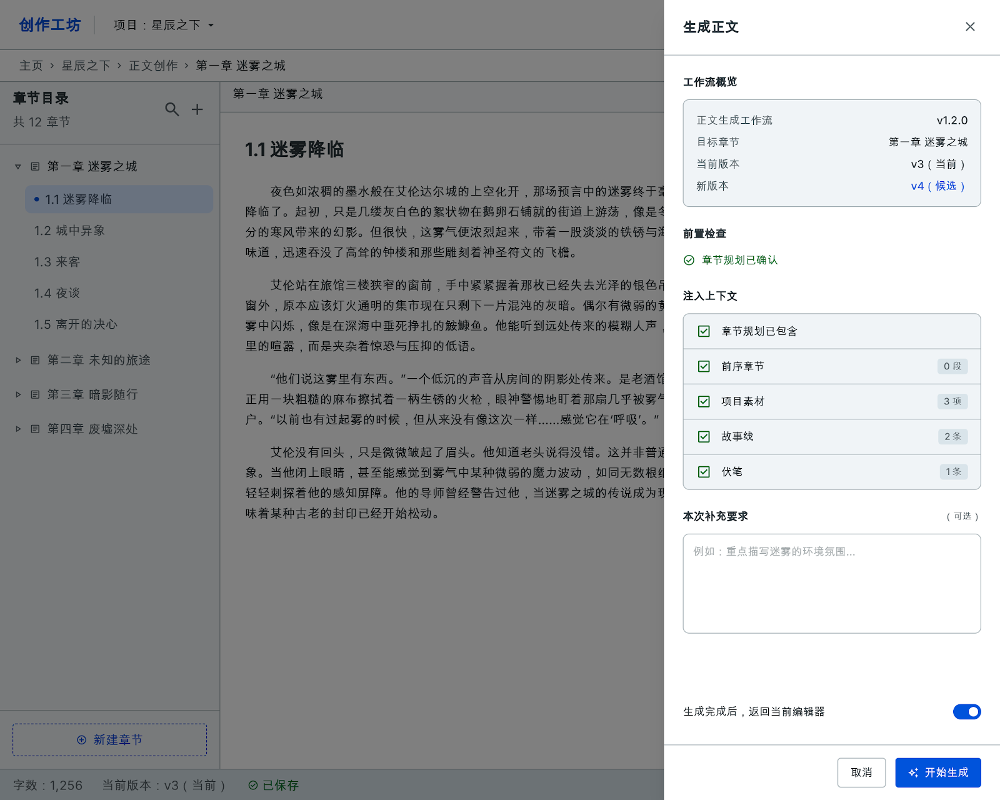

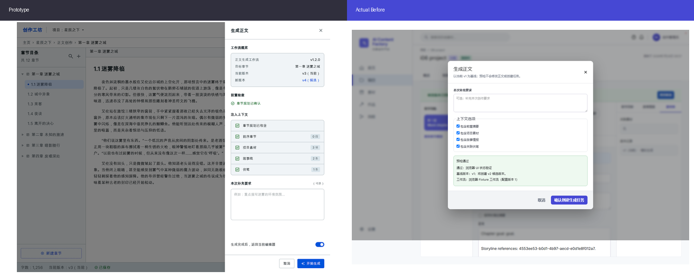

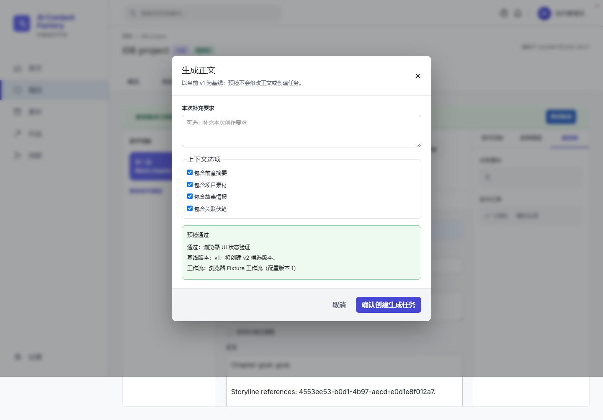

## 5. I16_D2_GENERATE_REQUIREMENTS

- 页面标题：生成正文：补充要求
- 实机完整 URL：http://127.0.0.1:13001/projects/13362446-e528-4071-a9d1-5260cc1fcd78/works/9ea091d1-b63e-409c-92dd-9b1271c508c7
- 原型 screen.png：http://127.0.0.1:13002/iteration-16-real-content-generation/ui/frames/I16_D2_GENERATE_REQUIREMENTS/screen.png
- 原型 code.html：http://127.0.0.1:13002/iteration-16-real-content-generation/ui/frames/I16_D2_GENERATE_REQUIREMENTS/code.html
- 使用 ID：`{"projectId": "13362446-e528-4071-a9d1-5260cc1fcd78", "workId": "9ea091d1-b63e-409c-92dd-9b1271c508c7"}`
- 状态构造步骤：通过仓库既有 Content Generation 浏览器 Fixture 构造 Summary/Run/Candidate 状态，使用正式生产组件与路由渲染；未修改 DOM。
- 修复前结果：PASS
- 差异说明：仅动态 ID、时间、真实业务数据、中文文案与当前 AppShell 合理差异；结构、状态和交互顺序一致。
- 是否允许差异：是
- 修改文件：无产品代码修改
- 修复后结果：PASS
- 最终结果：PASS
- 截图相对路径：`screenshots/I16_D2_GENERATE_REQUIREMENTS/`

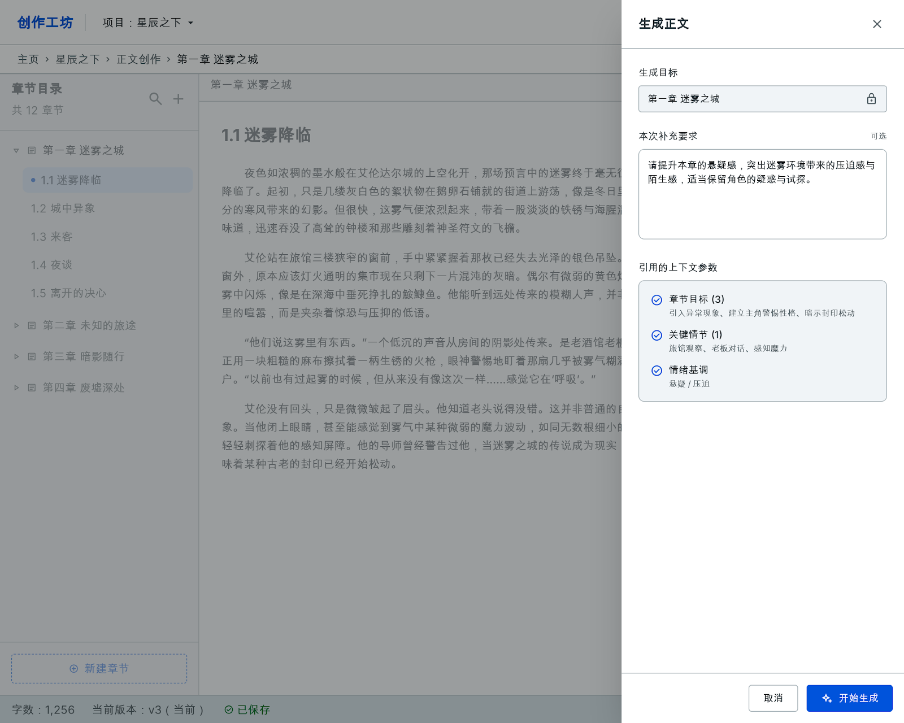

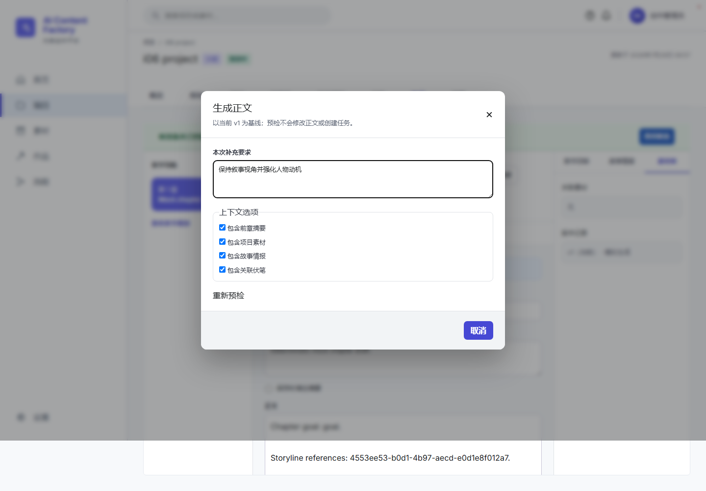

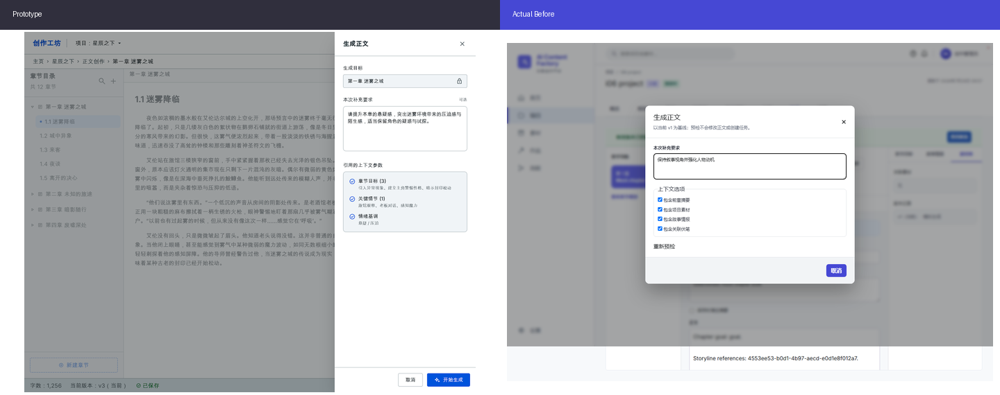

## 6. I16_D3_RUN_QUEUED

- 页面标题：正文生成任务：排队中
- 实机完整 URL：http://127.0.0.1:13001/projects/13362446-e528-4071-a9d1-5260cc1fcd78/works/9ea091d1-b63e-409c-92dd-9b1271c508c7
- 原型 screen.png：http://127.0.0.1:13002/iteration-16-real-content-generation/ui/frames/I16_D3_RUN_QUEUED/screen.png
- 原型 code.html：http://127.0.0.1:13002/iteration-16-real-content-generation/ui/frames/I16_D3_RUN_QUEUED/code.html
- 使用 ID：`{"projectId": "13362446-e528-4071-a9d1-5260cc1fcd78", "workId": "9ea091d1-b63e-409c-92dd-9b1271c508c7"}`
- 状态构造步骤：通过仓库既有 Content Generation 浏览器 Fixture 构造 Summary/Run/Candidate 状态，使用正式生产组件与路由渲染；未修改 DOM。
- 修复前结果：PASS
- 差异说明：仅动态 ID、时间、真实业务数据、中文文案与当前 AppShell 合理差异；结构、状态和交互顺序一致。
- 是否允许差异：是
- 修改文件：无产品代码修改
- 修复后结果：PASS
- 最终结果：PASS
- 截图相对路径：`screenshots/I16_D3_RUN_QUEUED/`

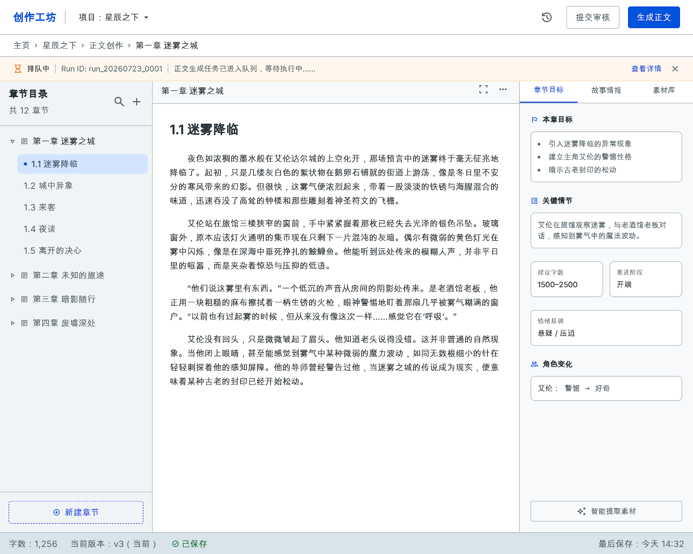

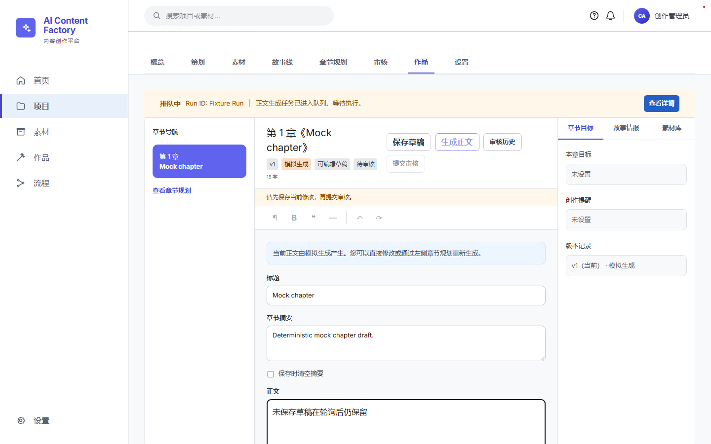

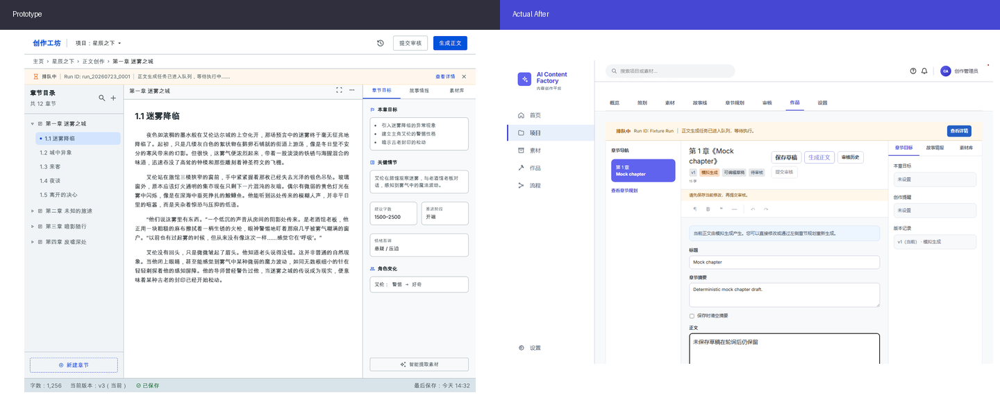

## 7. I16_D3_RUN_RUNNING

- 页面标题：正文生成任务：运行中
- 实机完整 URL：http://127.0.0.1:13001/projects/13362446-e528-4071-a9d1-5260cc1fcd78/works/9ea091d1-b63e-409c-92dd-9b1271c508c7
- 原型 screen.png：http://127.0.0.1:13002/iteration-16-real-content-generation/ui/frames/I16_D3_RUN_RUNNING/screen.png
- 原型 code.html：http://127.0.0.1:13002/iteration-16-real-content-generation/ui/frames/I16_D3_RUN_RUNNING/code.html
- 使用 ID：`{"projectId": "13362446-e528-4071-a9d1-5260cc1fcd78", "workId": "9ea091d1-b63e-409c-92dd-9b1271c508c7"}`
- 状态构造步骤：通过仓库既有 Content Generation 浏览器 Fixture 构造 Summary/Run/Candidate 状态，使用正式生产组件与路由渲染；未修改 DOM。
- 修复前结果：PASS
- 差异说明：仅动态 ID、时间、真实业务数据、中文文案与当前 AppShell 合理差异；结构、状态和交互顺序一致。
- 是否允许差异：是
- 修改文件：无产品代码修改
- 修复后结果：PASS
- 最终结果：PASS
- 截图相对路径：`screenshots/I16_D3_RUN_RUNNING/`

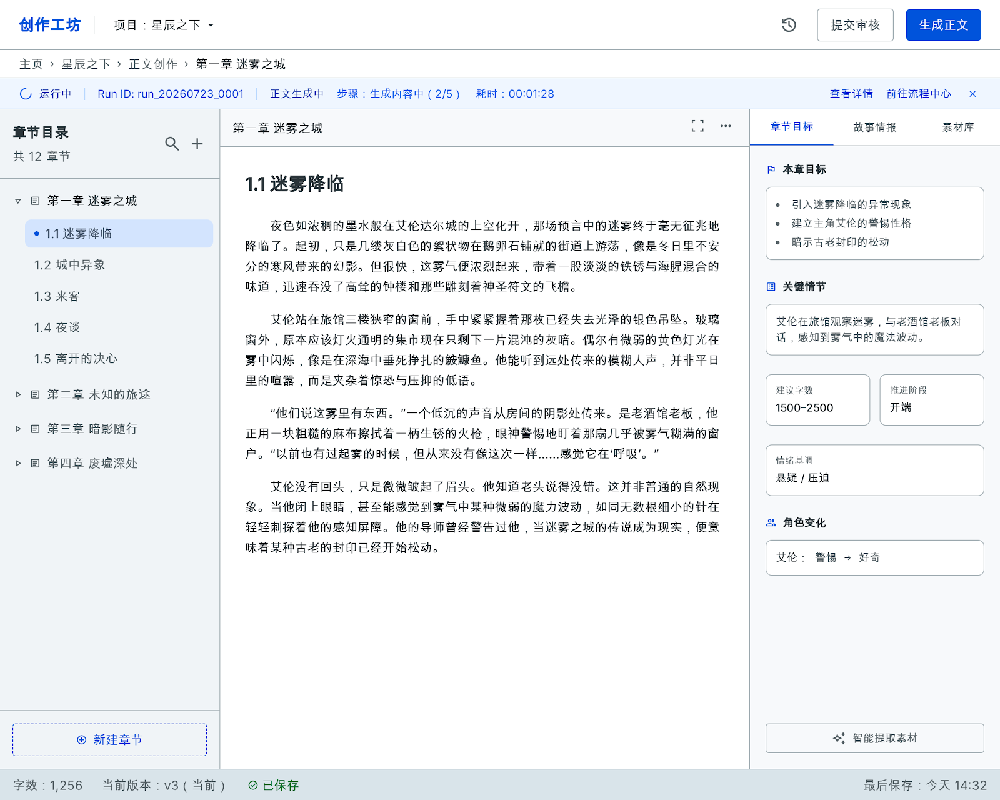

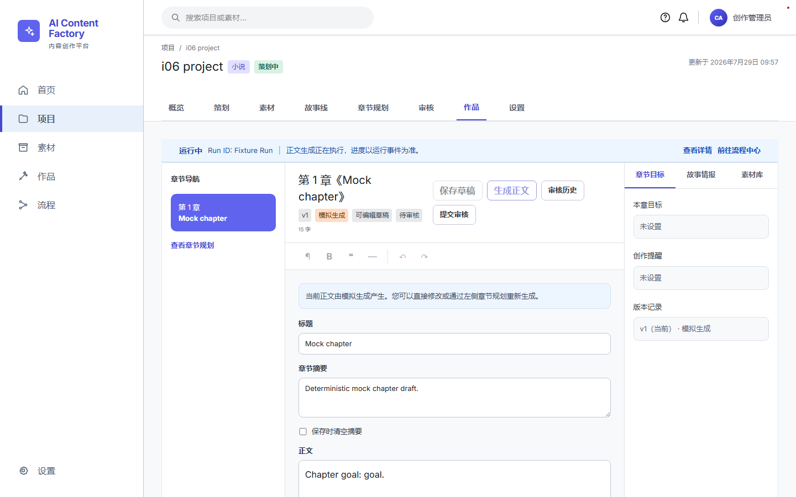

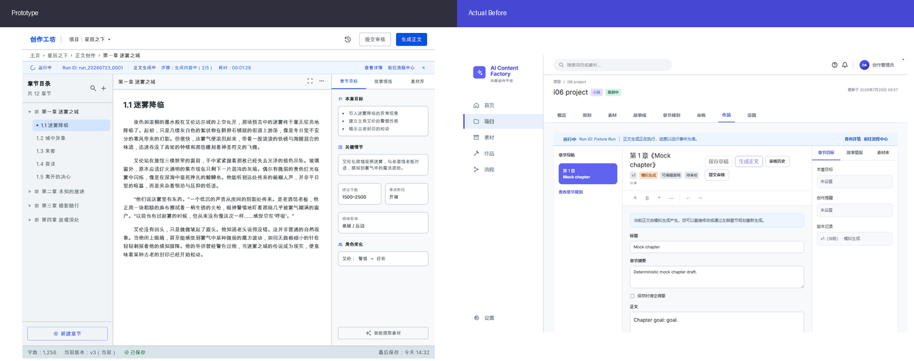

## 8. I16_D3_RUN_SUCCEEDED

- 页面标题：正文生成任务：候选已创建
- 实机完整 URL：http://127.0.0.1:13001/projects/13362446-e528-4071-a9d1-5260cc1fcd78/works/9ea091d1-b63e-409c-92dd-9b1271c508c7
- 原型 screen.png：http://127.0.0.1:13002/iteration-16-real-content-generation/ui/frames/I16_D3_RUN_SUCCEEDED/screen.png
- 原型 code.html：http://127.0.0.1:13002/iteration-16-real-content-generation/ui/frames/I16_D3_RUN_SUCCEEDED/code.html
- 使用 ID：`{"projectId": "13362446-e528-4071-a9d1-5260cc1fcd78", "workId": "9ea091d1-b63e-409c-92dd-9b1271c508c7"}`
- 状态构造步骤：通过仓库既有 Content Generation 浏览器 Fixture 构造 Summary/Run/Candidate 状态，使用正式生产组件与路由渲染；未修改 DOM。
- 修复前结果：PASS
- 差异说明：仅动态 ID、时间、真实业务数据、中文文案与当前 AppShell 合理差异；结构、状态和交互顺序一致。
- 是否允许差异：是
- 修改文件：无产品代码修改
- 修复后结果：PASS
- 最终结果：PASS
- 截图相对路径：`screenshots/I16_D3_RUN_SUCCEEDED/`

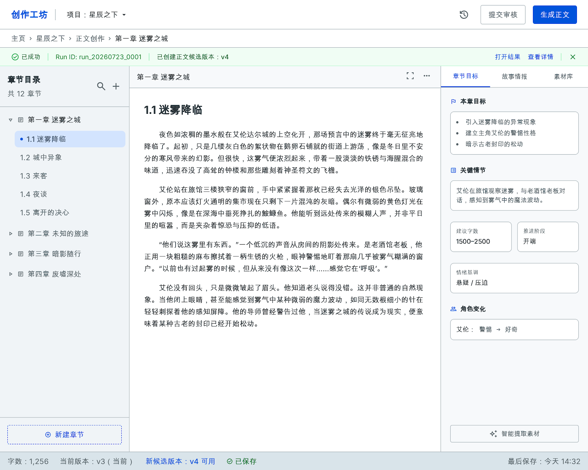

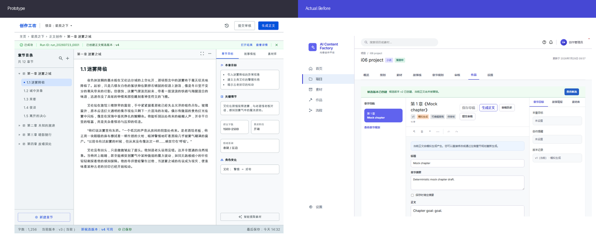

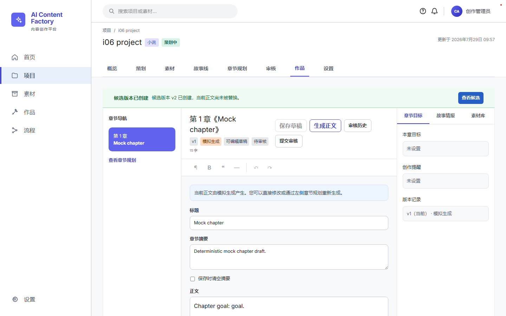

## 9. I16_D3_RUN_FAILED

- 页面标题：正文生成任务：失败
- 实机完整 URL：http://127.0.0.1:13001/projects/13362446-e528-4071-a9d1-5260cc1fcd78/works/9ea091d1-b63e-409c-92dd-9b1271c508c7
- 原型 screen.png：http://127.0.0.1:13002/iteration-16-real-content-generation/ui/frames/I16_D3_RUN_FAILED/screen.png
- 原型 code.html：http://127.0.0.1:13002/iteration-16-real-content-generation/ui/frames/I16_D3_RUN_FAILED/code.html
- 使用 ID：`{"projectId": "13362446-e528-4071-a9d1-5260cc1fcd78", "workId": "9ea091d1-b63e-409c-92dd-9b1271c508c7"}`
- 状态构造步骤：通过仓库既有 Content Generation 浏览器 Fixture 构造 Summary/Run/Candidate 状态，使用正式生产组件与路由渲染；未修改 DOM。
- 修复前结果：PASS
- 差异说明：仅动态 ID、时间、真实业务数据、中文文案与当前 AppShell 合理差异；结构、状态和交互顺序一致。
- 是否允许差异：是
- 修改文件：无产品代码修改
- 修复后结果：PASS
- 最终结果：PASS
- 截图相对路径：`screenshots/I16_D3_RUN_FAILED/`

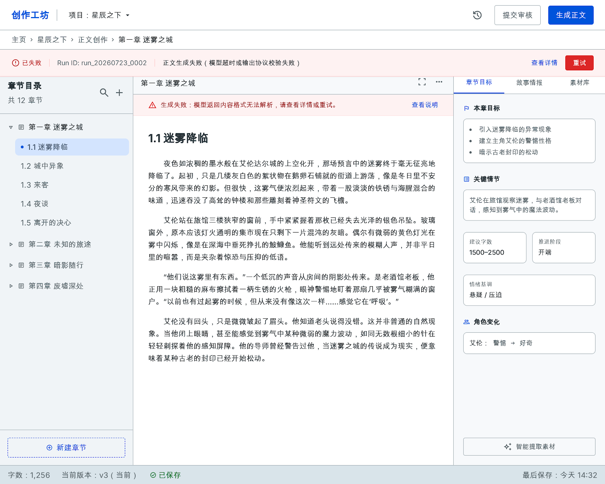

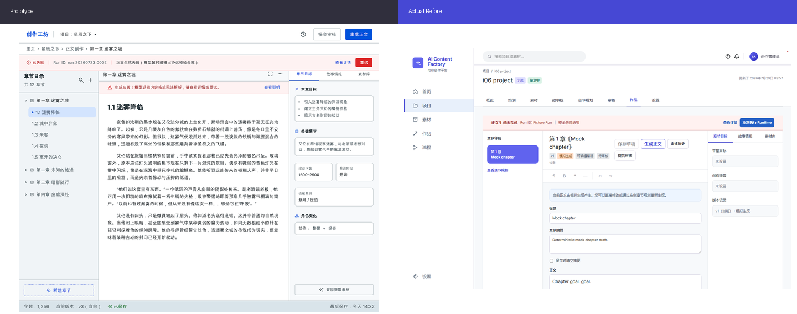

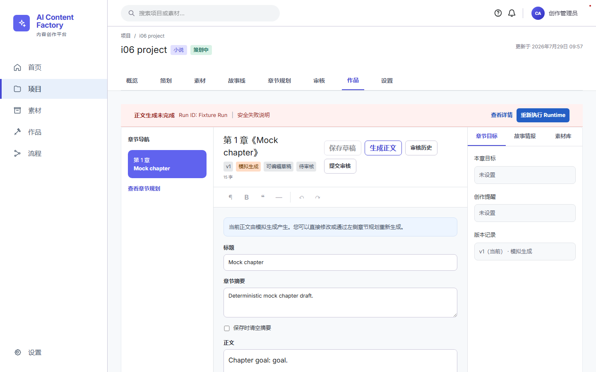

## 10. I16_D4_CANDIDATE_VERSION

- 页面标题：正文候选版本
- 实机完整 URL：http://127.0.0.1:13001/projects/13362446-e528-4071-a9d1-5260cc1fcd78/works/9ea091d1-b63e-409c-92dd-9b1271c508c7
- 原型 screen.png：http://127.0.0.1:13002/iteration-16-real-content-generation/ui/frames/I16_D4_CANDIDATE_VERSION/screen.png
- 原型 code.html：http://127.0.0.1:13002/iteration-16-real-content-generation/ui/frames/I16_D4_CANDIDATE_VERSION/code.html
- 使用 ID：`{"projectId": "13362446-e528-4071-a9d1-5260cc1fcd78", "workId": "9ea091d1-b63e-409c-92dd-9b1271c508c7"}`
- 状态构造步骤：通过仓库既有 Content Generation 浏览器 Fixture 构造 Summary/Run/Candidate 状态，使用正式生产组件与路由渲染；未修改 DOM。
- 修复前结果：PASS
- 差异说明：仅动态 ID、时间、真实业务数据、中文文案与当前 AppShell 合理差异；结构、状态和交互顺序一致。
- 是否允许差异：是
- 修改文件：无产品代码修改
- 修复后结果：PASS
- 最终结果：PASS
- 截图相对路径：`screenshots/I16_D4_CANDIDATE_VERSION/`

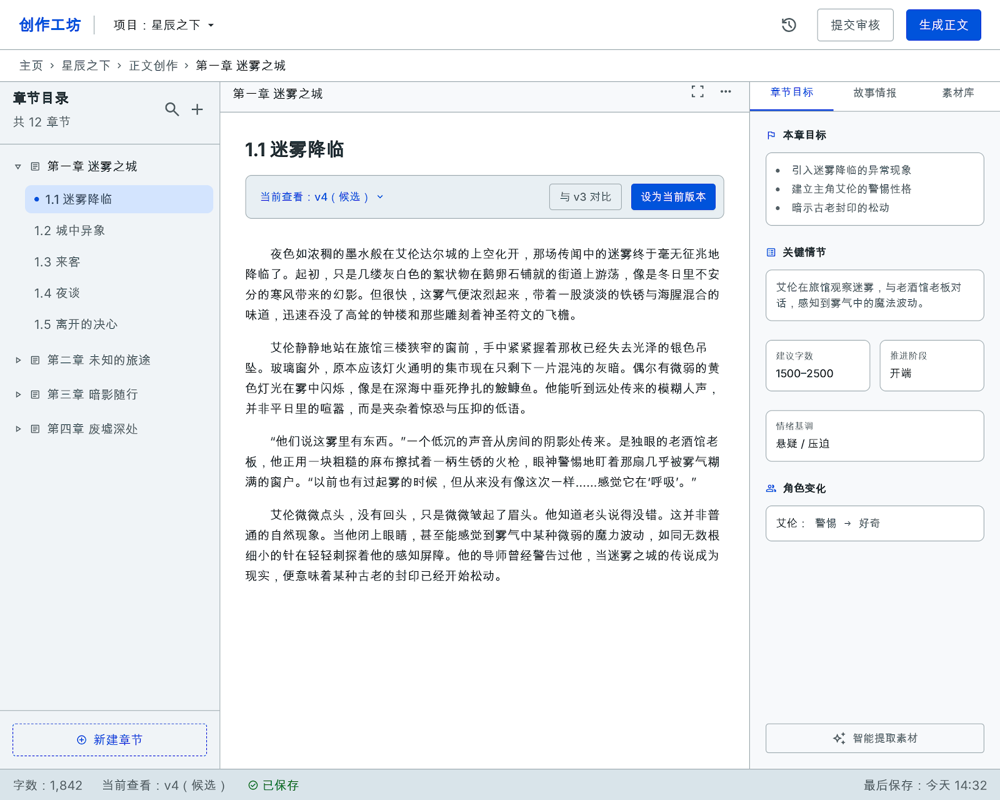

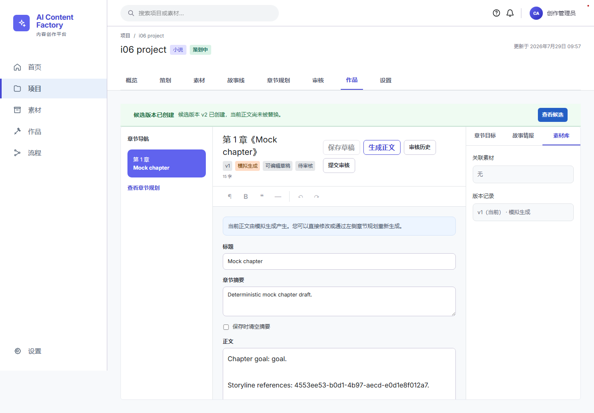

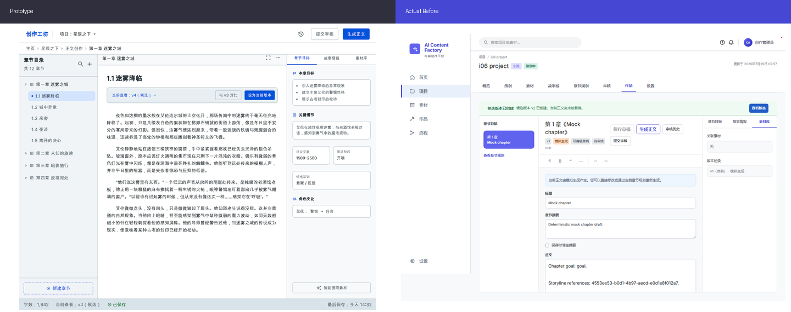

## 11. I16_D5_NOT_CONFIGURED

- 页面标题：正文生成工作流未配置
- 实机完整 URL：http://127.0.0.1:13001/projects/13362446-e528-4071-a9d1-5260cc1fcd78/works/9ea091d1-b63e-409c-92dd-9b1271c508c7
- 原型 screen.png：http://127.0.0.1:13002/iteration-16-real-content-generation/ui/frames/I16_D5_NOT_CONFIGURED/screen.png
- 原型 code.html：http://127.0.0.1:13002/iteration-16-real-content-generation/ui/frames/I16_D5_NOT_CONFIGURED/code.html
- 使用 ID：`{"projectId": "13362446-e528-4071-a9d1-5260cc1fcd78", "workId": "9ea091d1-b63e-409c-92dd-9b1271c508c7"}`
- 状态构造步骤：通过仓库既有 Content Generation 浏览器 Fixture 构造 Summary/Run/Candidate 状态，使用正式生产组件与路由渲染；未修改 DOM。
- 修复前结果：PASS
- 差异说明：仅动态 ID、时间、真实业务数据、中文文案与当前 AppShell 合理差异；结构、状态和交互顺序一致。
- 是否允许差异：是
- 修改文件：无产品代码修改
- 修复后结果：PASS
- 最终结果：PASS
- 截图相对路径：`screenshots/I16_D5_NOT_CONFIGURED/`

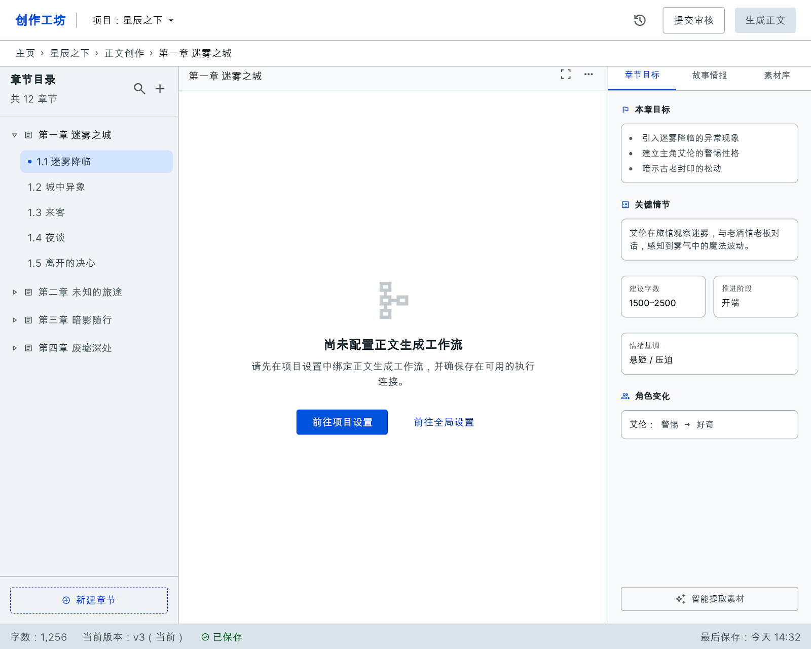

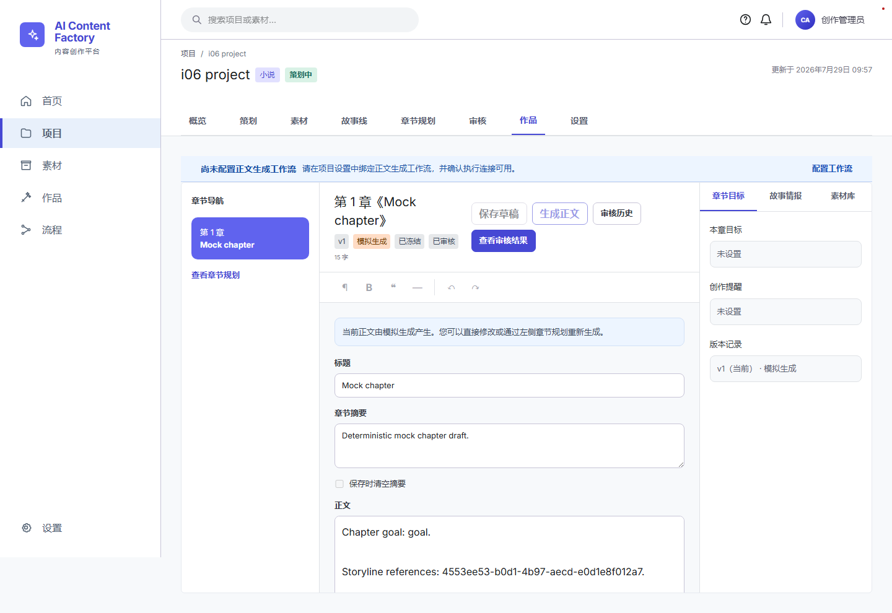

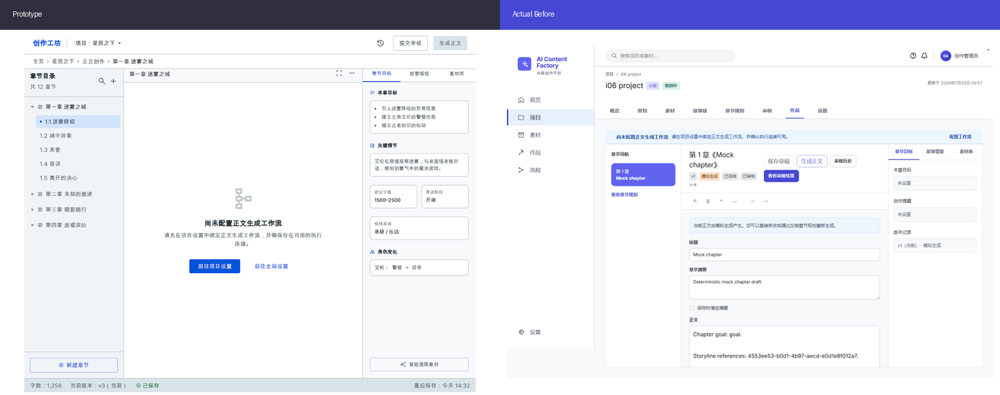

