# Iteration 17 浏览器 UI 对比验收报告

## 汇总

- Iteration：17
- Frame 总数：8
- 初次 PASS：8
- 初次 FAIL：0
- 修复成功数：0
- 未修复数：0
- Console error：0
- 最终状态：修复成功
- 修改文件：apps/web/e2e/iteration17/review-ui.spec.ts
- 工程测试：定向测试、完整单元测试、Typecheck、Lint、Production Build、契约校验与 git diff --check 全部 PASS

固定浏览器条件：Chromium，1440×900，deviceScaleFactor=1，100% 缩放，zh-CN，Asia/Shanghai，light，reduced motion；截图前禁用 animation/transition。

## 1. I17_D1_EDITOR_REVIEW_ENTRY

- 页面标题：正文编辑器与审核入口
- 实机完整 URL：http://127.0.0.1:13001/projects/11111111-1111-4111-8111-111111111111/works/22222222-2222-4222-8222-222222222222
- 原型 screen.png：http://127.0.0.1:13002/iteration-17-real-content-review/ui/frames/I17_D1_EDITOR_REVIEW_ENTRY/screen.png
- 原型 code.html：http://127.0.0.1:13002/iteration-17-real-content-review/ui/frames/I17_D1_EDITOR_REVIEW_ENTRY/code.html
- 使用 ID：`{"projectId": "11111111-1111-4111-8111-111111111111", "workId": "22222222-2222-4222-8222-222222222222"}`
- 状态构造步骤：通过仓库既有 Review Playwright E2E Fixture 构造状态，使用正式生产组件与路由渲染；Issue Detail 已滚动到底复验。
- 修复前结果：PASS
- 差异说明：仅动态 ID、时间、真实业务数据、中文文案与当前 AppShell 合理差异；结构、状态和交互顺序一致。
- 是否允许差异：是
- 修改文件：无产品代码修改
- 修复后结果：PASS
- 最终结果：PASS
- 截图相对路径：`screenshots/I17_D1_EDITOR_REVIEW_ENTRY/`

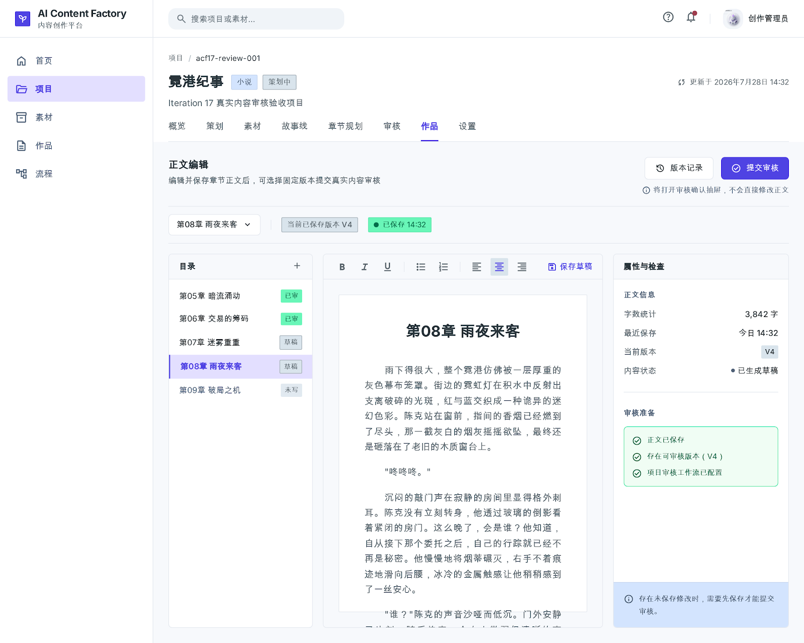

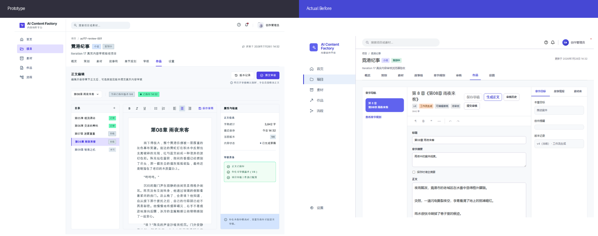

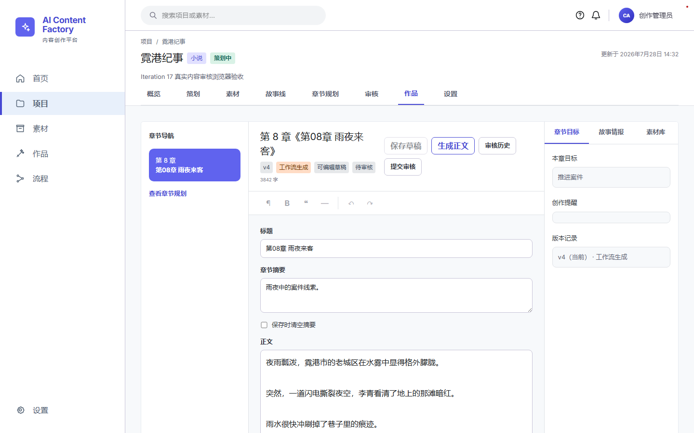

## 2. D2_SUBMIT_REVIEW_DRAWER

- 页面标题：发起内容审核抽屉
- 实机完整 URL：http://127.0.0.1:13001/projects/11111111-1111-4111-8111-111111111111/works/22222222-2222-4222-8222-222222222222
- 原型 screen.png：http://127.0.0.1:13002/iteration-17-real-content-review/ui/frames/D2_SUBMIT_REVIEW_DRAWER/screen.png
- 原型 code.html：http://127.0.0.1:13002/iteration-17-real-content-review/ui/frames/D2_SUBMIT_REVIEW_DRAWER/code.html
- 使用 ID：`{"projectId": "11111111-1111-4111-8111-111111111111", "workId": "22222222-2222-4222-8222-222222222222"}`
- 状态构造步骤：通过仓库既有 Review Playwright E2E Fixture 构造状态，使用正式生产组件与路由渲染；Issue Detail 已滚动到底复验。
- 修复前结果：PASS
- 差异说明：仅动态 ID、时间、真实业务数据、中文文案与当前 AppShell 合理差异；结构、状态和交互顺序一致。
- 是否允许差异：是
- 修改文件：无产品代码修改
- 修复后结果：PASS
- 最终结果：PASS
- 截图相对路径：`screenshots/D2_SUBMIT_REVIEW_DRAWER/`

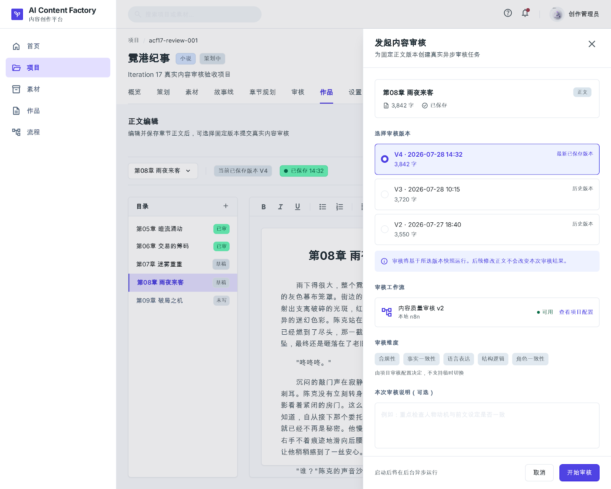

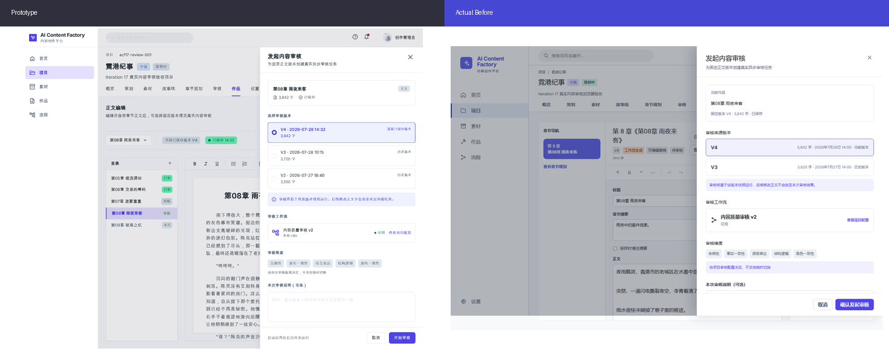

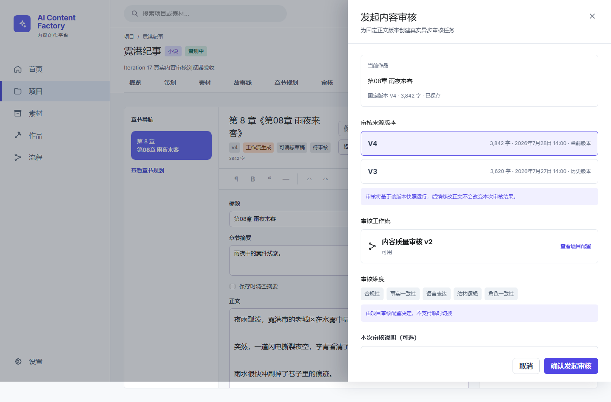

## 3. STATE_TASK_RUNNING_BAR

- 页面标题：内容审核运行中
- 实机完整 URL：http://127.0.0.1:13001/projects/11111111-1111-4111-8111-111111111111/works/22222222-2222-4222-8222-222222222222/review
- 原型 screen.png：http://127.0.0.1:13002/iteration-17-real-content-review/ui/frames/STATE_TASK_RUNNING_BAR/screen.png
- 原型 code.html：http://127.0.0.1:13002/iteration-17-real-content-review/ui/frames/STATE_TASK_RUNNING_BAR/code.html
- 使用 ID：`{"projectId": "11111111-1111-4111-8111-111111111111", "workId": "22222222-2222-4222-8222-222222222222"}`
- 状态构造步骤：通过仓库既有 Review Playwright E2E Fixture 构造状态，使用正式生产组件与路由渲染；Issue Detail 已滚动到底复验。
- 修复前结果：PASS
- 差异说明：仅动态 ID、时间、真实业务数据、中文文案与当前 AppShell 合理差异；结构、状态和交互顺序一致。
- 是否允许差异：是
- 修改文件：无产品代码修改
- 修复后结果：PASS
- 最终结果：PASS
- 截图相对路径：`screenshots/STATE_TASK_RUNNING_BAR/`

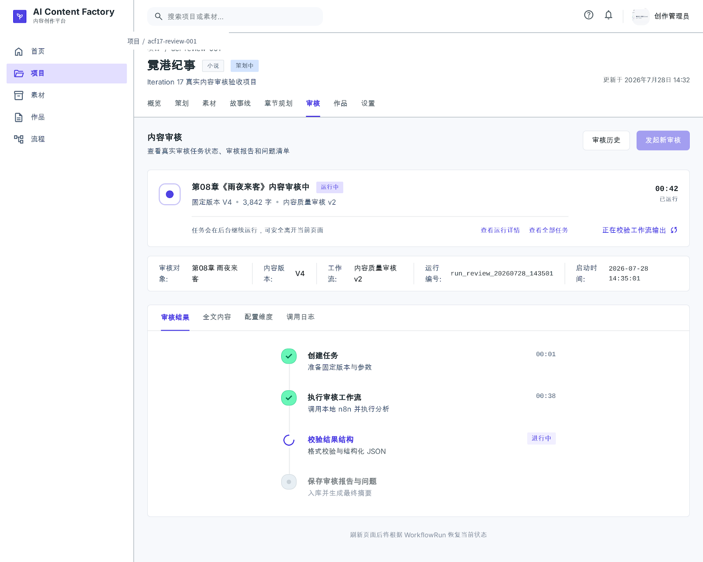

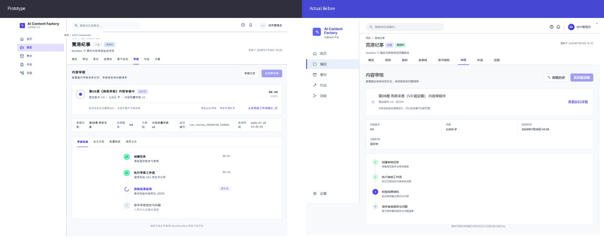

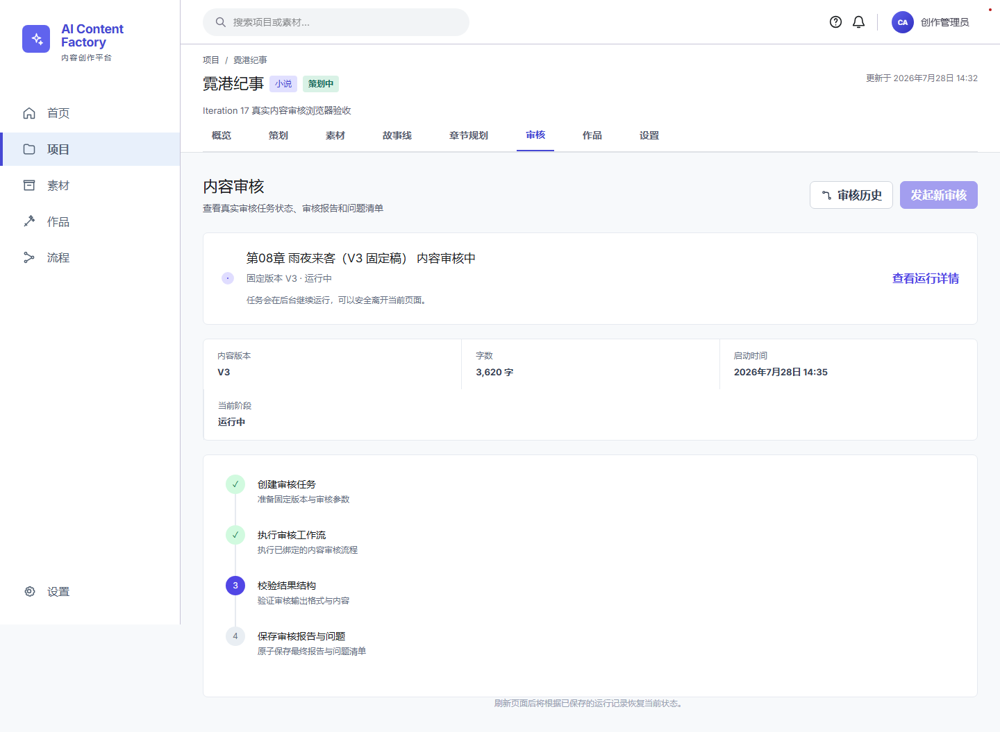

## 4. STATE_TASK_FAILED_NOTICE

- 页面标题：内容审核任务失败
- 实机完整 URL：http://127.0.0.1:13001/projects/11111111-1111-4111-8111-111111111111/works/22222222-2222-4222-8222-222222222222/review
- 原型 screen.png：http://127.0.0.1:13002/iteration-17-real-content-review/ui/frames/STATE_TASK_FAILED_NOTICE/screen.png
- 原型 code.html：http://127.0.0.1:13002/iteration-17-real-content-review/ui/frames/STATE_TASK_FAILED_NOTICE/code.html
- 使用 ID：`{"projectId": "11111111-1111-4111-8111-111111111111", "workId": "22222222-2222-4222-8222-222222222222"}`
- 状态构造步骤：通过仓库既有 Review Playwright E2E Fixture 构造状态，使用正式生产组件与路由渲染；Issue Detail 已滚动到底复验。
- 修复前结果：PASS
- 差异说明：仅动态 ID、时间、真实业务数据、中文文案与当前 AppShell 合理差异；结构、状态和交互顺序一致。
- 是否允许差异：是
- 修改文件：无产品代码修改
- 修复后结果：PASS
- 最终结果：PASS
- 截图相对路径：`screenshots/STATE_TASK_FAILED_NOTICE/`

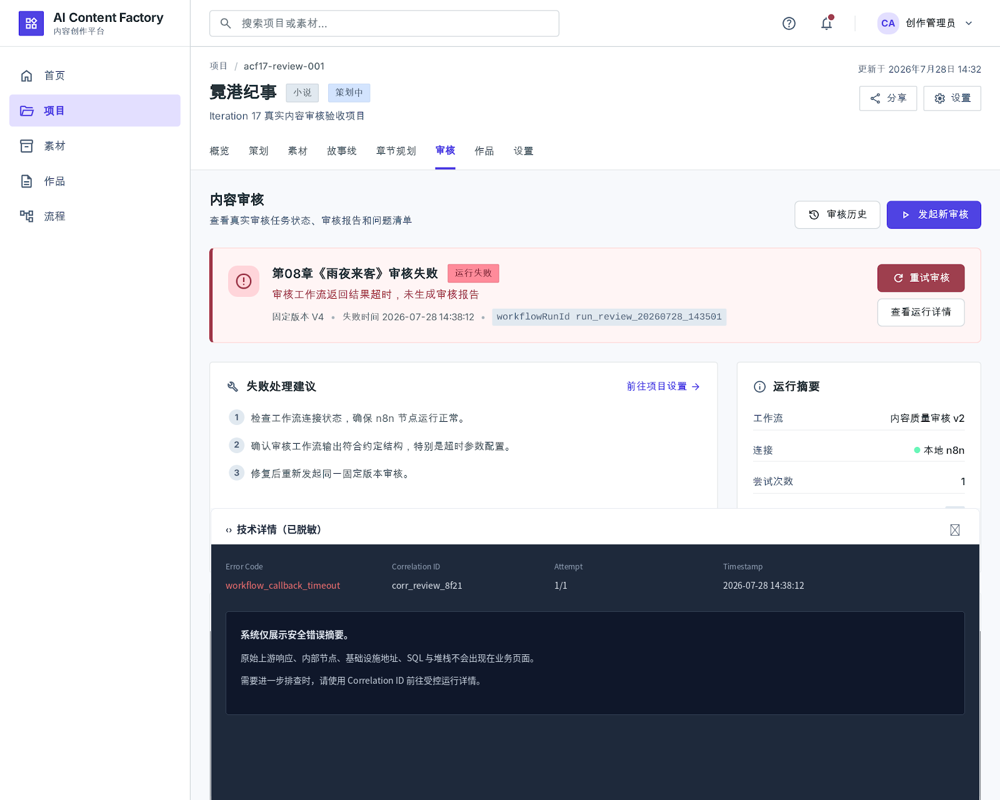

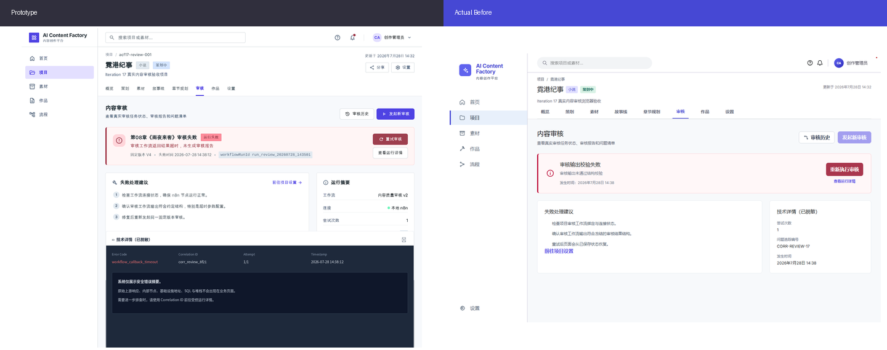

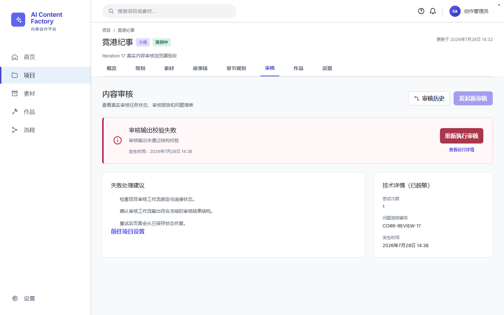

## 5. STATE_NOT_CONFIGURED_EMPTY

- 页面标题：审核工作流未配置
- 实机完整 URL：http://127.0.0.1:13001/projects/11111111-1111-4111-8111-111111111111/works/22222222-2222-4222-8222-222222222222/review
- 原型 screen.png：http://127.0.0.1:13002/iteration-17-real-content-review/ui/frames/STATE_NOT_CONFIGURED_EMPTY/screen.png
- 原型 code.html：http://127.0.0.1:13002/iteration-17-real-content-review/ui/frames/STATE_NOT_CONFIGURED_EMPTY/code.html
- 使用 ID：`{"projectId": "11111111-1111-4111-8111-111111111111", "workId": "22222222-2222-4222-8222-222222222222"}`
- 状态构造步骤：通过仓库既有 Review Playwright E2E Fixture 构造状态，使用正式生产组件与路由渲染；Issue Detail 已滚动到底复验。
- 修复前结果：PASS
- 差异说明：仅动态 ID、时间、真实业务数据、中文文案与当前 AppShell 合理差异；结构、状态和交互顺序一致。
- 是否允许差异：是
- 修改文件：无产品代码修改
- 修复后结果：PASS
- 最终结果：PASS
- 截图相对路径：`screenshots/STATE_NOT_CONFIGURED_EMPTY/`

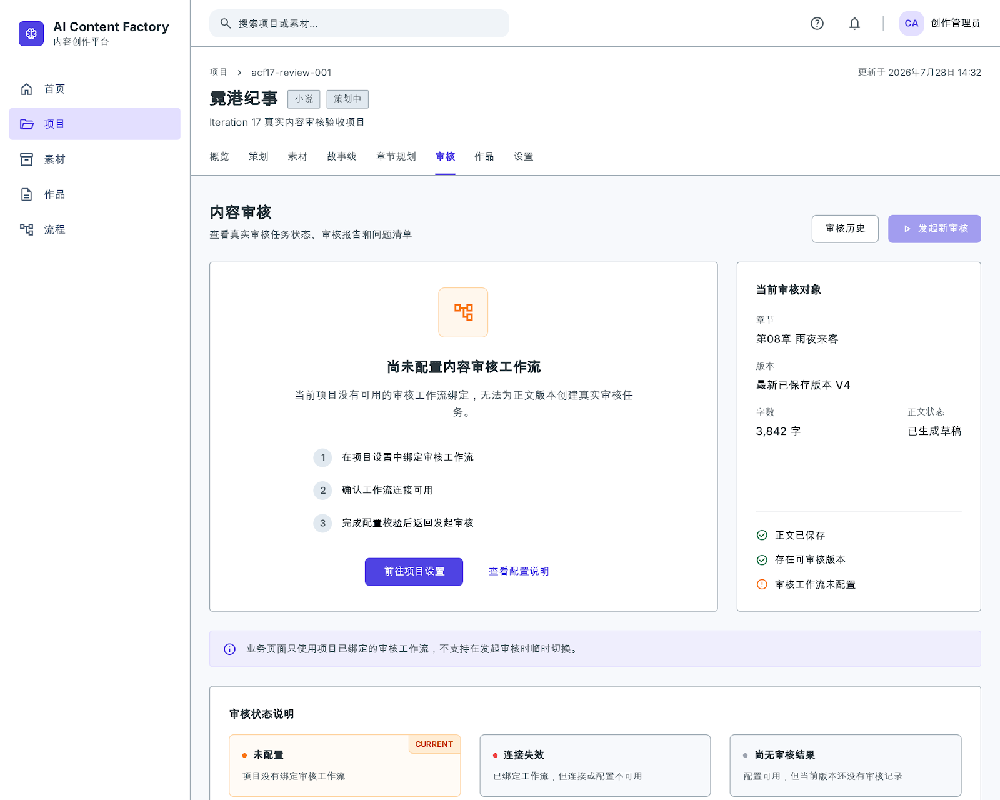

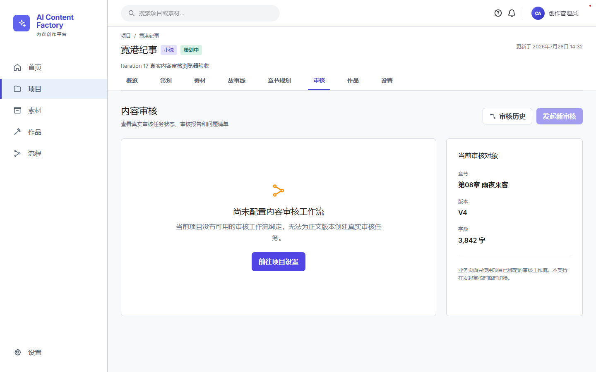

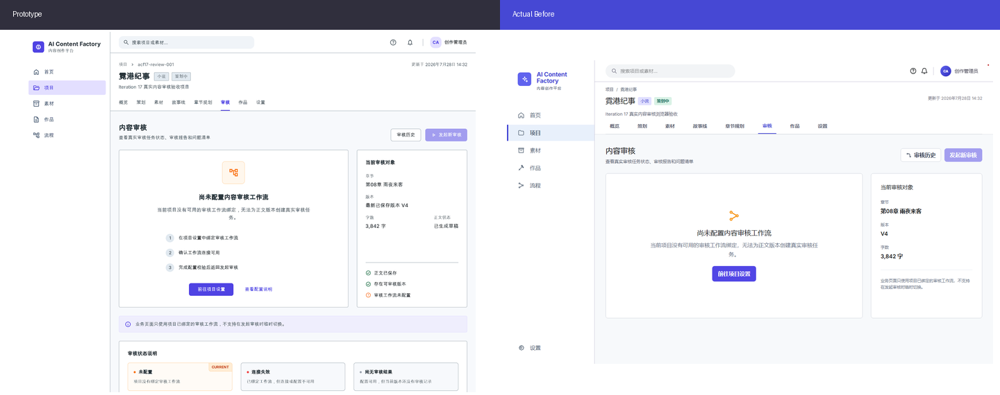

## 6. D2_REVIEW_V2

- 页面标题：审核结果总览
- 实机完整 URL：http://127.0.0.1:13001/projects/11111111-1111-4111-8111-111111111111/works/22222222-2222-4222-8222-222222222222/review?reportId=44444444-4444-4444-8444-444444444444
- 原型 screen.png：http://127.0.0.1:13002/iteration-17-real-content-review/ui/frames/D2_REVIEW_V2/screen.png
- 原型 code.html：http://127.0.0.1:13002/iteration-17-real-content-review/ui/frames/D2_REVIEW_V2/code.html
- 使用 ID：`{"projectId": "11111111-1111-4111-8111-111111111111", "workId": "22222222-2222-4222-8222-222222222222", "reportId": "44444444-4444-4444-8444-444444444444"}`
- 状态构造步骤：通过仓库既有 Review Playwright E2E Fixture 构造状态，使用正式生产组件与路由渲染；Issue Detail 已滚动到底复验。
- 修复前结果：PASS
- 差异说明：仅动态 ID、时间、真实业务数据、中文文案与当前 AppShell 合理差异；结构、状态和交互顺序一致。
- 是否允许差异：是
- 修改文件：无产品代码修改
- 修复后结果：PASS
- 最终结果：PASS
- 截图相对路径：`screenshots/D2_REVIEW_V2/`

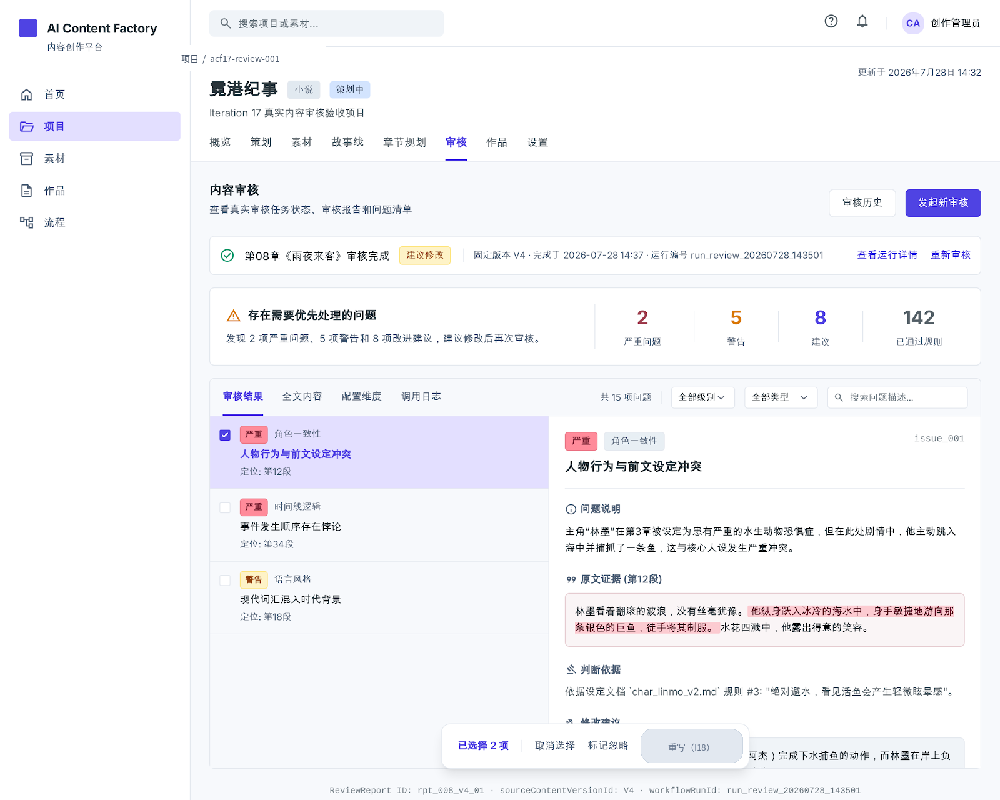

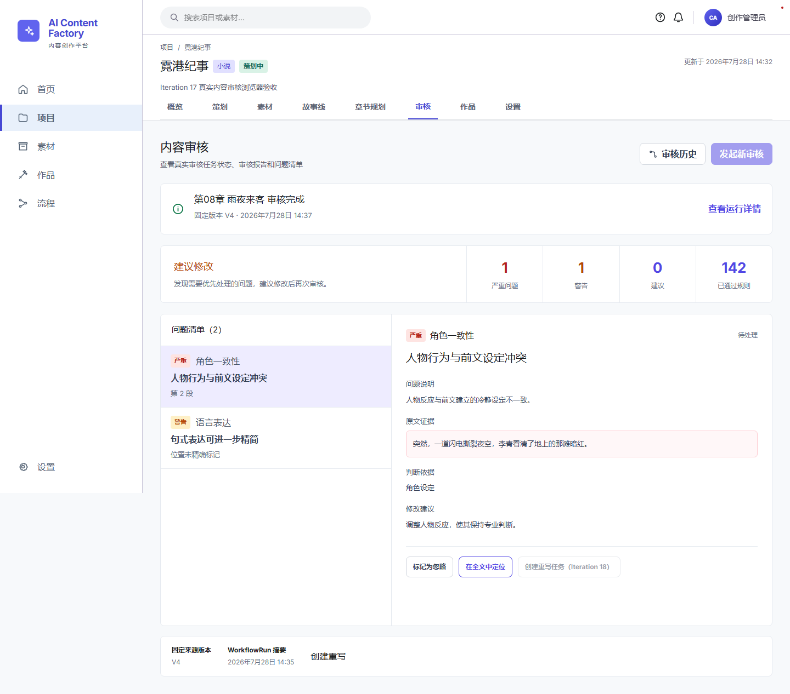

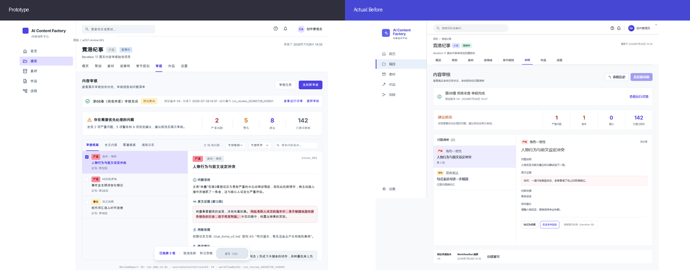

## 7. I17_D2_REVIEW_ISSUE_DETAIL

- 页面标题：问题详情与全文定位
- 实机完整 URL：http://127.0.0.1:13001/projects/11111111-1111-4111-8111-111111111111/works/22222222-2222-4222-8222-222222222222/review?reportId=44444444-4444-4444-8444-444444444444&issueId=55555555-5555-4555-8555-555555555555&view=source
- 原型 screen.png：http://127.0.0.1:13002/iteration-17-real-content-review/ui/frames/I17_D2_REVIEW_ISSUE_DETAIL/screen.png
- 原型 code.html：http://127.0.0.1:13002/iteration-17-real-content-review/ui/frames/I17_D2_REVIEW_ISSUE_DETAIL/code.html
- 使用 ID：`{"projectId": "11111111-1111-4111-8111-111111111111", "workId": "22222222-2222-4222-8222-222222222222", "reportId": "44444444-4444-4444-8444-444444444444", "issueId": "55555555-5555-4555-8555-555555555555"}`
- 状态构造步骤：通过仓库既有 Review Playwright E2E Fixture 构造状态，使用正式生产组件与路由渲染；Issue Detail 已滚动到底复验。
- 修复前结果：PASS
- 差异说明：仅动态 ID、时间、真实业务数据、中文文案与当前 AppShell 合理差异；结构、状态和交互顺序一致。
- 是否允许差异：是
- 修改文件：无产品代码修改
- 修复后结果：PASS
- 最终结果：PASS
- 截图相对路径：`screenshots/I17_D2_REVIEW_ISSUE_DETAIL/`

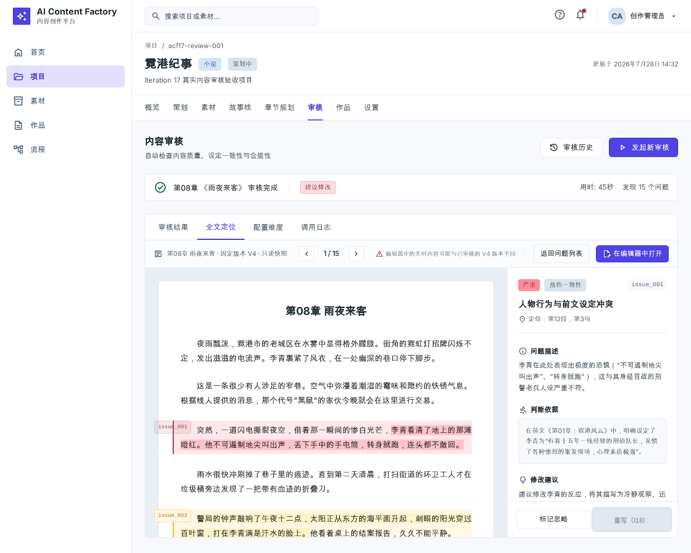

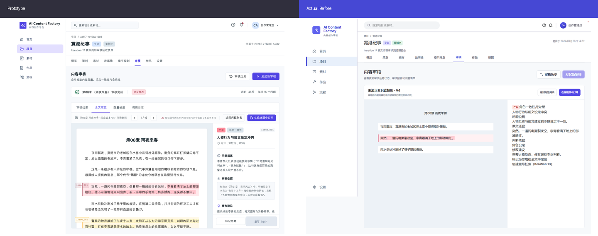

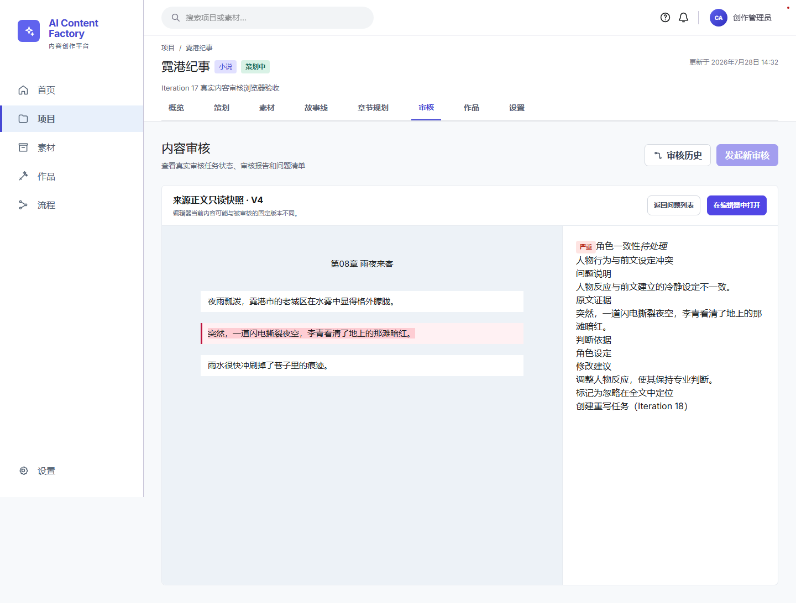

## 8. I17_D2_REVIEW_HISTORY

- 页面标题：审核历史
- 实机完整 URL：http://127.0.0.1:13001/projects/11111111-1111-4111-8111-111111111111/works/22222222-2222-4222-8222-222222222222/review/history
- 原型 screen.png：http://127.0.0.1:13002/iteration-17-real-content-review/ui/frames/I17_D2_REVIEW_HISTORY/screen.png
- 原型 code.html：http://127.0.0.1:13002/iteration-17-real-content-review/ui/frames/I17_D2_REVIEW_HISTORY/code.html
- 使用 ID：`{"projectId": "11111111-1111-4111-8111-111111111111", "workId": "22222222-2222-4222-8222-222222222222"}`
- 状态构造步骤：通过仓库既有 Review Playwright E2E Fixture 构造状态，使用正式生产组件与路由渲染；Issue Detail 已滚动到底复验。
- 修复前结果：PASS
- 差异说明：仅动态 ID、时间、真实业务数据、中文文案与当前 AppShell 合理差异；结构、状态和交互顺序一致。
- 是否允许差异：是
- 修改文件：无产品代码修改
- 修复后结果：PASS
- 最终结果：PASS
- 截图相对路径：`screenshots/I17_D2_REVIEW_HISTORY/`

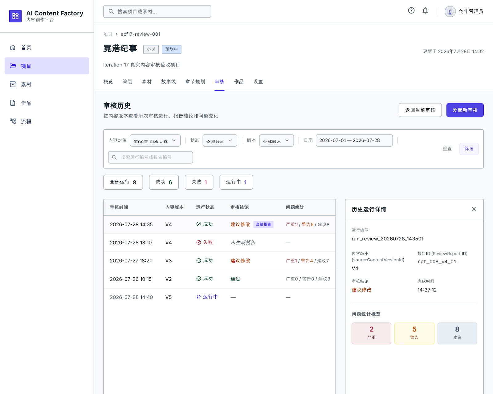

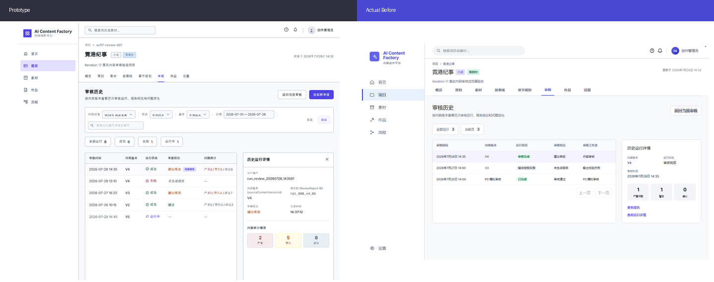

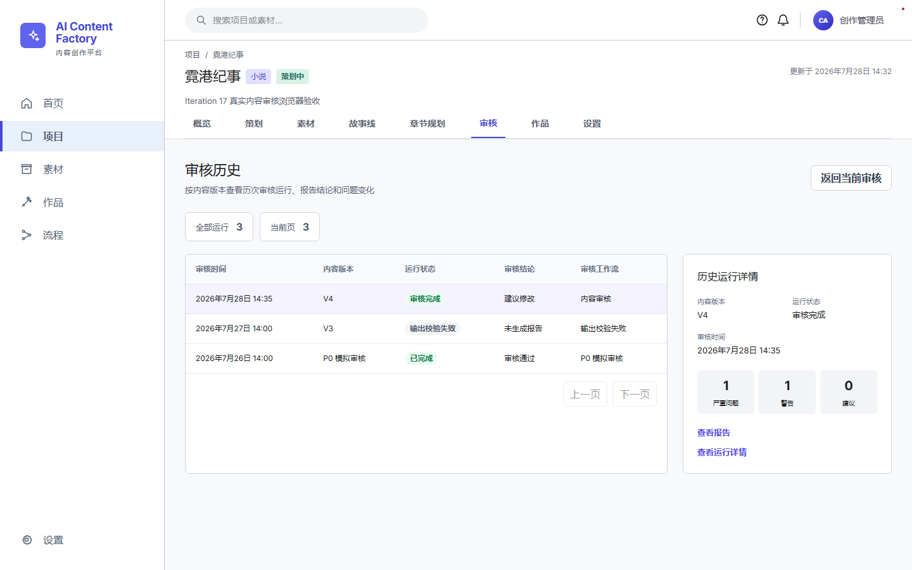

