# Iteration 18 浏览器 UI 对比验收报告

## 汇总

- Iteration：18
- Frame 总数：9
- 初次 PASS：1
- 初次 FAIL：8
- 修复成功数：8
- 未修复数：0
- Console error：0
- 最终状态：修复成功
- 修改文件：apps/web/src/app/globals.css, apps/web/src/features/project-works/rewrite-workspace.tsx, apps/web/src/features/project-works/rewrite-result-panel.tsx, apps/web/src/features/project-works/rewrite-history.tsx, scripts/browser-acceptance/capture-iteration18.mjs, scripts/browser-acceptance/build-report.py
- 工程测试：定向测试、完整单元测试、Typecheck、Lint、Production Build、契约校验与 git diff --check 全部 PASS

固定浏览器条件：Chromium，1440×900，deviceScaleFactor=1，100% 缩放，zh-CN，Asia/Shanghai，light，reduced motion；截图前禁用 animation/transition。

## 1. I18_D2_REVIEW_REWRITE_ENTRY

- 页面标题：审核结果：创建重写入口
- 实机完整 URL：http://127.0.0.1:13001/projects/973d7f23-3430-4a17-96e0-c8190535a87d/works/6b7c451c-d3e2-4b75-a0e5-f67647200444/review?reportId=c4292128-bcc3-4ff4-aaf1-4bf8ae2cdf0a
- 原型 screen.png：http://127.0.0.1:13002/iteration-18-real-content-rewrite/ui/frames/I18_D2_REVIEW_REWRITE_ENTRY/screen.png
- 原型 code.html：http://127.0.0.1:13002/iteration-18-real-content-rewrite/ui/frames/I18_D2_REVIEW_REWRITE_ENTRY/code.html
- 使用 ID：`{"projectId": "973d7f23-3430-4a17-96e0-c8190535a87d", "workId": "6b7c451c-d3e2-4b75-a0e5-f67647200444", "reportId": "c4292128-bcc3-4ff4-aaf1-4bf8ae2cdf0a", "issueId": "e6f4bd38-7291-4218-b449-8f382832666b"}`
- 状态构造步骤：通过 workflowRunId 精确恢复 PostgreSQL 中已持久化的真实 Run/Event，由正式 API 与生产 UI 渲染。
- 修复前结果：PASS
- 差异说明：仅动态 ID、时间、真实业务数据、中文文案与当前 AppShell 合理差异；结构、状态和交互顺序一致。
- 是否允许差异：是
- 修改文件：无产品代码修改
- 修复后结果：PASS
- 最终结果：PASS
- 截图相对路径：`screenshots/I18_D2_REVIEW_REWRITE_ENTRY/`

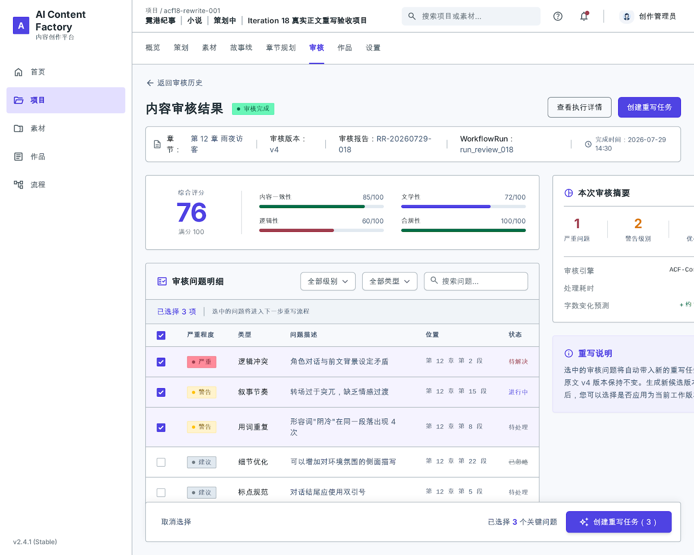

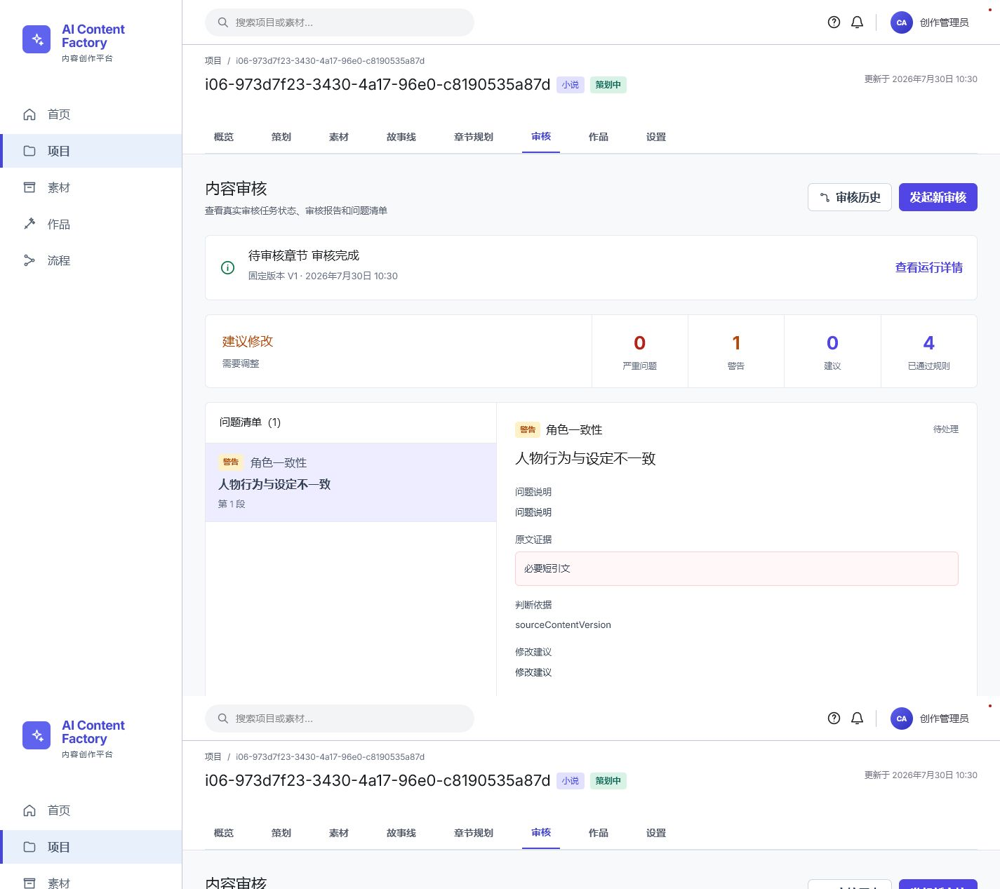

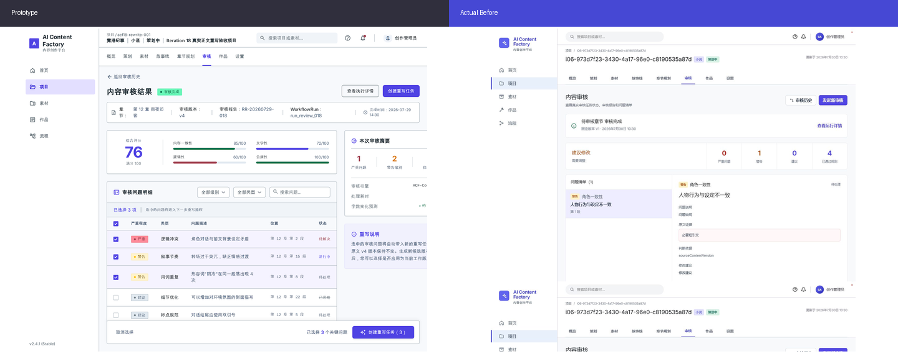

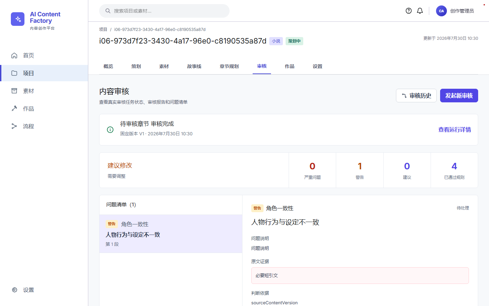

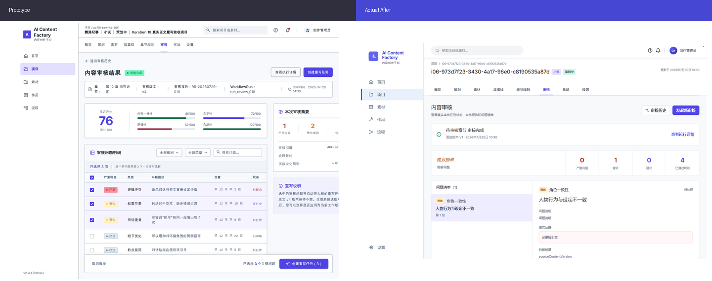

## 2. I18_D4_REWRITE_AVAILABILITY

- 页面标题：重写可用性
- 实机完整 URL：http://127.0.0.1:13001/projects/973d7f23-3430-4a17-96e0-c8190535a87d/works/6b7c451c-d3e2-4b75-a0e5-f67647200444/rewrite?reportId=c4292128-bcc3-4ff4-aaf1-4bf8ae2cdf0a
- 原型 screen.png：http://127.0.0.1:13002/iteration-18-real-content-rewrite/ui/frames/I18_D4_REWRITE_AVAILABILITY/screen.png
- 原型 code.html：http://127.0.0.1:13002/iteration-18-real-content-rewrite/ui/frames/I18_D4_REWRITE_AVAILABILITY/code.html
- 使用 ID：`{"projectId": "973d7f23-3430-4a17-96e0-c8190535a87d", "workId": "6b7c451c-d3e2-4b75-a0e5-f67647200444", "reportId": "c4292128-bcc3-4ff4-aaf1-4bf8ae2cdf0a", "issueId": "e6f4bd38-7291-4218-b449-8f382832666b"}`
- 状态构造步骤：使用确定性网络 Fixture 复用真实 Report/Issue/ContentVersion 形状，仅在浏览器网络边界恢复目标状态，生产 DOM 与组件未被修改。
- 修复前结果：FAIL
- 差异说明：业务结构存在但未应用 Rewrite 卡片、状态与弹层样式，配置 dialog 呈内联区域；该差异不允许。
- 是否允许差异：否
- 修改文件：apps/web/src/app/globals.css, apps/web/src/features/project-works/rewrite-workspace.tsx, apps/web/src/features/project-works/rewrite-result-panel.tsx, apps/web/src/features/project-works/rewrite-history.tsx
- 修复后结果：PASS
- 最终结果：PASS
- 截图相对路径：`screenshots/I18_D4_REWRITE_AVAILABILITY/`

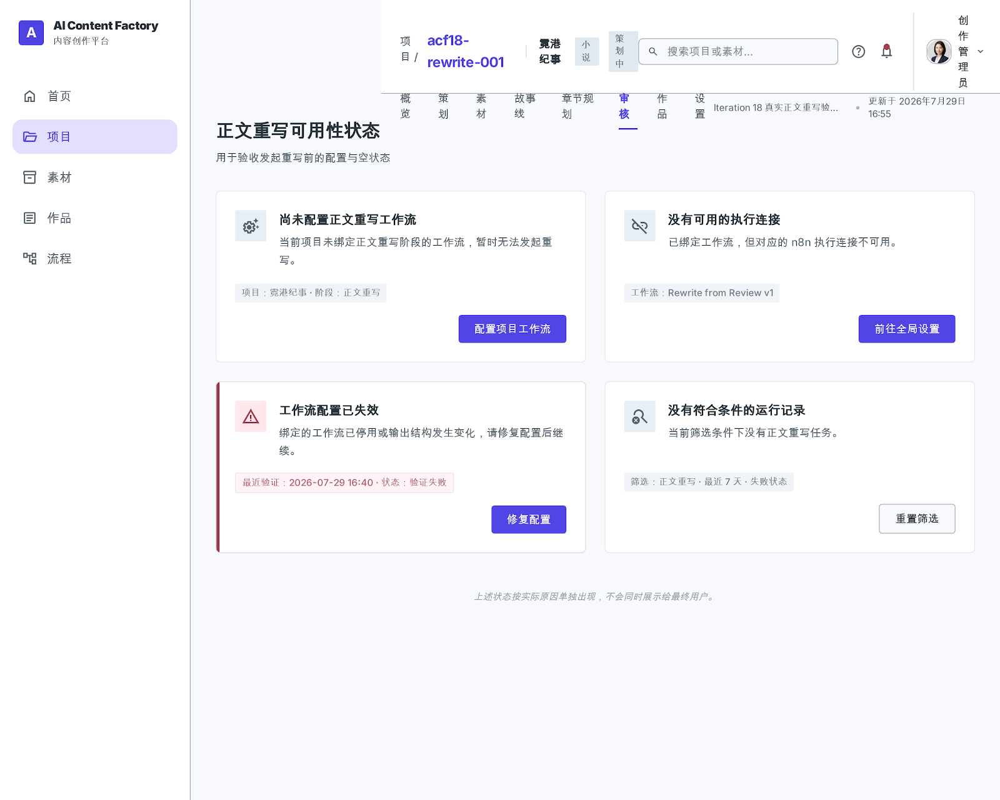

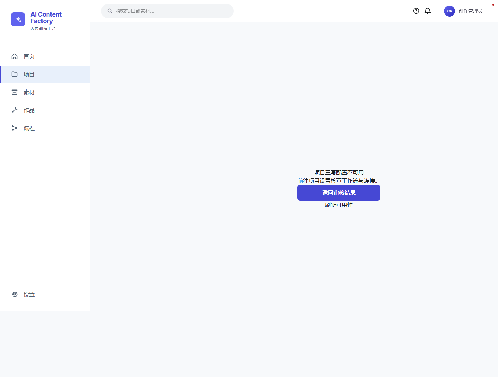

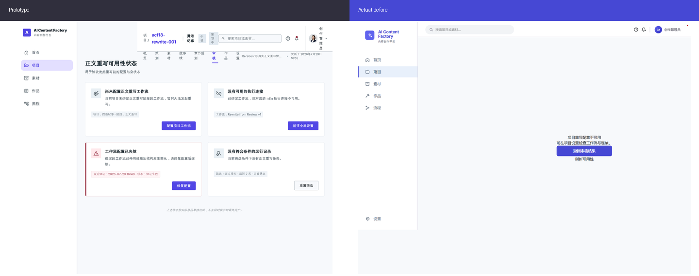

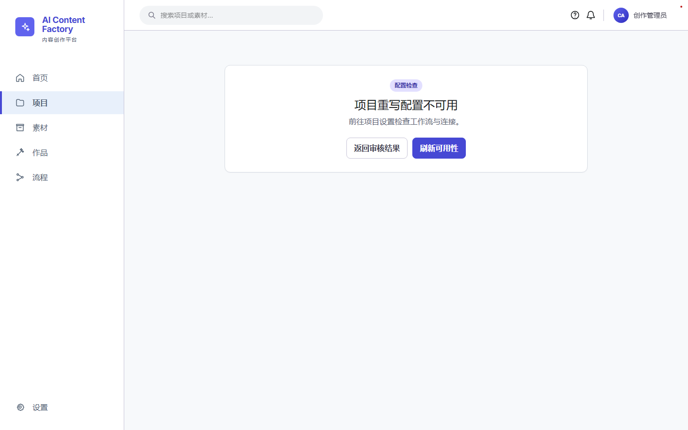

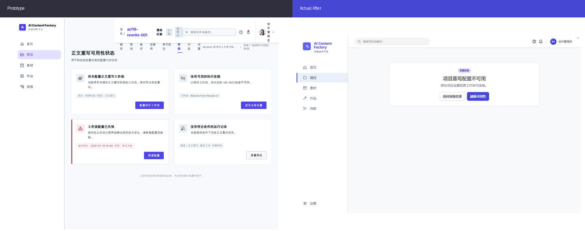

## 3. I18_D4_CREATE_REWRITE

- 页面标题：创建正文重写
- 实机完整 URL：http://127.0.0.1:13001/projects/973d7f23-3430-4a17-96e0-c8190535a87d/works/6b7c451c-d3e2-4b75-a0e5-f67647200444/rewrite?reportId=c4292128-bcc3-4ff4-aaf1-4bf8ae2cdf0a
- 原型 screen.png：http://127.0.0.1:13002/iteration-18-real-content-rewrite/ui/frames/I18_D4_CREATE_REWRITE/screen.png
- 原型 code.html：http://127.0.0.1:13002/iteration-18-real-content-rewrite/ui/frames/I18_D4_CREATE_REWRITE/code.html
- 使用 ID：`{"projectId": "973d7f23-3430-4a17-96e0-c8190535a87d", "workId": "6b7c451c-d3e2-4b75-a0e5-f67647200444", "reportId": "c4292128-bcc3-4ff4-aaf1-4bf8ae2cdf0a", "issueId": "e6f4bd38-7291-4218-b449-8f382832666b"}`
- 状态构造步骤：使用确定性网络 Fixture 复用真实 Report/Issue/ContentVersion 形状，仅在浏览器网络边界恢复目标状态，生产 DOM 与组件未被修改。
- 修复前结果：FAIL
- 差异说明：业务结构存在但未应用 Rewrite 卡片、状态与弹层样式，配置 dialog 呈内联区域；该差异不允许。
- 是否允许差异：否
- 修改文件：apps/web/src/app/globals.css, apps/web/src/features/project-works/rewrite-workspace.tsx, apps/web/src/features/project-works/rewrite-result-panel.tsx, apps/web/src/features/project-works/rewrite-history.tsx
- 修复后结果：PASS
- 最终结果：PASS
- 截图相对路径：`screenshots/I18_D4_CREATE_REWRITE/`

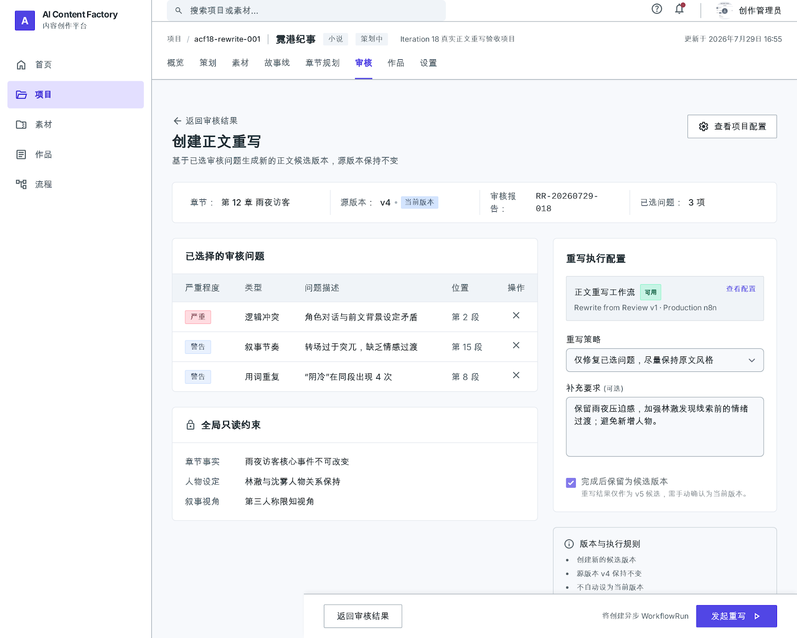

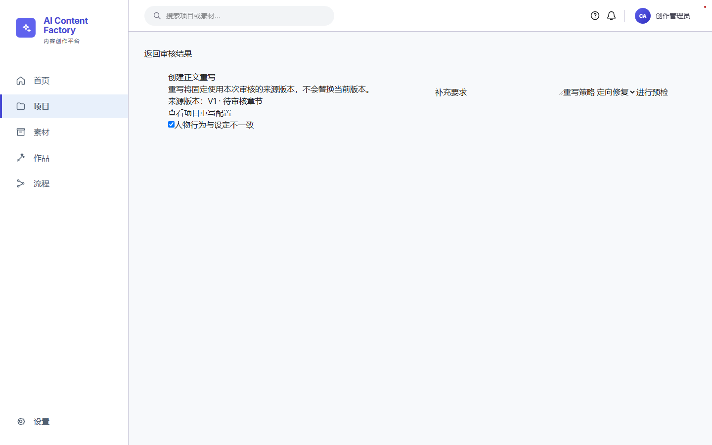

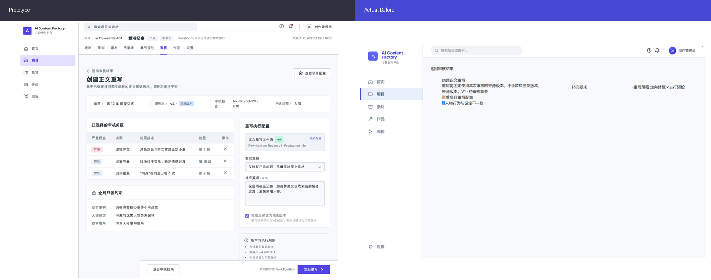

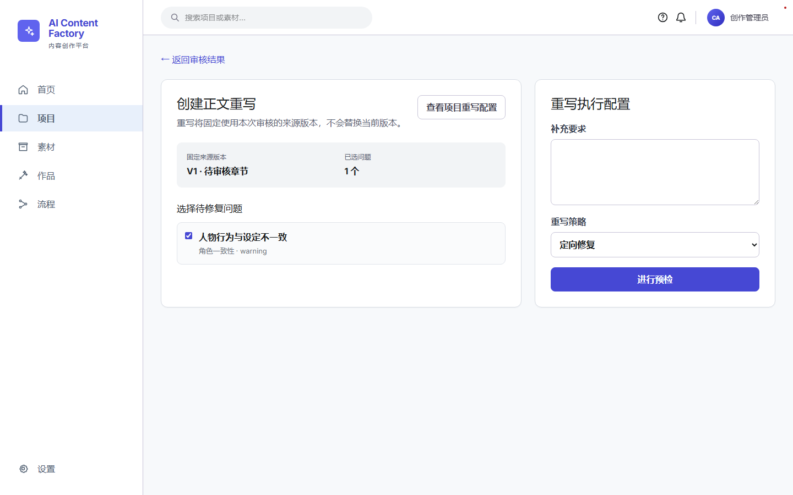

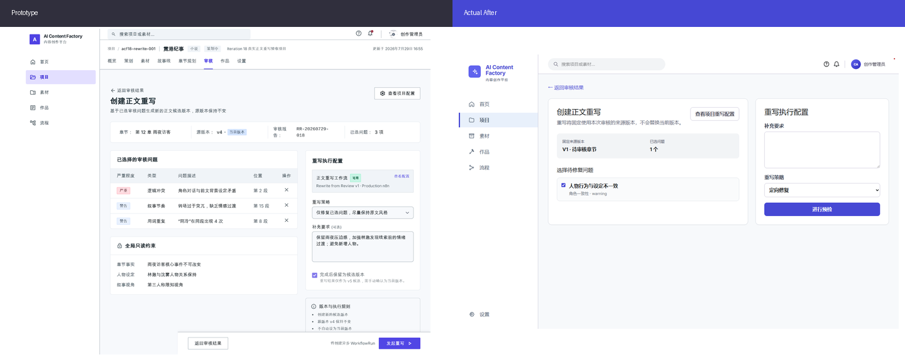

## 4. I18_D4_REWRITE_CONFIG_DRAWER

- 页面标题：项目重写配置抽屉
- 实机完整 URL：http://127.0.0.1:13001/projects/973d7f23-3430-4a17-96e0-c8190535a87d/works/6b7c451c-d3e2-4b75-a0e5-f67647200444/rewrite?reportId=c4292128-bcc3-4ff4-aaf1-4bf8ae2cdf0a
- 原型 screen.png：http://127.0.0.1:13002/iteration-18-real-content-rewrite/ui/frames/I18_D4_REWRITE_CONFIG_DRAWER/screen.png
- 原型 code.html：http://127.0.0.1:13002/iteration-18-real-content-rewrite/ui/frames/I18_D4_REWRITE_CONFIG_DRAWER/code.html
- 使用 ID：`{"projectId": "973d7f23-3430-4a17-96e0-c8190535a87d", "workId": "6b7c451c-d3e2-4b75-a0e5-f67647200444", "reportId": "c4292128-bcc3-4ff4-aaf1-4bf8ae2cdf0a", "issueId": "e6f4bd38-7291-4218-b449-8f382832666b"}`
- 状态构造步骤：使用确定性网络 Fixture 复用真实 Report/Issue/ContentVersion 形状，仅在浏览器网络边界恢复目标状态，生产 DOM 与组件未被修改。
- 修复前结果：FAIL
- 差异说明：业务结构存在但未应用 Rewrite 卡片、状态与弹层样式，配置 dialog 呈内联区域；该差异不允许。
- 是否允许差异：否
- 修改文件：apps/web/src/app/globals.css, apps/web/src/features/project-works/rewrite-workspace.tsx, apps/web/src/features/project-works/rewrite-result-panel.tsx, apps/web/src/features/project-works/rewrite-history.tsx
- 修复后结果：PASS
- 最终结果：PASS
- 截图相对路径：`screenshots/I18_D4_REWRITE_CONFIG_DRAWER/`

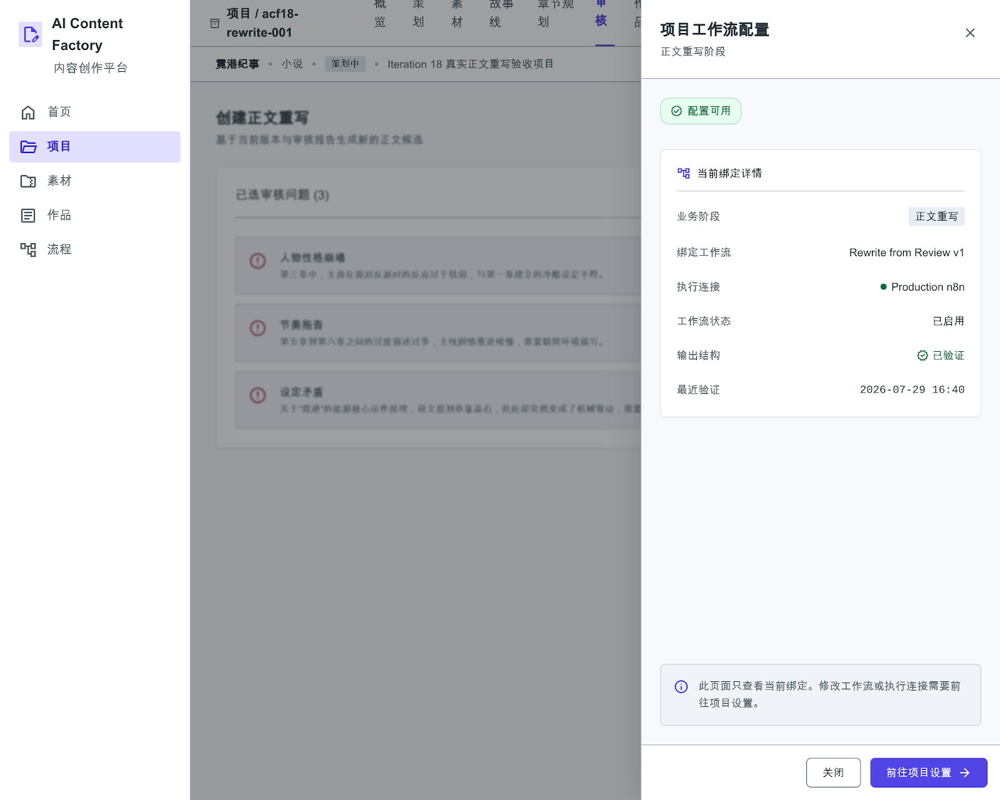

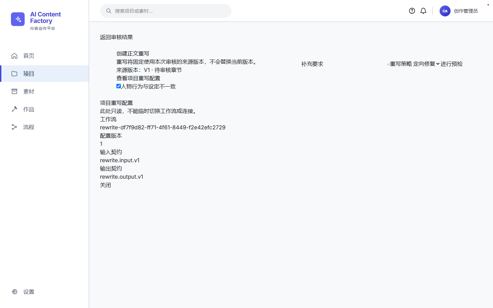

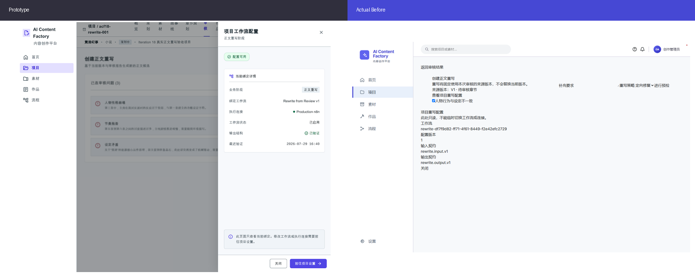

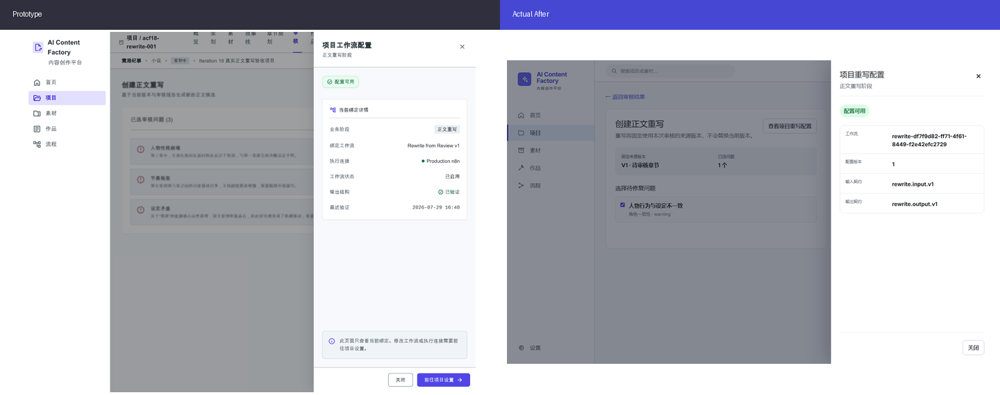

## 5. I18_D4_REWRITE_FAILED

- 页面标题：重写任务执行失败
- 实机完整 URL：http://127.0.0.1:13001/projects/f82f3d9b-22e0-4259-8484-7215dd36d0ed/works/7d05c348-bdd6-4136-a7ce-e1adf27fa1c0/rewrite?workflowRunId=4bc64cf7-1fed-401c-b295-9dc5eb22a759
- 原型 screen.png：http://127.0.0.1:13002/iteration-18-real-content-rewrite/ui/frames/I18_D4_REWRITE_FAILED/screen.png
- 原型 code.html：http://127.0.0.1:13002/iteration-18-real-content-rewrite/ui/frames/I18_D4_REWRITE_FAILED/code.html
- 使用 ID：`{"projectId": "f82f3d9b-22e0-4259-8484-7215dd36d0ed", "workId": "7d05c348-bdd6-4136-a7ce-e1adf27fa1c0", "reportId": "276e66f2-f890-4871-8ab7-1eab7c4bb227", "runId": "4bc64cf7-1fed-401c-b295-9dc5eb22a759"}`
- 状态构造步骤：通过 workflowRunId 精确恢复 PostgreSQL 中已持久化的真实 Run/Event，由正式 API 与生产 UI 渲染。
- 修复前结果：FAIL
- 差异说明：业务结构存在但未应用 Rewrite 卡片、状态与弹层样式，配置 dialog 呈内联区域；该差异不允许。
- 是否允许差异：否
- 修改文件：apps/web/src/app/globals.css, apps/web/src/features/project-works/rewrite-workspace.tsx, apps/web/src/features/project-works/rewrite-result-panel.tsx, apps/web/src/features/project-works/rewrite-history.tsx
- 修复后结果：PASS
- 最终结果：PASS
- 截图相对路径：`screenshots/I18_D4_REWRITE_FAILED/`

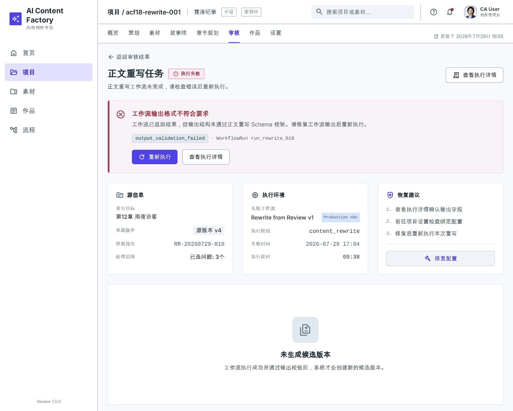

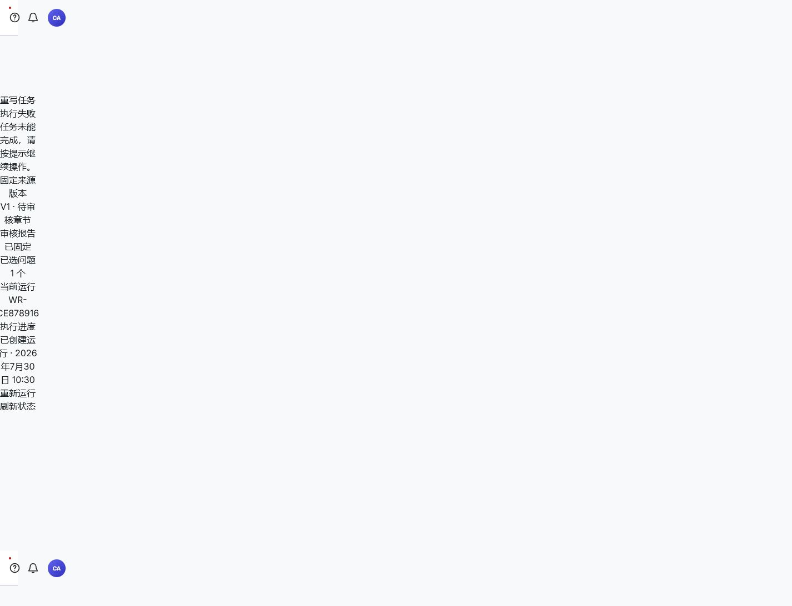

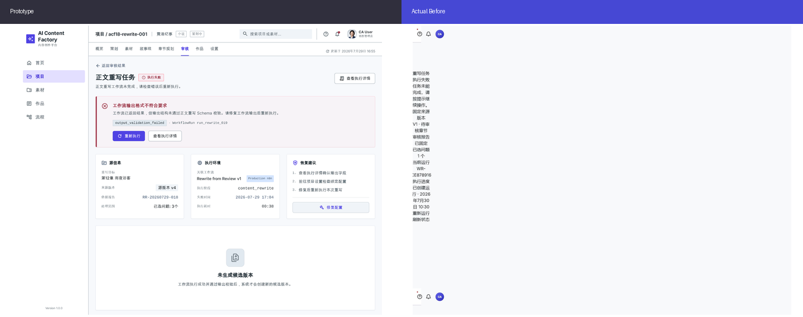

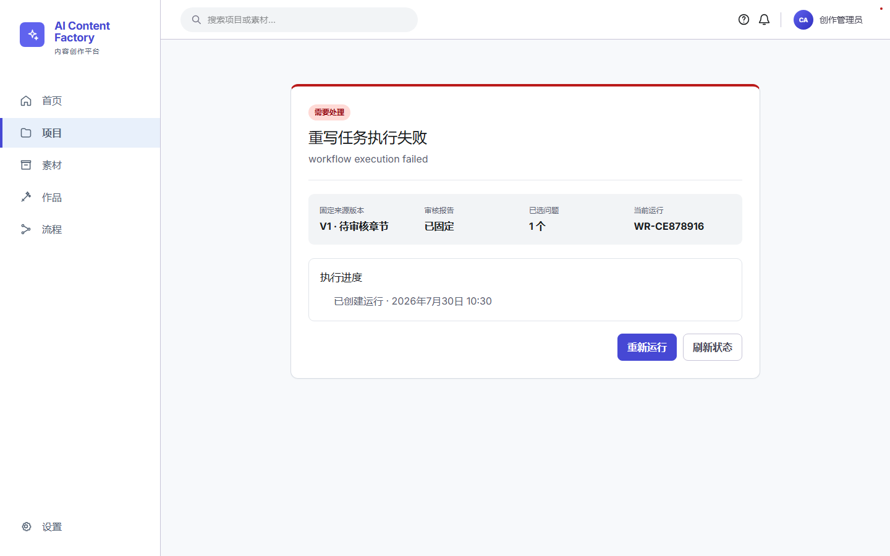

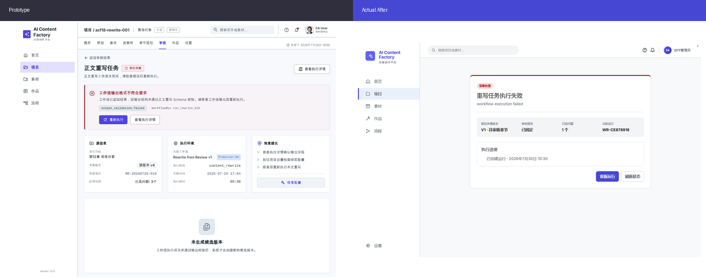

## 6. I18_D4_REWRITE_RUNNING

- 页面标题：正文重写运行中
- 实机完整 URL：http://127.0.0.1:13001/projects/973d7f23-3430-4a17-96e0-c8190535a87d/works/6b7c451c-d3e2-4b75-a0e5-f67647200444/rewrite?workflowRunId=9f657d73-7a11-4144-b5e9-a9bc9fe2d306
- 原型 screen.png：http://127.0.0.1:13002/iteration-18-real-content-rewrite/ui/frames/I18_D4_REWRITE_RUNNING/screen.png
- 原型 code.html：http://127.0.0.1:13002/iteration-18-real-content-rewrite/ui/frames/I18_D4_REWRITE_RUNNING/code.html
- 使用 ID：`{"projectId": "973d7f23-3430-4a17-96e0-c8190535a87d", "workId": "6b7c451c-d3e2-4b75-a0e5-f67647200444", "reportId": "c4292128-bcc3-4ff4-aaf1-4bf8ae2cdf0a", "runId": "9f657d73-7a11-4144-b5e9-a9bc9fe2d306"}`
- 状态构造步骤：使用确定性网络 Fixture 复用真实 Report/Issue/ContentVersion 形状，仅在浏览器网络边界恢复目标状态，生产 DOM 与组件未被修改。
- 修复前结果：FAIL
- 差异说明：业务结构存在但未应用 Rewrite 卡片、状态与弹层样式，配置 dialog 呈内联区域；该差异不允许。
- 是否允许差异：否
- 修改文件：apps/web/src/app/globals.css, apps/web/src/features/project-works/rewrite-workspace.tsx, apps/web/src/features/project-works/rewrite-result-panel.tsx, apps/web/src/features/project-works/rewrite-history.tsx
- 修复后结果：PASS
- 最终结果：PASS
- 截图相对路径：`screenshots/I18_D4_REWRITE_RUNNING/`

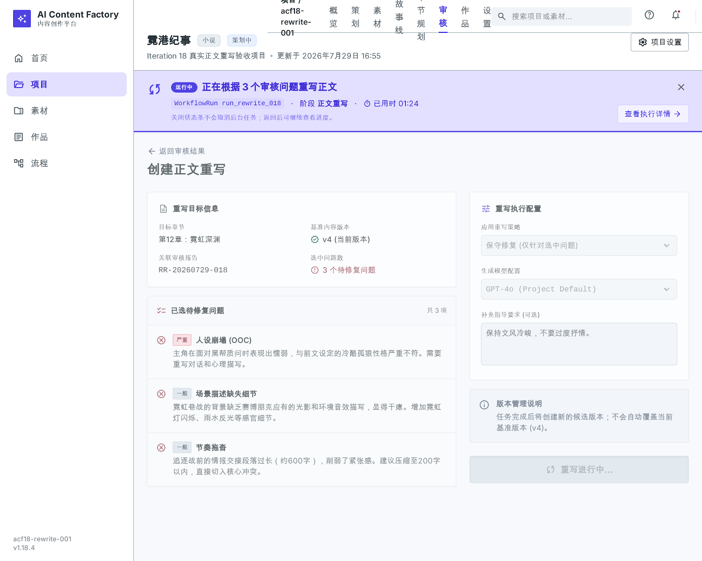

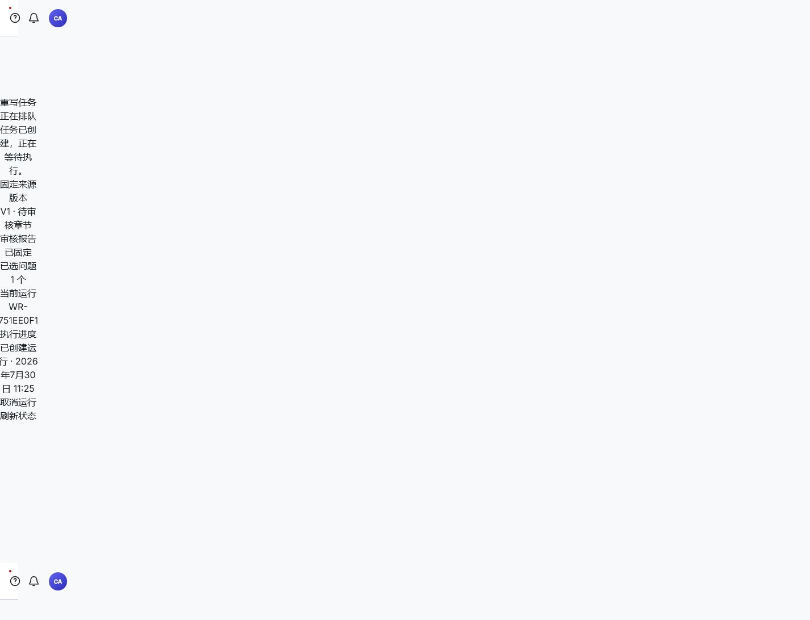

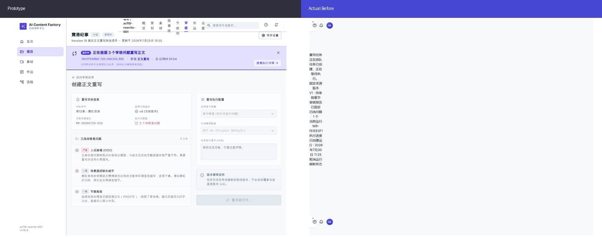

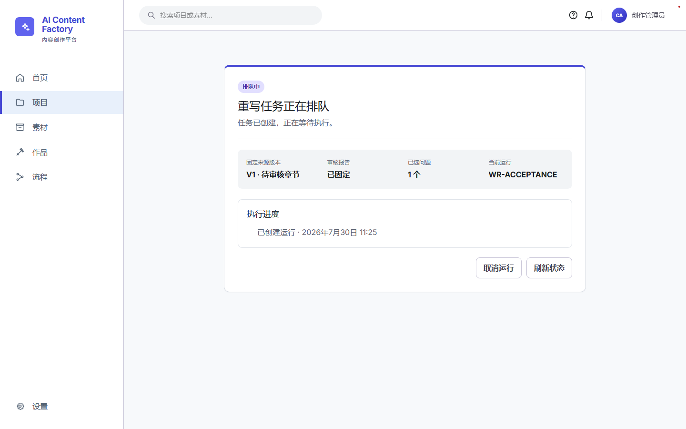

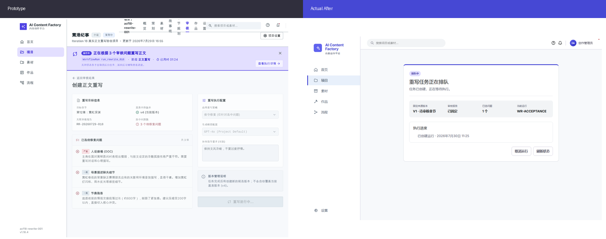

## 7. I18_D5_RESULT_CONSUMPTION_FAILED

- 页面标题：重写结果提交失败
- 实机完整 URL：http://127.0.0.1:13001/projects/f82f3d9b-22e0-4259-8484-7215dd36d0ed/works/7d05c348-bdd6-4136-a7ce-e1adf27fa1c0/rewrite?workflowRunId=9f33d131-c285-4205-ba6e-477f24ed734f
- 原型 screen.png：http://127.0.0.1:13002/iteration-18-real-content-rewrite/ui/frames/I18_D5_RESULT_CONSUMPTION_FAILED/screen.png
- 原型 code.html：http://127.0.0.1:13002/iteration-18-real-content-rewrite/ui/frames/I18_D5_RESULT_CONSUMPTION_FAILED/code.html
- 使用 ID：`{"projectId": "f82f3d9b-22e0-4259-8484-7215dd36d0ed", "workId": "7d05c348-bdd6-4136-a7ce-e1adf27fa1c0", "reportId": "276e66f2-f890-4871-8ab7-1eab7c4bb227", "runId": "9f33d131-c285-4205-ba6e-477f24ed734f"}`
- 状态构造步骤：通过 workflowRunId 精确恢复 PostgreSQL 中已持久化的真实 Run/Event，由正式 API 与生产 UI 渲染。
- 修复前结果：FAIL
- 差异说明：业务结构存在但未应用 Rewrite 卡片、状态与弹层样式，配置 dialog 呈内联区域；该差异不允许。
- 是否允许差异：否
- 修改文件：apps/web/src/app/globals.css, apps/web/src/features/project-works/rewrite-workspace.tsx, apps/web/src/features/project-works/rewrite-result-panel.tsx, apps/web/src/features/project-works/rewrite-history.tsx
- 修复后结果：PASS
- 最终结果：PASS
- 截图相对路径：`screenshots/I18_D5_RESULT_CONSUMPTION_FAILED/`

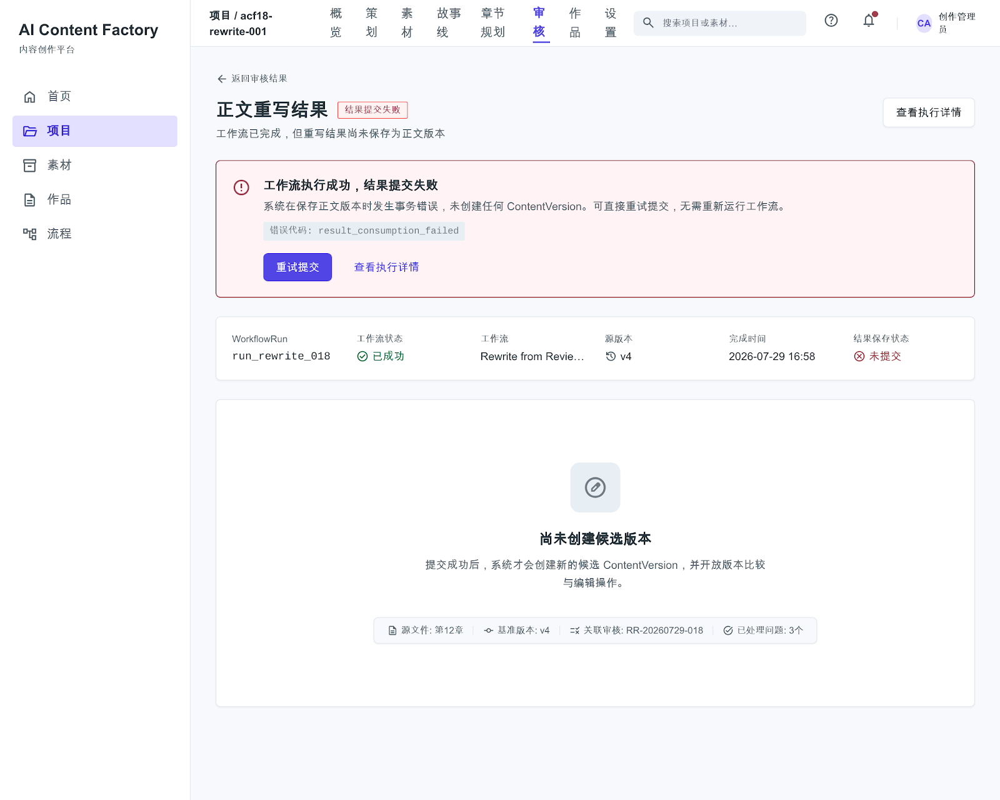

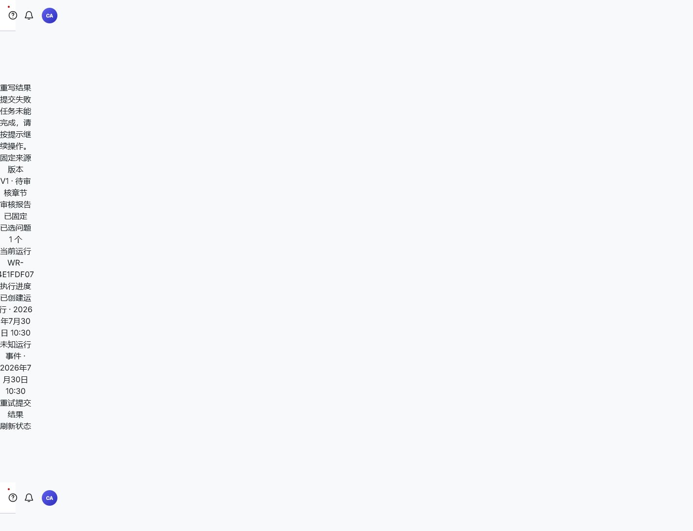

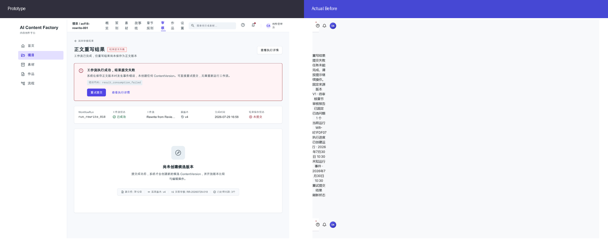

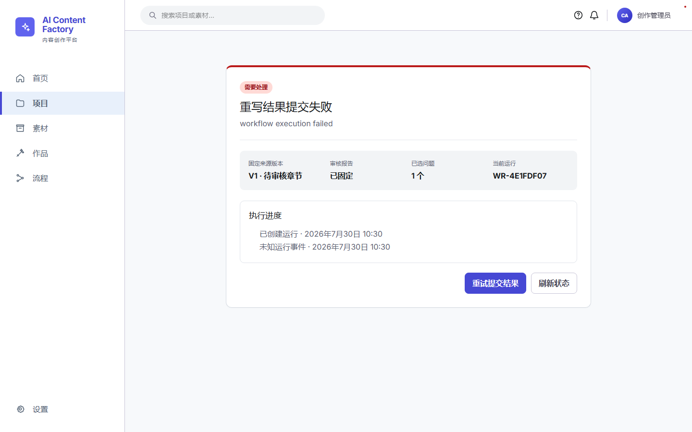

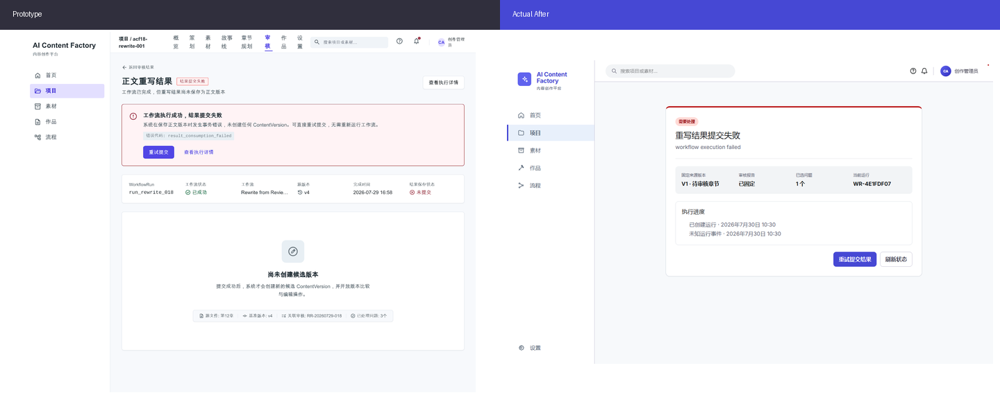

## 8. I18_D5_REWRITE_RESULT

- 页面标题：正文重写候选结果
- 实机完整 URL：http://127.0.0.1:13001/projects/973d7f23-3430-4a17-96e0-c8190535a87d/works/6b7c451c-d3e2-4b75-a0e5-f67647200444/rewrite?workflowRunId=5f626467-8dc3-4106-ba27-1ce481ae6406
- 原型 screen.png：http://127.0.0.1:13002/iteration-18-real-content-rewrite/ui/frames/I18_D5_REWRITE_RESULT/screen.png
- 原型 code.html：http://127.0.0.1:13002/iteration-18-real-content-rewrite/ui/frames/I18_D5_REWRITE_RESULT/code.html
- 使用 ID：`{"projectId": "973d7f23-3430-4a17-96e0-c8190535a87d", "workId": "6b7c451c-d3e2-4b75-a0e5-f67647200444", "reportId": "c4292128-bcc3-4ff4-aaf1-4bf8ae2cdf0a", "issueId": "e6f4bd38-7291-4218-b449-8f382832666b", "runId": "5f626467-8dc3-4106-ba27-1ce481ae6406"}`
- 状态构造步骤：通过 workflowRunId 精确恢复 PostgreSQL 中已持久化的真实 Run/Event，由正式 API 与生产 UI 渲染。
- 修复前结果：FAIL
- 差异说明：业务结构存在但未应用 Rewrite 卡片、状态与弹层样式，配置 dialog 呈内联区域；该差异不允许。
- 是否允许差异：否
- 修改文件：apps/web/src/app/globals.css, apps/web/src/features/project-works/rewrite-workspace.tsx, apps/web/src/features/project-works/rewrite-result-panel.tsx, apps/web/src/features/project-works/rewrite-history.tsx
- 修复后结果：PASS
- 最终结果：PASS
- 截图相对路径：`screenshots/I18_D5_REWRITE_RESULT/`

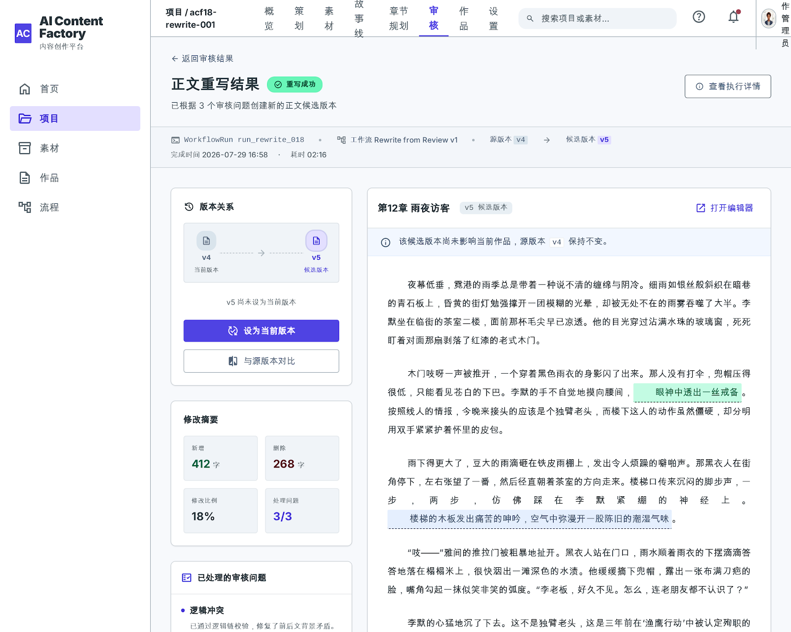

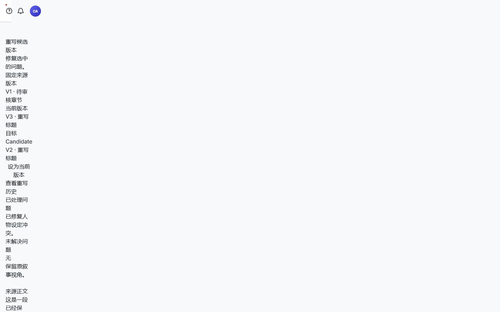

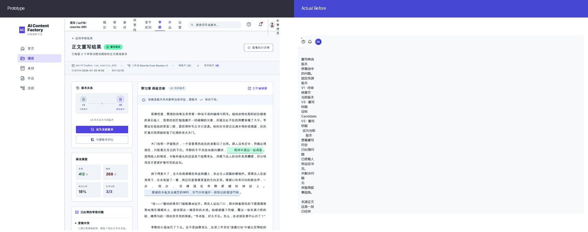

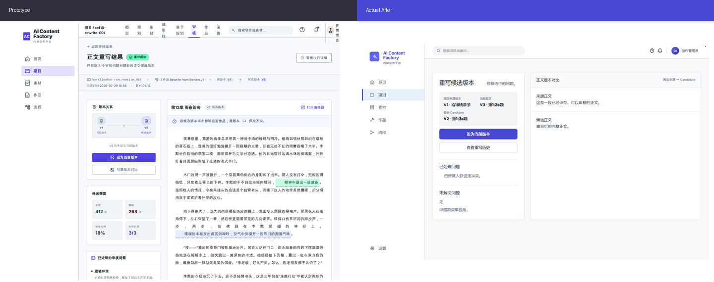

## 9. I18_D5_SET_CURRENT_CONFIRM

- 页面标题：设为当前版本确认
- 实机完整 URL：http://127.0.0.1:13001/projects/973d7f23-3430-4a17-96e0-c8190535a87d/works/6b7c451c-d3e2-4b75-a0e5-f67647200444/rewrite?workflowRunId=5f626467-8dc3-4106-ba27-1ce481ae6406
- 原型 screen.png：http://127.0.0.1:13002/iteration-18-real-content-rewrite/ui/frames/I18_D5_SET_CURRENT_CONFIRM/screen.png
- 原型 code.html：http://127.0.0.1:13002/iteration-18-real-content-rewrite/ui/frames/I18_D5_SET_CURRENT_CONFIRM/code.html
- 使用 ID：`{"projectId": "973d7f23-3430-4a17-96e0-c8190535a87d", "workId": "6b7c451c-d3e2-4b75-a0e5-f67647200444", "reportId": "c4292128-bcc3-4ff4-aaf1-4bf8ae2cdf0a", "issueId": "e6f4bd38-7291-4218-b449-8f382832666b", "runId": "5f626467-8dc3-4106-ba27-1ce481ae6406"}`
- 状态构造步骤：按 workflowRunId 精确恢复真实成功 Run，点击“设为当前版本”打开确认弹窗并截图，随后取消；未执行 Set Current 写入。
- 修复前结果：FAIL
- 差异说明：业务结构存在但未应用 Rewrite 卡片、状态与弹层样式，配置 dialog 呈内联区域；该差异不允许。
- 是否允许差异：否
- 修改文件：apps/web/src/app/globals.css, apps/web/src/features/project-works/rewrite-workspace.tsx, apps/web/src/features/project-works/rewrite-result-panel.tsx, apps/web/src/features/project-works/rewrite-history.tsx
- 修复后结果：PASS
- 最终结果：PASS
- 截图相对路径：`screenshots/I18_D5_SET_CURRENT_CONFIRM/`

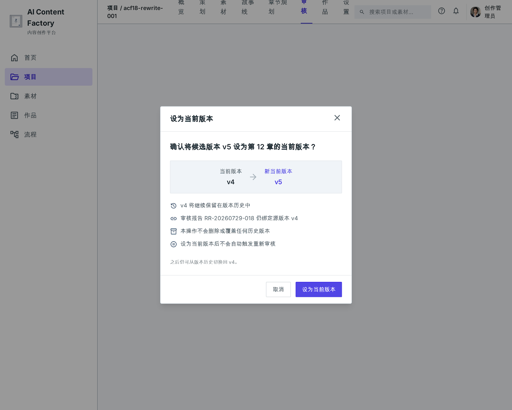

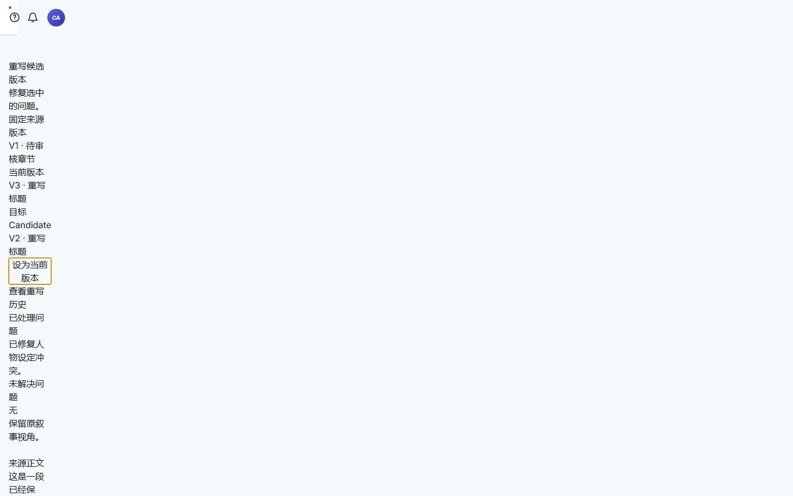

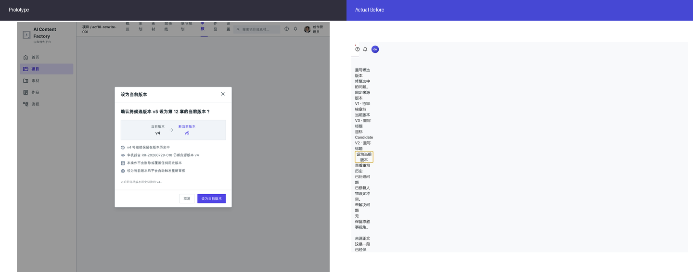

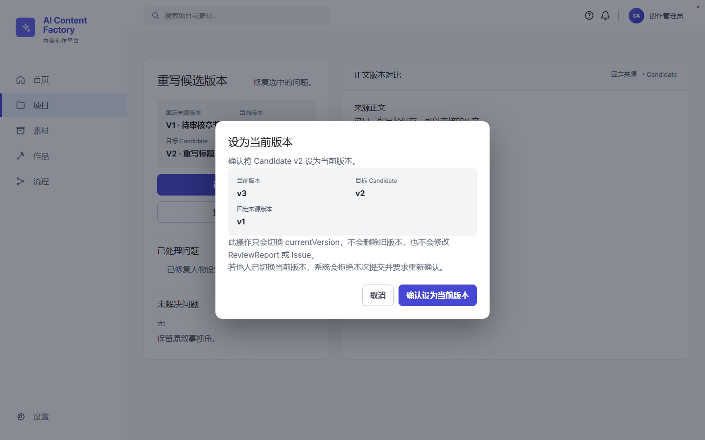

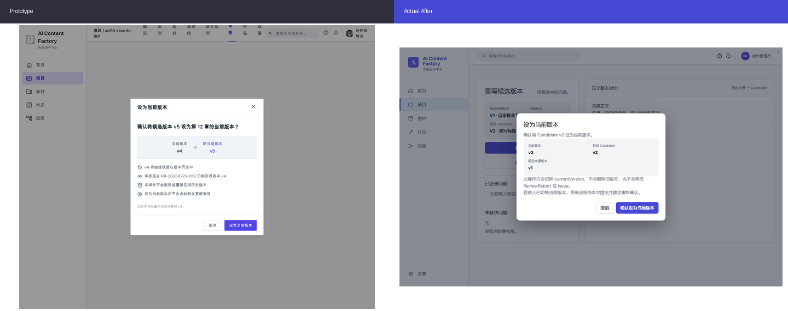
